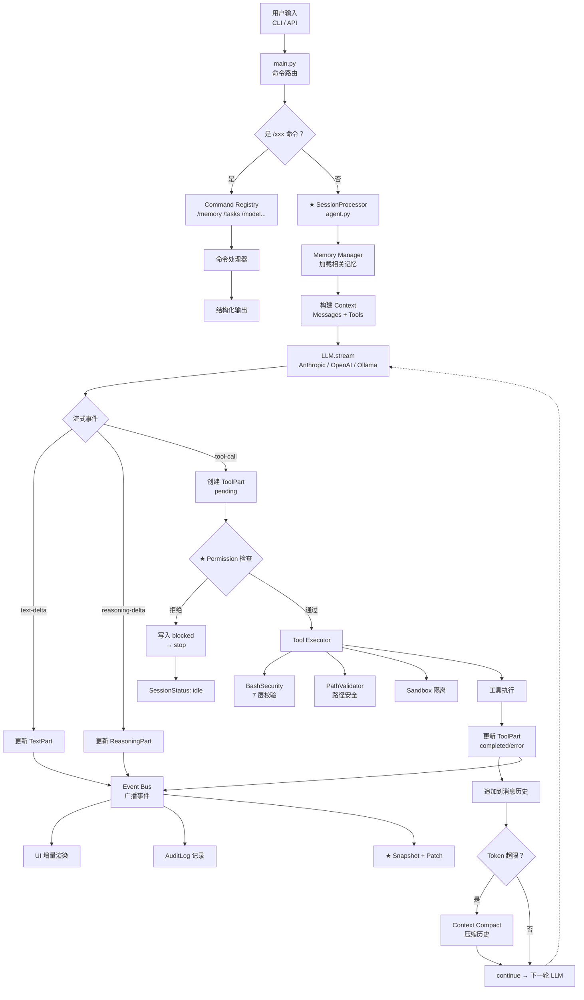

# Auton 项目目录结构设计

## 1. 设计原则

- **事件驱动**：所有模块间通信和 LLM 输出均通过结构化事件总线，解耦 UI 与执行逻辑
- **执行闭环为核心**：SessionProcessor 是唯一主循环，职责单一，状态只有 continue / compact / stop
- **Part 化消息**：消息不是裸字符串，而是由 text / reasoning / tool / step 等 Part 组成，每种 Part 可独立更新
- **工具自包含**：每个工具独立目录，逻辑、Schema、Prompt 描述放一起，新增工具不改现有代码
- **可追踪**：每步操作产生 Snapshot + Patch，做到可回放、可审计、可重试
- **权限分级**：操作按风险分级，用户全程可控，支持 bypass 和 yolo 模式
- **配置外置**：所有可配置项通过 yaml / env / cli args 管理，不硬编码
- **保持精简**：Agent 主类不超过 200 行，每个子系统独立演进

## 2. 目录结构

```
Auton/
├── docs/                          # 项目文档
│   ├── Feature.md                 # 功能规格文档
│   ├── DESIGN.md                  # 本文件，项目结构设计
│   ├── ARCHITECTURE.md            # 系统架构设计（含流程图）
│   ├── API.md                     # API 接口文档
│   └── CHANGELOG.md               # 变更日志
│
├── src/                          # 源代码
│   ├── main.py                    # CLI 入口（所有子命令注册点）
│   ├── __init__.py
│   │
│   ├── core/                      # 核心基础设施（所有模块共享）
│   │   ├── __init__.py
│   │   ├── config.py              # 配置加载（yaml / env / cli args 优先级）
│   │   ├── events.py              # ★ 事件总线（Event Bus）：所有模块间通信走事件
│   │   ├── event_types.py         # ★ 结构化事件类型（text-* / reasoning-* / tool-* / step-*）
│   │   ├── errors.py              # 统一错误类型（可重试 vs 不可重试）
│   │   ├── logging.py             # 结构化日志（JSON + Console 双输出）
│   │   └── snapshot.py            # ★ 快照与 Patch 系统（每步改动可追踪）
│   │
│   ├── agent/                     # Agent 核心
│   │   ├── __init__.py
│   │   ├── agent.py               # ★ SessionProcessor：主执行循环（不超过 200 行）
│   │   ├── session.py             # 会话管理（多会话、compact、rewind）
│   │   ├── context.py             # 动态上下文（当前会话的 working context）
│   │   ├── message.py             # ★ Part 化消息模型（text / reasoning / tool / step parts）
│   │   ├── session_store.py       # ★ 会话日志存储（append-only jsonl，存+用分离）
│   │   ├── policies.py            # 行为策略（何时询问、何时自治）
│   │   └── types.py               # Agent 相关数据类型定义
│   │
│   ├── llm/                       # LLM 接口层
│   │   ├── __init__.py
│   │   ├── base.py                # LLM Provider 抽象基类
│   │   ├── anthropic_provider.py  # Anthropic Claude 实现
│   │   ├── openai_provider.py     # OpenAI GPT 实现
│   │   ├── ollama_provider.py     # Ollama 本地模型实现
│   │   ├── router.py              # LLM 路由器（按任务类型选模型）
│   │   └── prompt.py              # Prompt 模板管理
│   │
│   ├── tools/                     # ★ 工具系统（每个工具独立目录）
│   │   ├── __init__.py
│   │   ├── registry.py            # 工具注册表（内置 + MCP + 插件 统一合并）
│   │   ├── base.py                # 工具基类（输入 Schema 验证 + 执行接口）
│   │   ├── read/
│   │   │   └── tool.py            # 文件读取工具
│   │   ├── write/
│   │   │   └── tool.py            # 文件写入工具
│   │   ├── edit/
│   │   │   └── tool.py            # 字符串替换编辑工具（幂等）
│   │   ├── bash/
│   │   │   ├── tool.py            # Shell 执行（含 7 层安全校验）
│   │   │   ├── security.py         # 危险命令过滤 / 路径校验 / 读写语义分类
│   │   │   └── sandbox.py         # 沙箱隔离（Linux namespaces / macOS sandbox）
│   │   ├── glob/
│   │   │   └── tool.py            # 文件路径模式匹配
│   │   ├── grep/
│   │   │   └── tool.py            # 正则内容搜索（ripgrep 封装）
│   │   ├── web_search/
│   │   │   └── tool.py            # Web 搜索
│   │   ├── web_fetch/
│   │   │   └── tool.py            # URL 内容抓取
│   │   ├── git/
│   │   │   └── tool.py            # Git 操作
│   │   ├── http/
│   │   │   └── tool.py            # HTTP API 请求
│   │   ├── task_create/
│   │   │   └── tool.py            # 创建后台任务
│   │   ├── task_get/
│   │   │   └── tool.py            # 查询任务状态
│   │   ├── task_list/
│   │   │   └── tool.py            # 列出所有任务
│   │   └── mcp/
│   │       └── tool.py            # MCP 协议工具适配器
│   │
│   ├── commands/                  # ★ 命令系统（斜杠命令，第一公民）
│   │   ├── __init__.py
│   │   ├── registry.py            # 命令注册表（聚合所有 /xxx 命令）
│   │   ├── base.py                # 命令基类（name / description / handler / is_enabled）
│   │   ├── help.py                # /help
│   │   ├── model.py               # /model（切换模型）
│   │   ├── session.py             # /session 系列
│   │   ├── memory.py             # /memory 系列（查看/编辑/删除记忆）
│   │   ├── tasks.py              # /tasks 系列
│   │   ├── config.py             # /config（读写配置）
│   │   ├── compact.py            # /compact（手动触发上下文压缩）
│   │   ├── plan.py             # /plan（进入计划模式）
│   │   └── skill.py           # /skill 系列命令（list/info/create/delete/edit/check/install）
│   │   └── cron.py             # /cron 系列命令（list/add/edit/remove/run/enable/disable）
│   ├── memory/                    # 记忆系统
│   │   ├── __init__.py
│   │   ├── types.py              # 记忆类型（type: user / feedback / project / reference）
│   │   ├── session_memory.py     # ★ 会话级记忆（随 AppState 存在，会话结束消失）
│   │   ├── project_memory.py     # ★ 项目记忆（参考 Claude Code：MEMORY.md 索引 + 主题文件）
│   │   ├── global_memory.py      # ★ 全局记忆（参考 OpenClaw：按日期目录，启动时加载当日+昨日）
│   │   ├── long_term_memory.py   # ★ 长期记忆（按语义分块，向量检索 top-k）
│   │   ├── embedding_store.py    # 向量嵌入存储（Qdrant / ChromaDB）
│   │   ├── memory_manager.py     # 记忆管理器（统一检索入口 + 遗忘策略 + 加载优先级 + 模式判断 + MEMORY.md 蒸馏触发）
│   │   ├── session_store.py      # ★ 会话记录存储（append-only jsonl，存+用分离）
│   │   ├── session_summarizer.py # ★ 会话摘要生成器（jsonl → 分段摘要 + jsonl_range）
│   │   ├── memory_md.py          # ★ MEMORY.md 索引生成器（三层检索顶层：从 SUMMARY 蒸馏 + 索引追加）
│   │   ├── auton_md.py           # ★ auton.md 加载器（三位置取并集 + 优先级合并）+ 闲聊模式全局记忆加载
│   │   ├── conflict_resolver.py  # ★ 冲突管理（写入冲突检测 + 召回冲突裁决 + 去重）
│   │   ├── pointer.py            # ★ 记忆指针文件（渐进式披露，避免大块内容直接塞入 context）
│   │   └── chunker.py            # 长期记忆分块器（语义分块策略）
│   │
│   ├── heartbeat/                  # ★ 心跳机制（参考 OpenClaw：主会话周期性感知）
│   │   ├── __init__.py
│   │   ├── scheduler.py           # 心跳调度器（定时触发心跳 turn）
│   │   ├── heartbeat_manager.py  # 心跳管理器（维护 HEARTBEAT.md 生命周期）
│   │   ├── checklist.py          # HEARTBEAT.md 读写与解析
│   │   ├── contracts.py          # HEARTBEAT_OK / HEARTBEAT_ASK 契约写入
│   │   └── config.py             # 心跳配置（every / active_hours / session_mode）
│   │
│   ├── cron/                      # ★ 定时任务系统（参考 OpenClaw：精确时间独立任务）
│   │   ├── __init__.py
│   │   ├── scheduler.py           # Cron 调度器（基于 croniter）
│   │   ├── job_manager.py        # 任务注册表（持久化到 jobs.yaml）
│   │   ├── executor.py            # 任务执行器（main-session vs isolated 执行）
│   │   ├── delivery.py           # 交付模式（announce / webhook / none）
│   │   ├── retry.py              # 指数退避重试策略（30s → 1m → 5m → 15m → 60m）
│   │   ├── logs.py               # 任务日志（每个 job 每条执行一个 jsonl）
│   │   ├── triggers.py           # 触发器（at / every / cron 表达式解析）
│   │   └── config.py             # Cron 配置结构
│   │
│   ├── planner/                   # 规划引擎
│   │   ├── __init__.py
│   │   ├── planner.py             # 主规划器（调用 LLM 生成计划）
│   │   ├── task_decomposer.py     # 任务分解器
│   │   ├── plan_executor.py       # 计划执行器（与 SessionProcessor 协同）
│   │   ├── plan_revisor.py       # 计划动态调整器（遇阻时重新规划）
│   │   └── risk_analyzer.py      # 风险分析器（执行前识别风险点）
│   │
│   ├── task/                      # 任务管理系统（后台异步任务）
│   │   ├── __init__.py
│   │   ├── types.py               # 任务类型（TaskType / TaskStatus / TaskHandle）
│   │   ├── registry.py            # 任务注册表（持久化到磁盘）
│   │   ├── executor.py            # 任务执行器（独立进程/线程池）
│   │   ├── state_machine.py       # ★ 任务状态机（pending→running→completed/failed/killed）
│   │   └── output_file.py         # 任务输出文件（支持增量读取和断点续执）
│   │
│   ├── workflow/                  # 工作流引擎
│   │   ├── __init__.py
│   │   ├── engine.py              # 工作流执行引擎
│   │   ├── parser.py              # 工作流 DSL 解析器
│   │   ├── nodes.py               # 工作流节点类型（task / branch / loop / parallel）
│   │   ├── context.py             # 工作流执行上下文
│   │   └── checkpoint.py          # 断点管理（支持续执）
│   │
│   ├── security/                   # 安全与权限
│   │   ├── __init__.py
│   │   ├── permission.py         # ★ 权限检查器（四模式：default / auto / bypass / yolo）
│   │   ├── audit.py               # 操作审计日志（所有工具调用写入日志）
│   │   ├── path_validator.py      # 路径安全校验（遍历攻击 / Unicode 标准化攻击）
│   │   ├── command_classifier.py # 命令读写语义分类
│   │   └── key_manager.py        # 密钥管理（不存明文，从 env / Keychain 读取）
│   │
│   ├── context_aware/             # 上下文感知
│   │   ├── __init__.py
│   │   ├── project_scanner.py    # 项目类型扫描器（检测 pyproject.toml 等）
│   │   ├── project_analyzer.py    # 项目结构分析器
│   │   ├── recent_history.py     # 最近操作历史感知
│   │   └── suggestion_engine.py  # 主动建议引擎
│   │
│   ├── skills/                    # ★ 技能系统（SKILL.md 知识文档）
│   │   ├── __init__.py
│   │   ├── loader.py             # 技能加载器（扫描所有路径的 SKILL.md）
│   │   ├── registry.py           # 技能注册表（内存索引，支持语义检索）
│   │   ├── injector.py           # 技能注入器（根据上下文选 top-k 注入 prompt）
│   │   ├── frontmatter.py        # frontmatter 解析（YAML）
│   │   ├── semantic_search.py     # 基于 embedding 的技能语义检索
│   │   ├── checker.py            # 技能检查工具（验证依赖 bins/权限）
│   │   ├── packager.py          # 技能打包/解压（.skill zip 包）
│   │   └── builtin/
│   │       ├── skill_creator/SKILL.md   # ★ 元技能：引导创建新技能
│   │       ├── github/SKILL.md
│   │       ├── git_workflow/SKILL.md
│   │       ├── web_search/SKILL.md
│   │       ├── code_review/SKILL.md
│   │       ├── debugging/SKILL.md
│   │       ├── planning/SKILL.md
│   │       └── tdd/SKILL.md
│   │
│   ├── plugins/                   # 插件系统（扩展 Agent 底层能力）
│   │   ├── __init__.py
│   │   ├── loader.py             # 插件加载器（importlib + 热加载）
│   │   ├── base.py               # 插件基类
│   │   ├── registry.py           # 插件注册表
│   │   └── sandbox.py            # 插件沙箱隔离
│   │
│   └── api/                      # API 服务（可选）
│       ├── __init__.py
│       ├── server.py             # FastAPI / Uvicorn server
│       ├── routes/
│       │   ├── chat.py           # 对话路由（请求通道）
│       │   ├── memory.py         # 记忆管理路由
│       │   ├── task.py           # 任务管理路由
│       │   └── tool.py           # 工具管理路由
│       └── middleware.py         # 中间件（认证、日志、限流）
│
├── tests/
│   ├── unit/
│   │   ├── core/
│   │   ├── agent/
│   │   ├── llm/
│   │   ├── tools/
│   │   ├── commands/
│   │   ├── memory/
│   │   ├── planner/
│   │   ├── task/
│   │   │   ├── workflow/
│   │   └── security/
│   │   ├── skills/               # 技能系统测试
│   ├── integration/
│   │   ├── test_session_processor.py  # SessionProcessor 执行循环测试
│   │   ├── test_memory_flow.py        # 记忆系统流程测试
│   │   └── test_event_bus.py          # 事件总线集成测试
│   ├── e2e/
│   │   └── test_cli.py
│   └── fixtures/
│
├── config/
│   ├── default.yaml
│   ├── tools.yaml
│   ├── memory.yaml
│   ├── heartbeat.yaml          # 心跳配置（every / active_hours / session_mode）
│   ├── cron.yaml               # Cron 定时任务配置（jobs 列表）
│   └── plugins.yaml
│
├── plugins/                       # 用户插件目录
│
├── data/                          # 运行时数据（不提交）
│   ├── memory/                     # 记忆数据（SQLite + 向量存储）
│   ├── tasks/                      # 后台任务输出文件
│   ├── cache/
│   ├── logs/
│   ├── heartbeat/                  # 心跳数据
│   │   ├── HEARTBEAT.md           # 心跳检查清单
│   │   └── HEARTBEAT_OK.log       # 历史心跳记录
│   ├── cron/                       # Cron 任务数据
│   │   ├── jobs.yaml              # 定时任务配置
│   │   └── logs/                   # 执行日志
│   │       ├── job-name/
│   │       │   └── 2024-01-15T09-00-00.jsonl
│   │       └── ...
│   └── workspace/                  # Agent 临时工作目录
│
├── scripts/
│   ├── install.sh
│   ├── init_project.py
│   └── benchmark.py
│
├── pyproject.toml
├── uv.lock
├── README.md
├── LICENSE
└── .env.example
```

## 3. 核心模块依赖关系

```mermaid
flowchart TD
    CLI["CLI main.py"]
    API["API Server FastAPI"]
    Agent["(S) SessionProcessor agent.py"]
    Session["Session session.py"]
    C["Context context.py"]
    Message["(S) Part Model message.py"]
    Router["LLM Router router.py"]
    GPT["OpenAI Provider"]
    Claude["Anthropic Provider"]
    Ollama["Ollama Provider"]
    EB["(S) Event Bus core/events.py"]
    ET["(S) Event Types core/event_types.py"]
    Snap["(S) Snapshot/Patch core/snapshot.py"]
    CR["(S) Command Registry commands/registry.py"]
    CB["(S) Command Base commands/base.py"]
    Planner["Planner planner/"]
    TM["Task Manager task/"]
    Mem["Memory System memory/"]
    ProjMem["(S) Project Memory project_memory.py"]
    GlobalMem["(S) Global Memory global_memory.py"]
    LTMem["(S) Long-term Memory long_term_memory.py"]
    Chunker["Chunker chunker.py"]
    EmbStore["Embedding Store embedding_store.py"]
    MemMD["(S) MEMORY.md memory_md.py"]
    AutonMD["(S) auton.md auton_md.py"]
    HB["(S) Heartbeat heartbeat/"]
    Cron["(S) Cron System cron/"]
    CronSched["Cron Scheduler"]
    CronExec["Cron Executor"]
    CronRetry["Retry + Backoff"]
    Skills["(S) Skills System skills/"]
    CA["Context Aware context_aware/"]
    TR["(S) Tool Registry tools/registry.py"]
    BT["Bash Tool tools/bash/"]
    FT["File Tools tools/read/write/edit/glob/grep/"]
    WT["Web Tools tools/web_search/web_fetch/"]
    MCPT["MCP Tool tools/mcp/"]
    Perm["(S) Permission security/permission.py"]
    Audit["Audit Log security/audit.py"]
    PV["Path Validator security/path_validator.py"]
    WF["Workflow Engine workflow/"]
    Plug["Plugin System plugins/"]
    CF["Config core/config.py"]
    Log["Logging core/logging.py"]
    Err["Errors core/errors.py"]

    CLI --> Agent
    API --> Agent
    Agent --> EB
    EB --> ET
    Agent --> Session
    Agent --> C
    Agent --> Message
    Agent --> Router
    Router --> GPT
    Router --> Claude
    Router --> Ollama
    Agent --> CR
    CR --> CB
    TM --> TR
    Planner --> TM
    Planner --> TR
    Mem --> ProjMem
    Mem --> GlobalMem
    Mem --> LTMem
    Mem --> MemMD
    Mem --> AutonMD
    LTMem --> Chunker
    LTMem --> EmbStore
    EmbStore --> Chunker
    HB --> Mem
    Cron --> Mem
    Cron --> CronSched
    Cron --> CronExec
    Cron --> CronRetry
    CronSched --> CronExec
    CronExec --> CronRetry
    Skills --> TR
    CA --> TR
    TR --> BT
    TR --> FT
    TR --> WT
    TR --> MCPT
    BT --> Perm
    BT --> Audit
    BT --> PV
    WF --> TM
    WF --> TR
    Plug --> TR
    Perm --> TR
    EB --> Snap
    Snap --> CB
    CF --> Log
    CF --> Err
    Agent --> CF
    Planner --> CF
    TM --> CF
```



## 4. 核心执行闭环（SessionProcessor）

SessionProcessor 是整个系统的唯一主循环，伪代码如下：

```python
class SessionProcessor:
    """主执行循环——所有其他模块围绕它协作"""

    async def process(self, session: Session) -> SessionStatus:
        while True:
            # 1. 构建消息历史（Session + Memory）
            messages = await self._build_messages(session)

            # 2. 调用 LLM 流式推理
            response = self.llm.stream(messages, tools=self.tools)

            # 3. 分发流事件（text / reasoning / tool / step）
            for event in response.stream():
                self.event_bus.emit(event)  # 所有 UI / 记录器订阅

                if event.type == "text-delta":
                    self._update_text_part(session, event)
                elif event.type == "reasoning-delta":
                    self._update_reasoning_part(session, event)
                elif event.type == "tool-call":
                    await self._execute_tool(session, event)
                elif event.type == "step-finish":
                    self._write_snapshot(session, event)

            # 4. 收集工具结果，写回历史
            if response.has_tool_calls():
                results = await self._collect_results(session)
                session.messages.extend(results)
                self.event_bus.emit(SnapshotEvent(...))  # 记录本轮改动
                continue  # 循环

            # 5. 三态决策
            status = self._decide_status(session)  # continue / compact / stop
            if status == "continue":
                continue
            elif status == "compact":
                session.compact()  # 上下文压缩后继续
                continue
            else:
                return "idle"  # 停止，回到 idle
```

### 4.1 三态控制

| 状态 | 含义 | 触发条件 |
|------|------|----------|
| `continue` | 继续下一轮 LLM 调用 | 正常流程 |
| `compact` | 上下文压缩后继续 | Token 接近上限 / 历史过长 |
| `stop` | 终止回到 idle | 用户中断 / 不可重试错误 / 需用户确认 |

### 4.2 Part 化消息模型

消息由多种 Part 组成，每种 Part 独立更新：

```python
class Message(BaseModel):
    role: Literal["user", "assistant"]
    parts: list[Part]  # 一个消息可有多个 Part

class TextPart(BaseModel):
    type: Literal["text"]
    content: str       # 增量更新，支持 streaming

class ReasoningPart(BaseModel):
    type: Literal["reasoning"]
    content: str       # 思考过程，不暴露给用户但保留在 context

class ToolPart(BaseModel):
    type: Literal["tool"]
    tool_name: str
    tool_input: dict
    status: Literal["pending", "running", "completed", "error"]
    tool_output: str | None = None

class StepPart(BaseModel):
    type: Literal["step"]
    step_id: str
    summary: str        # 步骤摘要
    files_changed: list[str]  # ★ 此步骤改动了哪些文件
```

### 4.3 结构化事件类型

事件总线承载全系统的状态流转：

```python
# Text 事件
TextStartEvent | TextDeltaEvent | TextFinishEvent

# Reasoning 事件
ReasoningStartEvent | ReasoningDeltaEvent | ReasoningFinishEvent

# Tool 事件
ToolCallEvent | ToolResultEvent | ToolErrorEvent

# Step 事件
StepStartEvent | StepFinishEvent  # 含 files_changed 信息

# 系统事件
SessionCompactEvent | SessionStatusChangeEvent | AuditEvent
```

## 5. 数据流向（完整主路径）



## 6. 命令系统设计

每个命令是符合 `Command` 接口的对象：

```python
@dataclass
class Command:
    name: str                      # "memory", "tasks", "compact"...
    description: str               # 帮助文本
    is_enabled: Callable[[], bool]  # 动态启用/禁用
    handler: Callable[[CommandContext], Coroutine]  # 异步处理函数

# 命令注册后，SessionProcessor 将其注入 LLM prompt
# 模型可识别 /memory /tasks 等命令格式并触发对应 handler
```

| 命令 | 功能 |
|------|------|
| `/help` | 显示所有可用命令 |
| `/model <name>` | 切换 LLM Provider |
| `/memory list` | 列出当前记忆（**项目模式**：仅当前项目；**无项目模式**：全部项目+日期） |
| `/memory get <id>` | 查看单条记忆内容 |
| `/memory edit <id>` | 编辑记忆 |
| `/memory delete <id>` | 删除记忆 |
| `/memory gc` | 触发遗忘机制，手动清理 |
| `/tasks list` | 列出所有任务及状态 |
| `/tasks get <id>` | 获取任务输出 |
| `/tasks stop <id>` | 停止任务 |
| `/compact` | 手动触发上下文压缩 |
| `/plan` | 进入计划模式 |
| `/skill list` | 列出所有可用技能（含来源） |
| `/skill info <name>` | 查看指定技能完整内容 |
| `/skill create` | 触发 skill-creator，引导创建新技能 |
| `/skill delete <name>` | 删除用户/项目级技能 |
| `/skill edit <name>` | 编辑指定技能 |
| `/skill check` | 检查所有技能依赖是否满足 |
| `/skill install <file>` | 从 .skill 包文件安装 |
| `/cron list` | 列出所有定时任务（含状态） |
| `/cron add <name> <schedule>` | 添加定时任务 |
| `/cron edit <name>` | 编辑定时任务配置 |
| `/cron remove <name>` | 删除定时任务 |
| `/cron run <name>` | 立即执行定时任务（跳过调度） |
| `/cron enable <name>` | 启用定时任务 |
| `/cron disable <name>` | 禁用定时任务 |
| `/cron logs <name>` | 查看任务执行日志 |
| `/config get <key>` | 读取配置 |
| `/config set <key> <value>` | 写入配置 |

## 6.1 技能系统设计（Skills System）

**核心认知（源自 OpenClaw）**：Skill 就是 **SKILL.md 文件**，不是可执行代码。Skill 是**知识文档**，让 LLM 知道在什么场景下该用什么工具。

### 6.1.1 SKILL.md 格式

```yaml
---
name: github
description: "GitHub operations via `gh` CLI. Use when: (1) checking PR status
  or CI, (2) creating/commenting on issues, (3) listing/filtering PRs.
  NOT for: local git operations, non-GitHub repos."
disable-model-invocation: false
user-invocable: true
metadata:
  openclaw:
    emoji: "🐙"
    requires:
      bins: ["gh"]
    install:
      - kind: brew
        formula: gh
        label: "Install gh (brew)"
---

# GitHub Skill

## When to Use

✅ **USE this skill when:**
- Checking PR status, CI runs, or merge readiness
- Creating, closing, or commenting on issues
- Listing repos, releases, or collaborators

❌ **DON'T use when:**
- Local git operations → use `git` directly
- Reviewing code → use `coding-agent`

## Setup

gh auth login
gh auth status

## Common Commands

gh pr list --repo owner/repo
gh pr checks 55 --repo owner/repo
gh issue create --title "Bug" --body "..."
```

### 6.1.2 Frontmatter Schema

| 字段 | 说明 |
|------|------|
| `name` | 技能名称（唯一标识） |
| `description` | **核心字段**：描述何时使用/不使用，LLM 据此判断是否注入 |
| `disable-model-invocation` | 是否禁止 LLM 自动调用（默认 false） |
| `user-invocable` | 是否允许用户手动触发（默认 true） |
| `metadata.openclaw.emoji` | 展示 emoji |
| `metadata.openclaw.requires.bins` | 依赖的二进制命令 |
| `metadata.openclaw.install` | 安装说明（支持 brew/apt/npm 等） |

### 6.1.3 技能加载与注入流程

```
SkillsLoader.load()
  ├── 扫描 src/skills/builtin/    # 内置技能
  ├── 扫描 ~/.auton/skills/       # 用户技能
  ├── 扫描 .auton/skills/          # 项目技能（最高优先级）
  └── 所有 SKILL.md → frontmatter 解析 → 存入 registry

每次请求时：
  用户输入 → SemanticSearch(embedding) → top-k 相关 Skills
    → 将 SKILL.md 完整内容注入 system prompt
    → LLM 根据注入知识决定调用哪些工具（bash / read / gh...）
```

### 6.1.4 Skill 目录结构

```
skill-name/
├── SKILL.md          # ★ 必需（YAML frontmatter + Markdown 知识）
├── scripts/          # 可选：可执行脚本（Python/Bash），直接运行不占 context
├── references/       # 可选：按需加载的参考文档（表结构、API 规范、公司规范）
└── assets/          # 可选：输出资产（模板、样板代码），不加载入 context
```

**渐进式披露**：元数据始终在 context → SKILL.md body 触发后加载 → references/ 按需加载 → scripts/ 直接执行。

### 6.1.5 技能 vs 工具的关系

- **工具**（Tool）：原子能力，每个工具对应一个具体动作（`bash`、`read`、`write`）
- **技能**（Skill）：**知识包**，本身不执行动作，而是告诉 LLM"在 X 场景下应该组合 Y、Z 工具，按以下步骤操作"

技能不替代工具，工具不替代技能。两者互补。

### 6.1.6 技能创建（skill-creator）

内置 `skill-creator` 技能，让用户用自然语言构建新技能：

```
用户: "我想建一个 skill 来管理我们的 PostgreSQL 数据库"
  → skill-creator 触发 → Auton 与用户对话理解场景
  → 确定需要哪些 scripts/ references/ assets/
  → 创建 ~/.auton/skills/postgres-manager/
  → 编写 SKILL.md + 资源文件
  → 验证格式 → 通知用户就绪
```

构建流程：理解场景 → 规划内容 → 初始化目录 → 编辑内容 → 验证打包。

### 6.1.7 用户技能存储

| 来源 | 路径 | 说明 |
|------|------|------|
| **内置技能** | `src/skills/` | 随 Auton 分发，不可修改 |
| **用户技能** | `~/.auton/skills/` | 用户创建，skill-creator 默认写入此 |
| **项目技能** | `.auton/skills/` | 项目级覆盖，优先级最高 |

技能可打包为 `.skill` 文件（zip），通过 `/skill install <file>` 安装。

## 7. 记忆系统设计

### 7.1 核心原则：存与用完全分离

存储与检索是两个完全独立的子系统，各自职责清晰：

| 子系统 | 模块 | 职责 |
|--------|------|------|
| **存储（Store）** | `session_store.py` | 将会话中所有事件**只追加**写入 jsonl，存储本身不做任何压缩/过滤 |
| **检索（Use）** | `memory_manager.py` | 从 jsonl 中读取和检索，按模式限定范围，按需加载到 context |

两者通过 jsonl 文件解耦：存储只管写，检索只管读，互不感知对方内部逻辑。

### 7.2 存储：Append-only 会话日志

参考 Claude Code 的 append-only 原则：

#### 7.2.1 写入规则

- 每个会话对应一个 `session_{timestamp}.jsonl` 文件
- 会话执行过程中，**每发生一个事件就 append 一行**，永不覆盖
- jsonl 中每行是一个完整的结构化事件（text-delta / tool-call / tool-result / compact 摘要等）

#### 7.2.2 压缩时的追加行为

压缩（compact）时，**原始消息和压缩摘要同时写入 jsonl**，不在原位置修改：

```
# session_2024-01-15T10-00-00.jsonl（截选）

{"type": "user-message", "content": "帮我重构 auth 模块"}
{"type": "assistant-message", "content": "好的，我来重构 auth 模块..."}
{"type": "tool-call", "tool": "bash", "command": "ls src/auth/"}
{"type": "tool-result", "tool": "bash", "result": "..."}
{"type": "tool-call", "tool": "edit", "file": "src/auth/token.py", "old": "...", "new": "..."}
{"type": "tool-result", "tool": "edit", "result": "ok"}
{"type": "compact", "before_count": 28, "after_summary": "保留首尾消息，中间28条压缩为摘要：重构auth模块，替换了token.py的刷新逻辑，修改了3个文件"}
{"type": "user-message", "content": "继续添加单元测试"}
...
```

- **原始消息永远保留**：压缩摘要中的 `before_count` 指明了原始消息数量，所有原始行仍然存在于 jsonl 中
- **可完整回放**：调试时可以从 jsonl 完整重建会话历史
- **不丢失任何信息**：即使压缩后，原始记录仍可查询

#### 7.2.3 会话结束归档

会话结束后，将 jsonl 路径追加到 `index.jsonl`：

```json
{"session_id": "session_2024-01-15T10-00-00", "started_at": "2024-01-15T10:00:00", "ended_at": "2024-01-15T11:30:00", "compaction_count": 1, "path": "execution/session_2024-01-15T10-00-00.jsonl"}
```

### 7.3 检索：三层检索架构

检索模块独立于存储实现，按**打开模式**决定检索范围。检索走三层逐步定位：

```
query → MEMORY.md（顶层索引）
       → SUMMARY.md（二层摘要，按 jsonl 名 + block_序号 定位）
           → execution/*.jsonl（三层原始内容，按 block 编号精确定位）
```

| 模式 | 触发条件 | 检索范围 |
|------|----------|----------|
| **项目模式** | 当前目录或其父目录存在 `.auton/` | **仅当前项目**的 SUMMARY.md |
| **无项目模式** | 不在任何项目目录下 | **全部日期** global/*/SUMMARY.md + **近 2 天有变动的项目** SUMMARY.md |

**检索流程**（项目模式为例）：
```
用户 query
  → 在当前项目 MEMORY.md 中检索（一级匹配，找到相关条目及对应 SUMMARY.md 锚点）
  → 读取命中条目指向的 SUMMARY.md（二级匹配，找到 jsonl 文件名 + block_序号）
  → 读取指定 jsonl 的指定 block（三级，精确定位原始内容）
  → 将 block 原文追加到 context
```

**为什么需要三层**：
- jsonl 行数多、含大量工具调用噪声，不适合直接语义检索
- SUMMARY.md 每行对应一个 block，精确定位源文件 + 编号
- MEMORY.md 只保留高价值结论，容量极小但可能缺细节
- 三层弥合了粒度差异："索引粗定位 → 摘要精定位 → 原文读取"

**无项目模式**：检索 `~/.auton/memory/` 下所有 `summary_*.md`，以及近 2 天有变动的项目 SUMMARY.md。

### 7.4 打开模式与启动时加载策略

| 模式 | 检索范围 | 启动时加载 |
|------|----------|-----------|
| **项目模式** | 仅当前项目的 execution/ jsonl | 项目 `.auton/memory/MEMORY.md`（整块）+ 长期记忆 top-k |
| **无项目模式** | 全部项目 + 全部日期 | 当日 + 昨日 global MEMORY.md + 近 2 天有变动的项目 MEMORY.md + 长期记忆 top-k |

### 7.5 四类记忆架构

| 层级 | 存储位置 | 组织方式 | 加载策略 |
|------|----------|----------|----------|
| **会话记忆** | `AppState.messages` | 消息历史 | 直接存入上下文 |
| **项目记忆** | `.auton/memory/` | **按项目隔离**，指针文件 + session jsonl | 项目模式下整块加载 |
| **全局记忆** | `~/.auton/memory/memory_<date>.md` | **按日期组织** | 无项目模式下加载当日块 |
| **长期记忆** | `~/.auton/memory/vector_db/` | **向量检索**，ChromaDB | 按 query 相关度 top-k 加载 |

### 7.6 长期记忆分块管理

长期记忆采用向量检索 + 语义分块，避免全量加载导致 context 溢出：

```
~/.auton/memory/
  vector_db/                # Chroma 向量数据库（长期记忆检索）
    collection_001/         # chunk 向量 + 元数据
  memory_<date>.md          # 每日长期记忆 L1 索引
  summary_<date>.md         # 每日分段摘要 L2（来自 jsonl）
```

### 7.7 项目记忆（按项目隔离，参考 Claude Code 格式）

参考 Claude Code，每个项目记忆目录结构如下：

```
.auton/memory/
  MEMORY.md                 # ★ 记忆索引（三层检索顶层：无 frontmatter，一行一个入口）
  SUMMARY.md               # ★ 三层检索中间层：本项目所有 jsonl 的 block 逐行摘要
  user_role.md              # 用户身份、偏好、沟通风格
  feedback_*.md             # 用户反馈与规则（type: feedback）
  project_*.md              # 项目背景与决策（type: project）
  reference_*.md            # 外部引用指针（type: reference）
  index.jsonl               # session 索引（session_id / started_at / ended_at / compaction_count）
  project_meta.json          # 项目元信息（名称、技术栈、描述）
  execution/                # 会话日志（每个 Session 一个 jsonl，append-only）
    session_2024-01-15T10-00-00.jsonl
    session_2024-01-20T14-30-00.jsonl
```

**`SUMMARY.md` 格式**（本项目所有 jsonl 的 block 逐行详细摘要）：
```markdown
# 摘要索引：project-A

本文档记录本项目所有对话的分段总结，每个 block 对应 jsonl 中一个完整的话题/任务段，
包含该段的参与者意图、关键决策、主要结论和待跟进事项，供后续检索和上下文复用。

## session_2024-01-15T10-00-00.jsonl
- block_001: 用户要求重构 auth 模块（token 刷新逻辑），Agent 分析后决定替换 token.py 中的过期刷新机制，
  涉及 src/auth/token.py、src/auth/client.py、src/config.py 共 3 个文件，修改前先确认了向后兼容需求。
- block_002: 在重构完成后，Agent 主动提出添加单元测试，用户同意，测试覆盖了 token 刷新的正常流程、token 过期、
  刷新失败重试、网络异常 4 个分支，使用 unittest.mock 模拟外部依赖。

## session_2024-01-20T14-30-00.jsonl
- block_001: 用户与 Agent 讨论项目数据库技术选型，涉及 PostgreSQL vs MySQL vs SQLite 的多维度对比，
  最终决定采用 PostgreSQL，主要理由是 JSONB 支持、丰富索引类型、成熟生态。
- block_002: Agent review 了同事提交的 API 设计文档，提出了 REST 规范改进建议：
  1) 建议统一使用 snake_case 命名而非 camelCase；2) 建议对批量操作增加 /users/batch 接口；
  3) 建议在 POST /users 中增加幂等 key 字段避免重复创建。
```

- 每个 block 一行，`block_序号` 与 jsonl 中的 block 编号对应
- 总结包含：意图、涉及文件/模块、关键决策/结论、待跟进事项，足以让 LLM 仅凭此判断相关性

**`MEMORY.md` 格式**（索引，一行一个入口，无 frontmatter，参考 Claude Code）：
```markdown
本文档是项目记忆顶层索引，详细的会话分段总结见 [SUMMARY.md](SUMMARY.md)。

- [用户角色与偏好](user_role.md) — 用户是后端工程师，偏好先出最小可运行解再迭代。
- [测试策略偏好](feedback_testing.md) — 涉及数据库的改动必须优先真实集成测试。
- [认证改造背景](project_auth_context.md) — 合规审计驱动，兼容性优先于重构美观度。
- [本项目会话分段总结索引](SUMMARY.md) — 记录了本项目所有 session 的详细分段总结，
  包含意图、涉及文件/模块、关键决策和待跟进事项。
```
- 无 frontmatter，最多 200 行，超限截断
- MEMORY.md 第一行注明 SUMMARY.md 的作用，每行：`主题名 + 文件名 + 一句话钩子`

**主题文件格式**（带 frontmatter，参考 Claude Code）：
```markdown
---
name: 用户角色与交互偏好
description: 记录用户技术背景与沟通偏好，确保回答风格一致
type: user
---

用户长期关注点：工程可维护性、可验证性、边界条件覆盖。
交互偏好：先给结论，再给证据链；不喜欢空泛建议。
执行偏好：未经明确要求不自动提交，不执行高风险命令。
```

**主题文件类型**：

| type | 用途 | 典型文件名 |
|------|------|-----------|
| `user` | 用户身份、偏好、沟通风格 | `user_role.md` |
| `feedback` | 用户反馈与行为规则 | `feedback_testing.md` |
| `project` | 项目背景、关键决策、约束 | `project_auth_context.md` |
| `reference` | 外部资源指针（链接、文档） | `reference_runbook.md` |

### 7.8 全局记忆与闲聊模式加载策略（参考 OpenClaw）

参考 OpenClaw，全局记忆按日期目录组织：

```
~/.auton/memory/
  memory_<date>.md         # ★ 每日长期记忆（L1 索引，从 SUMMARY 蒸馏）
  summary_<date>.md        # ★ 每日所有项目的 block 逐行详细摘要
  execution/               # append-only jsonl 会话记录
  vector_db/               # Chroma 向量数据库
```

**闲聊模式（无项目）启动时加载策略**：

| 加载内容 | 路径 | 说明 |
|---------|------|------|
| 当日 global MEMORY.md | `~/.auton/memory/memory_<今天>.md` | 必加载 |
| 昨日 global MEMORY.md | `~/.auton/memory/memory_<昨天>.md` | 必加载（参考 OpenClaw） |
| 近 2 天有变动的项目 MEMORY.md | `{项目根}/.auton/memory/MEMORY.md` | mtime 在 48 小时内，跨所有项目扫描 |

闲聊时加载当日 + 昨日 global MEMORY.md，同时动态扫描所有项目目录，只加载近 2 天修改过的项目 MEMORY.md，实现跨项目近期上下文复用。

**`memory_<date>.md` 格式**（L1 索引，详细摘要见对应的 `summary_<date>.md`）：
```markdown
本文档是当日全局记忆顶层索引，详细的会话分段总结见 summary_2024-01-15.md。

- [Python 类型提示讨论](summary_2024-01-15.md#session_2024-01-15T14-30-00:block_001) — 用户讨论了类型提示取舍，倾向 Protocol 代替 duck typing。
- [Rust 学习](summary_2024-01-15.md#session_2024-01-15T14-30-00:block_002) — 用户提到最近在学习 Rust，通过写小工具学习。
```

启动时自动加载**当日**和**昨日**的 MEMORY.md（参考 OpenClaw）。

### 7.9 `auton.md` 用户偏好记忆（跨所有项目）

`auton.md` 存放**跨项目通用的用户偏好**（例如编码风格、沟通习惯、禁止行为等），可在三个位置出现：

| 位置 | 说明 | 优先级 |
|------|------|--------|
| `~/.auton/auton.md` | 用户全局偏好（最优先） | 高 |
| `{项目根}/.auton/auton.md` | 当前项目偏好覆盖 | 中 |
| `{auton源码}/.auton/auton.md` | Auton 内置默认偏好（最低） | 低 |

**优先级规则：取并集 + 高优先覆盖低优先（同字段冲突时，高优先的值覆盖低优先）**

```
加载策略：
1. 读取 ~/.auton/auton.md（全局）
2. 读取 {cwd}/.auton/auton.md（如存在）
3. 读取 {auton源码}/.auton/auton.md（如存在）
4. 合并所有内容，同键值取高优先级
5. 结果作为 system prompt 的固定前缀片段注入
```

**`auton.md` 格式示例**：
```markdown
# 用户偏好（跨项目通用）

## 编码规范
- 优先使用类型提示，不接受 bare `Any`
- 禁止 `except: pass`，必须记录日志或给出 fallback

## 沟通风格
- 先给结论，再给证据链
- 不使用 emoji（除非用户明确要求）

## 执行约束
- 未经用户确认不执行 `rm -rf`、`git push --force`
- 外部 API 调用必须记录来源
```

### 7.10 记忆生成时机（MEMORY.md 与主题文件何时产生）

参考 Claude Code 的 compaction 时蒸馏机制 + OpenClaw 的自动 flush：

| 时机 | 动作 |
|------|------|
| **compaction 时**（自动） | 主模型追加 `compact` 事件到 jsonl，同时触发蒸馏：提取值得沉淀的信息，追加到 `MEMORY.md` 索引 + 对应主题文件 |
| **每日首次启动时**（自动） | 扫描昨日 session jsonl，提取主题，更新当日 `MEMORY.md` |
| **会话结束时**（自动） | 将 session jsonl 路径追加到 `index.jsonl` |
| **用户显式要求** | 用户说"记住..."时，直接追加/编辑 `MEMORY.md` 或对应主题文件 |
| **压缩时 flush**（自动） | 参考 OpenClaw，compaction 前先 silent turn 提醒 agent 保存重要上下文到记忆文件 |

当日块在无项目模式启动时整块加载；历史块不自动加载，query 命中时按需加载。

### 7.11 auton.md 写入冲突管理

三处 `auton.md` 采用**写时冲突检测**，写入前先检测冲突：

**写入流程**：
```
1. 读取目标 auton.md，按 section 解析内容
2. 对写入内容计算 semantic_fingerprint（按 section 分段）
3. 冲突检测：
   - 相同 section + 相同语义 → 静默跳过（避免重复）
   - 相同 section + 语义矛盾 → 追加冲突标记，不覆盖
   - 不同 section → 正常追加
4. 写入时附加 source 标记（~/.auton / 项目 / 内置）
```

**冲突标记格式**（写入到 auton.md）：
```markdown
## 执行约束
<!-- source: project-X/.auton/auton.md | updated: 2024-01-16 -->
- 项目X禁止使用 `eval`
<!-- conflict: 与内置规则矛盾
     内置(source=内置 | updated: 2024-01-10): 允许 eval，但必须记录日志 -->
```

**冲突裁决策略**：

| 冲突类型 | 处理方式 |
|---------|---------|
| 相同语义重复写入 | 静默跳过，不重复追加 |
| 同一 section 语义矛盾 | 保留双方 + 冲突标记，提示用户确认 |
| 用户偏好 vs 内置默认 | 用户偏好优先（高优先级覆盖低优先级） |
| 新 section 追加 | 正常追加，无冲突 |

### 7.12 query 召回去重与冲突处理

##### 同一来源去重（语义指纹）

三层检索返回结果可能有重复（同一语义同时命中 SUMMARY 和 jsonl）：

```
召回结果集
  → 计算每个结果的 semantic_hash（核心语义，非行号/时间戳）
  → 相同 hash 只保留一条（保留相关性最高的）
  → 附带来历标记（MEMORY.md / SUMMARY.md / jsonl）
```

##### 跨来源冲突处理

跨来源（不同项目 / 不同日期）命中语义矛盾的内容：

```
发现矛盾结果
  → 标记为 conflict
  → 裁决优先级：时间（新 > 旧） > 来源（用户显式 > 自动生成） > 粒度（详细 > 简略）
  → 裁决后附加 [resolved: newer] / [resolved: user_pref] 标记
  → 返回结果中标注冲突说明
```

### 7.13 query 召回过载筛选

召回内容超出 context 预算时，分三阶段截断：

**第一阶段：相关性硬过滤**
```
相关性得分 < 0.3 的结果直接丢弃
```

**第二阶段：多样性过滤**
```
同主题只保留 top-1（避免单一主题占满 context）
→ 按主题聚类
→ 每类只保留最相关条目
```

**第三阶段：预算截断**
```
按相关性排序逐一加入 context
→ 总 token 接近预算时停止
→ 最后一条做截断而非丢弃
→ 提示："因 token 限制已截断，完整内容可通过 /memory get 查看"
```

## 8. 心跳与定时任务设计（参考 OpenClaw）

### 8.1 设计目标

让 Auton 在主会话闲置时仍能感知环境变化（心跳），同时支持精确时间的独立自动化任务（定时任务）。两者互补：

- **Heartbeat**：周期性感知，维持"活跃在场"状态（默认 30 分钟一次）
- **Cron**：精确时间执行，完全独立的自动化任务

### 8.2 心跳机制（Heartbeat）

#### 8.2.1 核心模型

Heartbeat 在主会话中周期性插入一个轻量 turn，读取检查清单并响应。与主会话的关系有两种：

| 执行模式 | 说明 | token 消耗 |
|---------|------|-----------|
| **main-session**（默认） | 主会话被打断，执行心跳 turn，恢复等待 | 高（携带完整上下文） |
| **isolated** | 独立 session turn，完全隔离上下文 | 低（仅 auton.md + HEARTBEAT.md） |

**isolated + light_context**：不加载 memory，仅携带 auton.md 和 HEARTBEAT.md，token 消耗大幅降低，适合高频心跳。

#### 8.2.2 心跳契约：HEARTBEAT.md

Auton 在 `~/.auton/heartbeat/HEARTBEAT.md` 中维护检查清单：

```markdown
# Heartbeat Checklist

## 待处理任务
- [ ] review PR #42
- [ ] 确认部署时间

## 待确认决策
- [ ] auth 模块是否采用 JWT？

## 提醒
- [ ] 周五下午 3 点周会

---
# HEARTBEAT_OK
timestamp: 2024-01-15T15:30:00
issues_responded: 2
issues_raised: 0
```

**心跳周期行为**：
1. 读取 HEARTBEAT.md，找到所有 `-[ ]` 未完成条目
2. 对每个条目做出响应（执行动作 / 更新状态 / 标记完成 / 提新问题）
3. 响应完成后写入 `HEARTBEAT_OK` 块（表示正常完成）
4. 如果有问题需要用户确认，写入 `HEARTBEAT_ASK` 并附上具体问题

**active_hours 限制**：心跳仅在指定时段生效，避免在非工作时间打扰用户。

#### 8.2.3 心跳调度

```
启动 Auton
  → HeartbeatScheduler 启动（asyncio Timer）
  → 按 every 配置间隔触发（默认 30m）
  → 检查 active_hours 是否在有效时段
  → 满足则触发 HeartbeatManager
  → 执行 HEARTBEAT.md 检查清单
  → 写入 HEARTBEAT_OK 或 HEARTBEAT_ASK
  → 重置 Timer，等待下一次心跳
```

### 8.3 定时任务（Cron Jobs）

#### 8.3.1 执行模式

| 模式 | 说明 | 适用场景 |
|------|------|---------|
| **main-session** | 作为主会话的系统事件，下次心跳时执行 | 与主会话上下文相关的周期性任务 |
| **isolated** | 独立 agent turn，完全隔离上下文 | 定时报告、数据采集、纯自动化任务 |

#### 8.3.2 调度类型

| 类型 | 格式 | 示例 |
|------|------|------|
| **at**（一次性） | `at YYYY-MM-DD HH:MM` | `at 2024-01-20 09:00` |
| **every**（间隔） | `every <duration>` | `every 1h`, `every 30m`, `every 1d` |
| **cron**（Cron 表达式） | 标准 5 字段 | `0 9 * * 1-5`（工作日 9 点）|

#### 8.3.3 交付模式（delivery）

| 模式 | 说明 |
|------|------|
| **announce**（默认） | 在主会话 announce 结果，类似 `/cron run` 输出 |
| **webhook** | POST 结果到指定 URL（POST body 为 JSON） |
| **none** | 仅记录日志，不输出不通知 |

#### 8.3.4 重试策略

定时任务执行失败时，使用**指数退避重试**：

```
失败后重试序列：30s → 1m → 5m → 15m → 60m
连续失败 max_attempts 次（默认 3）后暂停任务
→ 写入 HEARTBEAT_ASK，请求用户确认是否恢复
→ 用户确认后按正常调度继续执行
```

#### 8.3.5 任务存储

```
~/.auton/cron/
  jobs.yaml              # 所有定时任务配置
  logs/                  # 执行日志（每个 job 独立目录）
    daily-report/
      2024-01-15T09-00-00.jsonl
      2024-01-16T09-00-00.jsonl
    deploy-check/
      ...
```

每个执行日志为标准 jsonl，记录执行时间、耗时、输入输出和退出码。

### 8.4 与主会话的关系

```
┌──────────────────────────────────────────────────────────────┐
│  Heartbeat = 周期性感知，维持"活跃在场"状态                  │
│  - 按固定间隔（默认 30m）                                   │
│  - 读取 HEARTBEAT.md 检查清单                              │
│  - 上下文感知，依赖主会话状态                               │
│  - 适合：监控、提醒、持续感知                               │
└──────────────────────────────────────────────────────────────┘

┌──────────────────────────────────────────────────────────────┐
│  Cron = 精确时间，独立的自动化执行                          │
│  - cron 表达式或 every 间隔                                │
│  - 可选 isolated 完全隔离                                   │
│  - 精确时机 + 不同模型/配置                                 │
│  - 适合：定时报告、数据采集、精确调度                       │
└──────────────────────────────────────────────────────────────┘
```

**两者组合使用**：
- 心跳维持对环境的持续感知（定期检查提醒、待办、状态）
- Cron 处理精确时机的独立任务（日报生成、定时备份）
- Cron 在 main-session 模式下的任务可被心跳打断，两者协同而非竞争

### 8.5 命令接口

```
/cron list                  # 列出所有定时任务（含状态）
/cron add <name> <schedule> # 添加定时任务（交互式引导）
/cron edit <name> ...       # 编辑任务配置
/cron remove <name>         # 删除任务（确认后删除）
/cron run <name>           # 立即执行（跳过调度）
/cron enable/disable <name> # 启用/禁用任务
/cron logs <name>           # 查看任务执行日志

/cron add daily-report "0 9 * * *" --session isolated --delivery announce
/cron add backup "every 1d" --session main --delivery webhook --webhook-url https://...
```

## 9. 关键设计决策

### 9.1 为什么事件总线是一等公民？

Claude Code 和 OpenCode 都证明了：AI Agent 的核心价值在于**可观测性**。所有模块通过事件总线通信，意味着：
- UI 订阅事件流，增量渲染，无需轮询
- AuditLog 记录所有操作，可审计
- Snapshot/Patch 基于事件流构建，可回放和重试
- 调试时可直接 dump 事件流，重现问题

### 9.2 为什么命令系统要独立？

斜杠命令（`/memory /tasks /plan`）与自然语言是两条不同的交互路径。独立设计的好处：
- 命令的输入输出结构化，比自然语言的解析更可靠
- 命令处理函数与 SessionProcessor 完全解耦
- 模型可以选择调用命令或直接回复，两者并存

### 9.3 BashTool 为什么分这么多子模块？

BashTool 是最危险的工具。Claude Code 的实践证明，7 层校验分离后：
- 每层职责单一，易于测试和审计
- 可按需配置：本地模式全开，CI 环境部分关闭
- 新增校验规则不影响其他层

### 9.4 为什么不用 Effect Runtime？

OpenCode 使用 Effect 做依赖注入。Auton 选择 asyncio 原生 + 显式依赖注入的理由：
- Python 生态中 asyncio 更成熟（httpx、fastapi、anyio）
- Effect 的学习曲线高，调试难度大
- 显式注入足够清晰，且 IDE 支持好

## 10. 技术选型

| 组件 | 选型 | 理由 |
|------|------|------|
| **核心语言** | Python 3.12+ | LLM/Agent 生态最成熟 |
| **CLI 框架** | Typer | 类型安全，比 Click 更现代 |
| **Schema 验证** | Pydantic v2 | 类型安全 + Zod 替代（Python 原生） |
| **HTTP 服务** | FastAPI + Uvicorn | 异步、高性能、自动 OpenAPI 文档 |
| **向量存储** | ChromaDB（本地） | 零配置、支持本地部署 |
| **关系存储** | SQLite | 无依赖、够用、跨平台 |
| **日志** | Loguru | 简洁、彩色、结构化 |
| **异步** | asyncio + anyio | 统一同步/异步代码 |
| **LLM SDK** | Anthropic SDK / OpenAI SDK | 官方维护 |
| **进程执行** | asyncio subprocess | 与 asyncio 深度集成 |
| **配置** | Pydantic Settings + YAML | 声明式、类型验证、层级配置 |
| **测试** | pytest + pytest-asyncio | 异步测试支持好 |
| **Shell 安全** | 路径正则白名单 + namespace sandbox | 分层防护 |
