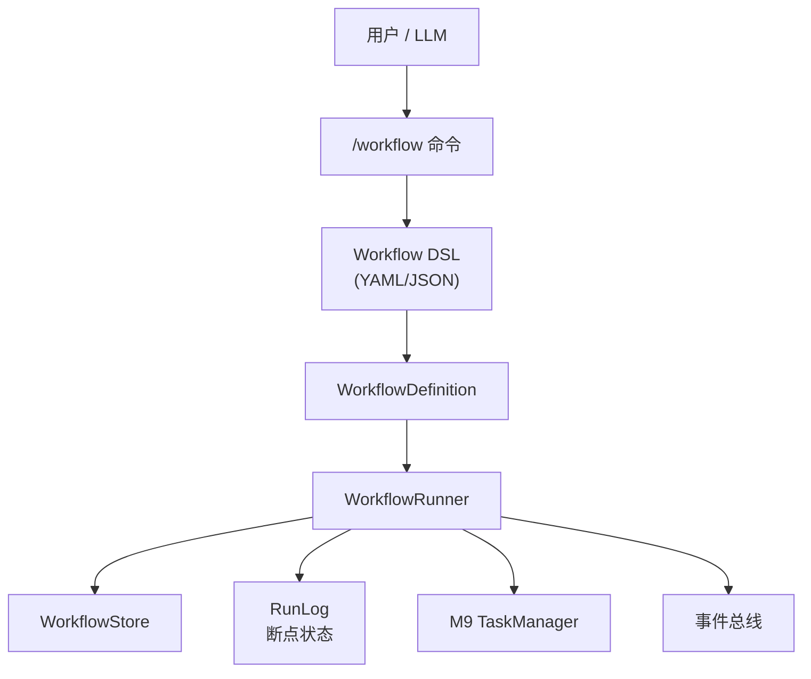

# M10 — Workflow Engine（工作流引擎）

**里程碑日期**: 2026-04-07
**状态**: 🚧 开发中
**前置里程碑**: M9 — Tasks

---

## 目标

实现可定的工作流引擎，支持 DSL 定义、条件分支、断点续执，让 Agent 能够自动执复尔性任务序列。

> "定义一次，自动化执行，出错了从断点恢复。"

---

## 架构概览



---

## 核心数据结构

### WorkflowDefinition（工作流定义）

```python
from auton.workflow import WorkflowDefinition, WorkflowStep, WorkflowCondition

wf = WorkflowDefinition(
    id="wf_deploy",
    name="一键部署工作流",
    description="构建 + 测试 + 部署",
    version="1.0",
    steps=[
        WorkflowStep(id="build", type="task", task=TaskRef(title="构建项目")),
        WorkflowStep(id="test", type="task", task=TaskRef(title="运行测试"), depends_on=["build"]),
        WorkflowStep(id="deploy", type="task", task=TaskRef(title="部署到生产"), depends_on=["test"]),
    ],
    breakpoints=["build", "test"],
    on_failure="stop",  # stop / skip / retry
)
```

### WorkflowStep（步骤类型）

| 类型 | 说明 |
|------|------|
| `task` | 关联一个 M9 Task 执行 |
| `condition` | 条件判断（if/else 分支） |
| `input` | 等待用户输入 |
| `output` | 输出结果 |
| `checkpoint` | 断点标记（保存状态） |

### WorkflowCondition（条件分支）

```python
WorkflowStep(
    id="check_env",
    type="condition",
    condition=WorkflowCondition(
        expression="{{ env }} == 'prod'",
        then=["deploy_prod"],
        else_=["deploy_staging"],
    ),
)
```

---

## 工作流 DSL

工作流以 YAML 定义（后缀 `.autowf` 或 `.yaml`）：

```yaml
# deploy.autowf
id: wf_deploy
name: 一键部署工作流
version: "1.0"
description: 构建 + 测试 + 部署到指定环境

breakpoints:
  - build
  - test

on_failure: stop  # stop | skip | retry

steps:
  - id: build
    type: task
    task:
      title: "构建项目"
      description: "python setup.py build"
    breakpoints: true

  - id: test
    type: task
    depends_on: [build]
    task:
      title: "运行单元测试"
      description: "pytest -v"
    breakpoints: true

  - id: check_env
    type: condition
    condition:
      expression: "{{ env }} == 'prod'"
      then: [deploy_prod]
      else: [deploy_staging]

  - id: deploy_prod
    type: task
    depends_on: [test, check_env]
    task:
      title: "部署到生产"
      description: "kubectl apply -f prod/"
    breakpoints: true

  - id: deploy_staging
    type: task
    depends_on: [test, check_env]
    task:
      title: "部署到预发布"
      description: "kubectl apply -f staging/"
```

---

## 执行流程

### 1. 加载工作流定义

`WorkflowStore.load(workflow_id)` 从 `~/.auton/workflows/` 加载 YAML 定义，解析为 `WorkflowDefinition`。

### 2. 创建执行实例

`WorkflowRunner.create_run(workflow_id, params)` 创建 `WorkflowRun` 实例：
- 分配 `run_id`
- 初始化所有步骤状态为 `pending`
- 写入 `~/.auton/workflow_runs/<run_id>.json`

### 3. 执行步骤

`WorkflowRunner.run()` 推进执行：

```
pending → running → completed / failed / skipped / breakpoint
```

- `task` 步骤：创建 M9 Task，轮询状态，Task 完成即步骤完成
- `condition` 步骤：计算表达式，确定分支，标记对应分支步骤
- `checkpoint` 步骤：自动保存当前状态到断点
- `input` 步骤：暂停，等待用户输入

### 4. 断点续执

```
执行到断点 → Runner 暂停 → Run 状态 = breakpoint
用户回来 → Runner.resume(run_id) → 从断点继续
```

断点信息保存在 `WorkflowRun` 中，包含：
- `breakpoint_step`: 暂停的步骤 ID
- `step_states`: 每步的当前状态
- `params`: 执行参数（`{{ env }}` 等变量值）
- `output`: 截至断点的累积输出

### 5. 执行日志

每个 `WorkflowRun` 记录详细日志：
- 每步骤开始/结束时间
- 步骤输出（引用 M9 Task output）
- 条件判断结果
- 断点触发

---

## WorkflowRun 状态机

```
idle → running → completed
          ↓         ↓
      breakpoint  failed
          ↓
        resumed → running
```

| 状态 | 含义 |
|------|------|
| `idle` | 未开始 |
| `running` | 执行中 |
| `completed` | 全部完成 |
| `failed` | 某步骤失败且 on_failure=stop |
| `breakpoint` | 在断点暂停 |
| `cancelled` | 用户取消 |

---

## `/workflow` 命令

```
/workflow list              — 列出所有工作流定义
/workflow show <wf_id>     — 查看工作流详情
/workflow run <wf_id>       — 运行工作流
/workflow run <wf_id> --param env=prod   — 带参数运行
/workflow pause <run_id>    — 暂停（触发断点）
/workflow resume <run_id>    — 从断点恢复
/workflow stop <run_id>    — 取消执行
/workflow log <run_id>      — 查看执行日志
/workflow delete <wf_id>   — 删除工作流定义
```

---

## 新增/修改文件清单

| 文件 | 操作 | 说明 |
|------|------|------|
| `auton/workflow/types.py` | 新增 | WorkflowDefinition / WorkflowStep / WorkflowCondition / WorkflowRun 数据结构 |
| `auton/workflow/dsl.py` | 新增 | DSL 解析（YAML → 对象） |
| `auton/workflow/store.py` | 新增 | WorkflowStore — 工作流定义持久化 |
| `auton/workflow/runner.py` | 新增 | WorkflowRunner — 执行引擎 + 断点续执 |
| `auton/workflow/__init__.py` | 新增 | 导出公共接口 |
| `auton/commands/workflow_cmd.py` | 新增 | /workflow 命令 |
| `auton/core/event_types.py` | 修改 | 添加 WorkflowRun 事件 |
| `docs/Milestones/M10.md` | 新增 | 本文档 |

---

## 测试方法

### 1. 模块导入验证

```bash
python -c "
from auton.workflow import (
    WorkflowDefinition, WorkflowStep, WorkflowCondition,
    WorkflowRun, WorkflowStore,
    WorkflowRunner, DSLParser,
)
print('All M10 imports OK!')
"
```

### 2. DSL 解析测试

```bash
python -c "
from auton.workflow import DSLParser

yaml_text = '''
id: wf_test
name: 测试工作流
steps:
  - id: step1
    type: task
    task:
      title: 步骤1
'''
parser = DSLParser()
wf = parser.parse(yaml_text)
print(f'Workflow: {wf.id}, steps={len(wf.steps)}')
"
```

### 3. 断点续执测试

```bash
python -c "
from auton.workflow import WorkflowRunner

runner = WorkflowRunner()
run = runner.create_run('wf_test', params={'env': 'staging'})
print(f'Run: {run.id}, status={run.status}')
# runner.resume(run.id)
"
```

---

## 已知限制

1. **工作流定义来源**：M10 支持手工编写 YAML DSL，M11 里程碑中提供 MCP Skill Builder 可视化编辑器
2. **条件表达式**：M10 使用简单的 Jinja2 风格模板变量替换，完整表达式求值在 M10+ 扩展
3. **并行分支**：M10 支持条件分支串行执行，并行分支在 M10+ 实现
