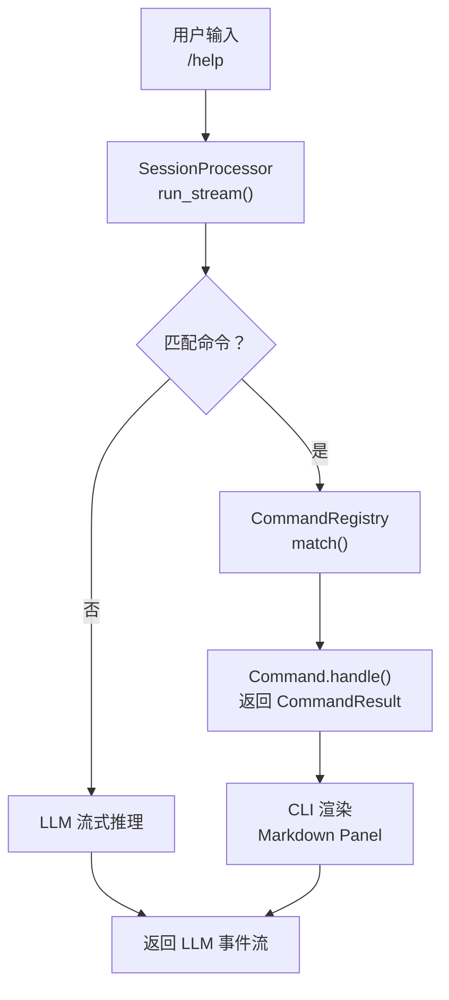

# M3 — Commands（命令系统）

**里程碑日期**: 2026-04-07
**状态**: ✅ 已完成
**前置里程碑**: M2 — Tools

---

## 目标

实现斜杠命令（`/xxx`）统一交互接口，包括命令基类、命令注册表、内置命令，以及与 SessionProcessor 的集成。

---

## 功能清单

### 1. 命令基础设施

| 模块 | 文件 | 说明 |
|------|------|------|
| 命令基类 | `commands/base.py` | `Command` ABC + `CommandResult` + `CommandRegistry` |
| 命令上下文 | `commands/context.py` | `CommandContext`（session/config/io） |
| 命令注册表 | `commands/registry.py` | `get_command_registry()` 全局单例 |
| 命令集成 | `agent/agent.py` | `_try_handle_command()` 集成到主循环 |

### 2. 命令执行流程



### 3. 内置命令

| 命令 | 文件 | 状态 | 说明 |
|------|------|------|------|
| `/help` | `help.py` | ✅ | 显示所有已注册命令 |
| `/model` | `model.py` | ✅ | 查看/切换 LLM 模型 |
| `/config` | `config_cmd.py` | ✅ | 读写配置项 |
| `/compact` | `compact.py` | ✅ | 手动触发上下文压缩 |
| `/plan` | `plan.py` | ✅ | 进入计划模式 |
| `/session` | `session_cmd.py` | ✅ | 当前会话信息 |
| `/memory` | `memory_cmd.py` | 🟡 | 记忆管理（stub） |
| `/skill` | `skill_cmd.py` | 🟡 | 技能管理（stub） |
| `/cron` | `cron_cmd.py` | 🟡 | 定时任务管理（stub） |
| `/tasks` | `tasks_cmd.py` | 🟡 | 后台任务管理（stub） |

✅ = 完整实现    🟡 = stub（对应子系统未就绪）

---

## 新增/修改文件清单

| 文件 | 操作 | 说明 |
|------|------|------|
| `auton/commands/base.py` | 新增 | Command ABC + CommandResult + CommandRegistry |
| `auton/commands/context.py` | 新增 | CommandContext |
| `auton/commands/registry.py` | 新增 | 命令注册表单例 |
| `auton/commands/help.py` | 新增 | `/help` |
| `auton/commands/model.py` | 新增 | `/model` |
| `auton/commands/config_cmd.py` | 新增 | `/config get/set` |
| `auton/commands/compact.py` | 新增 | `/compact` |
| `auton/commands/plan.py` | 新增 | `/plan` |
| `auton/commands/session_cmd.py` | 新增 | `/session` |
| `auton/commands/memory_cmd.py` | 新增 | `/memory` (stub) |
| `auton/commands/skill_cmd.py` | 新增 | `/skill` (stub) |
| `auton/commands/cron_cmd.py` | 新增 | `/cron` (stub) |
| `auton/commands/tasks_cmd.py` | 新增 | `/tasks` (stub) |
| `auton/commands/__init__.py` | 修改 | 导出公共接口 |
| `auton/commands/README.md` | 修改 | 更新命令文档 |
| `auton/agent/agent.py` | 修改 | 集成 `_try_handle_command()` |
| `auton/cli/main.py` | 修改 | 命令结果渲染支持 |
| `docs/Milestones/M3.md` | 新增 | 本文档 |

---

## 架构设计

### Command 基类

```python
class Command(ABC):
    name: str                     # "help", "model"...
    description: str               # 帮助文本
    patterns: list[tuple]         # 匹配规则

    def is_enabled(self) -> bool:
        """动态启用/禁用"""
        return True

    @abstractmethod
    async def handle(self, args: dict) -> CommandResult:
        """执行命令"""
        ...

    def match(self, text: str) -> bool:
        """检查文本是否匹配此命令"""

    def parse(self, text: str) -> dict | None:
        """解析命令参数"""
```

### CommandResult

```python
@dataclass
class CommandResult:
    content: str           # 用户可见输出
    success: bool = True
    error: str | None = None
    handled: bool = True   # True=命令已处理，不发 LLM
```

### SessionProcessor 集成

```python
async def _try_handle_command(self) -> tuple[bool, CommandResult | None]:
    """检查最后一条用户消息是否为命令"""
    registry = get_command_registry()
    last_user_text = self.session.messages[-1].get_text()
    command, args = registry.match(last_user_text)
    if command:
        result = await command.handle(args)
        return True, result
    return False, None
```

---

## 测试方法

### 1. 命令注册表测试

```bash
python -c "
from auton.commands import get_command_registry

registry = get_command_registry()
print(f'Commands: {len(registry)}')
for cmd in registry.list_commands():
    print(f'  /{cmd.name}: {cmd.description}')

# 测试匹配
cmd, args = registry.match('/help')
print(f'\\n/help matched: {cmd.name}')
"
```

预期输出：10 个命令，/help 匹配成功。

### 2. 命令执行测试

```bash
python -c "
import asyncio
from auton.agent.agent import SessionProcessor
from auton.agent.session import Session
from auton.agent.session_store import SessionStore
from auton.llm.minimax_provider import MiniMaxProvider
from auton.tools import get_registry
from pathlib import Path

async def test():
    session = Session.create()
    store = SessionStore(Path('~/.auton/memory').expanduser())
    llm = MiniMaxProvider(api_key='fake', model='MiniMax-M2.7')
    processor = SessionProcessor(
        session=session, llm=llm,
        tools=get_registry().get_tools(),
        session_store=store,
    )

    for cmd in ['/help', '/model', '/config get', '/session', '/compact']:
        session.add_user_message(cmd)
        handled, result = await processor._try_handle_command()
        print(f'{cmd}: handled={handled}, success={result.success if result else None}')
        session.messages.clear()

asyncio.run(test())
"
```

预期：所有命令 `handled=True`，`success=True`。

### 3. 非命令消息测试

```bash
python -c "
import asyncio
from auton.agent.agent import SessionProcessor
from auton.agent.session import Session
from auton.agent.session_store import SessionStore
from auton.llm.minimax_provider import MiniMaxProvider
from auton.tools import get_registry
from pathlib import Path

async def test():
    session = Session.create()
    store = SessionStore(Path('~/.auton/memory').expanduser())
    llm = MiniMaxProvider(api_key='fake', model='MiniMax-M2.7')
    processor = SessionProcessor(
        session=session, llm=llm,
        tools=get_registry().get_tools(),
        session_store=store,
    )
    session.add_user_message('帮我写一个 hello world 程序')
    handled, result = await processor._try_handle_command()
    print(f'Normal message handled={handled} (should be False)')

asyncio.run(test())
"
```

预期：`handled=False`（非命令，正常发给 LLM）。

### 4. 端到端测试（需要 API Key）

```bash
export MINIMAX_API_KEY="your-key"
auton --msg "/help"
auton --msg "/model"
auton --msg "/memory list"
```

---

## 已知限制

1. **切换 provider/model** — `/model <name>` 显示 stub 信息，切换需要重启 CLI（LLM provider 重初始化问题）
2. **配置持久化** — `/config set` 运行时生效，不写入配置文件
3. **Memory/Skill/Cron/Tasks** — 为 stub，将在对应里程碑实现
4. **交互式命令** — `input()` 交互支持有限（单行输入）

---

## 下一步

- **M4 — Memory**: 会话记忆、项目记忆（MEMORY.md + SUMMARY.md + 三层检索）
- **M5 — Security**: 权限系统（四模式）、审计日志
- **M6 — Skills**: 技能系统（SKILL.md + 渐进式披露）
- **M8 — Planning**: 规划引擎、任务分解
