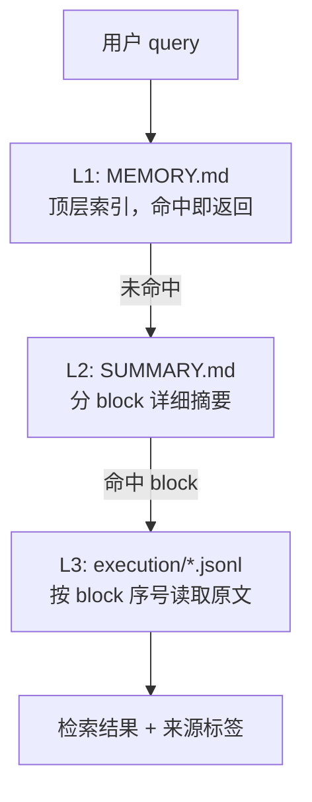

# M4 — Memory（记忆系统）

**里程碑日期**: 2026-04-07
**状态**: ✅ 已完成
**前置里程碑**: M3 — Commands

---

## 目标

实现四层记忆体系（会话 / 项目 / 全局 / 长期），支持项目模式与全局模式两种打开方式，三层检索架构（MEMORY.md → SUMMARY.md → jsonl），并提供完整的 `/memory` 命令。

---

## 功能清单

### 1. 记忆基础设施

| 模块 | 文件 | 状态 | 说明 |
|------|------|------|------|
| 记忆类型定义 | `memory/types.py` | ✅ | MemoryType 枚举（user/feedback/project/reference）、MemoryEntry、SummaryBlock、RetrievalResult |
| 项目记忆管理器 | `memory/project_memory.py` | ✅ | ProjectMemory（`.auton/memory/` 目录初始化、MEMORY.md、SUMMARY.md、index.jsonl、主题文件） |
| 全局记忆管理器 | `memory/global_memory.py` | ✅ | GlobalMemory（`~/.auton/memory/` 日期组织、闲聊模式加载策略） |
| 会话摘要生成器 | `memory/session_summarizer.py` | ✅ | SessionSummarizer（jsonl → 分 block 详细摘要） |
| MEMORY.md 管理器 | `memory/memory_md.py` | ✅ | MemoryMDManager（从 SUMMARY.md 蒸馏高价值条目到 MEMORY.md） |
| auton.md 合并器 | `memory/auton_md.py` | ✅ | AutonMDManager（三位置取并集 + 优先级合并） |
| 冲突管理器 | `memory/conflict_resolver.py` | ✅ | ConflictResolver（语义指纹 + 矛盾检测 + 去重） |
| 统一检索入口 | `memory/memory_manager.py` | ✅ | MemoryManager（模式检测 + 上下文加载 + 蒸馏触发 + 三层检索） |

### 2. 命令实现

| 命令 | 文件 | 状态 | 说明 |
|------|------|------|------|
| `/memory list` | `commands/memory_cmd.py` | ✅ | 列出当前模式所有记忆条目 |
| `/memory search` | `commands/memory_cmd.py` | ✅ | 三层关键词检索 |
| `/memory get` | `commands/memory_cmd.py` | ✅ | 查看单条记忆详情 |
| `/memory edit` | `commands/memory_cmd.py` | 🟡 stub | 交互式编辑（M7 实现） |
| `/memory delete` | `commands/memory_cmd.py` | 🟡 stub | 安全删除（M7 实现） |
| `/memory gc` | `commands/memory_cmd.py` | ✅ | 触发每日蒸馏 |

🟡 stub = 对应子系统未就绪（编辑/删除在 M7 实现）

---

## 架构设计

### 核心原则：存储与检索完全分离

```
SessionStore          MemoryManager
  │                        │
  │  append-only jsonl     │
  ▼                        ▼
{storage_dir}/execution/*.jsonl
                              │
                              │ read
                              ▼
              SessionSummarizer（jsonl → blocks）
                              │
                              ▼
                        SUMMARY.md（分 block 详细摘要）
                              │
                              │ distill
                              ▼
                        MEMORY.md（顶层索引）
```

两者通过 jsonl 文件解耦：存储只管 append，检索只管读，互不感知对方内部逻辑。

### 四层记忆体系

| 层级 | 存储位置 | 生命周期 | 加载策略 |
|------|----------|----------|----------|
| 会话记忆 | `AppState.messages` | 会话级 | 直接注入 context |
| 项目记忆 | `{项目根}/.auton/memory/` | 项目级 | 项目模式下整块加载 |
| 全局记忆 | `~/.auton/memory/memory_<date>.md` | 用户级 | 无项目模式加载当日+昨日 |
| 长期记忆 | `~/.auton/memory/vector_db/` | 用户级 | M7 向量检索 top-k |

### 打开模式

| 模式 | 触发条件 | 检索范围 | 记忆加载 |
|------|----------|----------|----------|
| **项目模式** | 当前目录或其父目录存在 `.auton/` | 仅当前项目 | 项目 MEMORY.md + 长期记忆 |
| **无项目模式** | 不满足项目模式条件 | 全部项目 + 全部日期 | 当日+昨日 global + 近 48h 项目 MEMORY.md |

### 三层检索架构



**为什么需要中间层**：jsonl 行数多、噪声高，不适合直接做语义检索；SUMMARY.md 浓缩每段语义；MEMORY.md 只保留高价值结论，容量极小但可能缺细节。

### auton.md 三位置优先级

| 位置 | 优先级 | 说明 |
|------|--------|------|
| `~/.auton/auton.md` | 高 | 用户全局偏好 |
| `{项目根}/.auton/auton.md` | 中 | 当前项目偏好覆盖 |
| `{auton源码}/.auton/auton.md` | 低 | Auton 内置默认偏好 |

加载规则：**取并集，同键冲突时高优先级覆盖低优先级**。

---

## 新增/修改文件清单

| 文件 | 操作 | 说明 |
|------|------|------|
| `auton/memory/__init__.py` | 新增 | 导出所有公共接口 |
| `auton/memory/types.py` | 新增 | MemoryType / MemoryEntry / SummaryBlock / RetrievalResult |
| `auton/memory/project_memory.py` | 新增 | ProjectMemory 完整实现 |
| `auton/memory/global_memory.py` | 新增 | GlobalMemory + 闲聊模式加载策略 |
| `auton/memory/session_summarizer.py` | 新增 | SessionSummarizer（block 拆分 + 摘要生成） |
| `auton/memory/memory_md.py` | 新增 | MemoryMDManager（蒸馏逻辑） |
| `auton/memory/auton_md.py` | 新增 | AutonMDManager（三位置合并） |
| `auton/memory/conflict_resolver.py` | 新增 | ConflictResolver（语义指纹 + 冲突检测） |
| `auton/memory/memory_manager.py` | 新增 | MemoryManager（统一入口） |
| `auton/commands/memory_cmd.py` | 修改 | stub → 完整实现（list/search/get/edit/delete/gc） |
| `docs/Milestones/M4.md` | 新增 | 本文档 |
| `auton/memory/README.md` | 修改 | 更新架构文档 |

---

## 测试方法

### 1. 模块导入验证

```bash
python -c "
from auton.memory import (
    MemoryType, MemoryEntry, SummaryBlock,
    MemoryManager, MemoryMode, ProjectMemory, GlobalMemory,
    SessionSummarizer, MemoryMDManager, AutonMDManager, ConflictResolver,
)
print('MemoryType:', [e.value for e in MemoryType])
print('MemoryManager OK')
print('ProjectMemory OK')
print('GlobalMemory OK')
print('SessionSummarizer OK')
"
```

预期：所有类导入成功，MemoryType 包含 user/feedback/project/reference。

### 2. SessionSummarizer 测试

```bash
python -c "
from auton.memory.session_summarizer import SessionSummarizer

ss = SessionSummarizer()
events = [
    {'type': 'user-message', 'content': '帮我重构 auth 模块的 token 刷新逻辑'},
    {'type': 'assistant', 'parts': [{'type': 'text', 'content': '好的，决定采用方案A。'}]},
    {'type': 'tool-call', 'tool': 'edit', 'tool_input': {'path': 'src/auth/token.py'}},
    {'type': 'user-message', 'content': '添加单元测试'},
    {'type': 'assistant', 'parts': [{'type': 'text', 'content': '最终测试覆盖率90%。'}]},
]
blocks = ss.summarize_session(events, 'test-session-001')
print(f'Blocks: {len(blocks)}')
for b in blocks:
    print(f'  block_{b.block_index}: {b.summary[:60]}')
"
```

预期：2 个 block，block_001 包含 token.py 文件，block_002 包含测试覆盖率结论。

### 3. MemoryEntry 序列化测试

```bash
python -c "
from auton.memory.types import MemoryEntry, MemoryType

entry = MemoryEntry(
    type=MemoryType.PROJECT,
    name='auth模块重构',
    description='token刷新逻辑重构方案',
    content='采用方案A，修改token.py',
    tags=['auth', '重构'],
)
md = entry.to_markdown()
print(md)
"
```

预期：输出带 YAML frontmatter 的 Markdown。

### 4. ProjectMemory 目录初始化测试

```bash
python -c "
from pathlib import Path
from auton.memory.project_memory import ProjectMemory

# 在临时目录测试
import tempfile
with tempfile.TemporaryDirectory() as tmpdir:
    pm = ProjectMemory(Path(tmpdir) / 'testproject')
    pm.ensure()
    print('memory_dir:', pm.memory_dir)
    print('exists:', pm.memory_dir.exists())

    pm.write_memory('- [测试条目](SUMMARY.md#test:block_001)')
    print('MEMORY.md:', pm.read_memory()[:60])

    # 测试 find_project_root
    result = ProjectMemory.find_project_root(Path.cwd())
    print('project_root found:', result is not None)
"
```

### 5. GlobalMemory 加载策略测试

```bash
python -c "
from pathlib import Path
from datetime import date, timedelta
from auton.memory.global_memory import GlobalMemory

gm = GlobalMemory()
today, yesterday = gm.get_today_and_yesterday()
print(f'today={today}, yesterday={yesterday}')

gm.ensure()
gm.append_memory_entry(today, '- [测试今日](summary_today.md#test:block_001)')
gm.append_memory_entry(yesterday, '- [测试昨日](summary_yesterday.md#test:block_001)')

print('today memory:', gm.read_memory(today)[:60])
print('yesterday memory:', gm.read_memory(yesterday)[:60])
"
```

### 6. AutonMDManager 三位置合并测试

```bash
python -c "
from auton.memory.auton_md import AutonMDManager

adm = AutonMDManager()
paths = adm.get_paths()
print('high:', paths['high'])
print('medium:', paths['medium'])
print('low:', paths['low'])

merged = adm.load_merged()
print('merged sections:', list(merged.keys()))
"
```

### 7. MemoryCommand 命令测试

```bash
python -c "
import asyncio
from auton.commands.memory_cmd import MemoryCommand

async def test():
    cmd = MemoryCommand()
    print('name:', cmd.name)
    print('patterns:', cmd.patterns)

    # 测试 list
    result = await cmd.handle({})
    print('list result:', result.content[:100])

    # 测试 search（无结果）
    result = await cmd.handle({'_subcommand': 'search', '<query>': '不存在的词'})
    print('search result:', result.content[:100])

    # 测试 gc
    result = await cmd.handle({'_subcommand': 'gc'})
    print('gc result:', result.content[:100])

asyncio.run(test())
"
```

### 8. 端到端测试（需要 API Key）

```bash
export MINIMAX_API_KEY="your-key"

# 闲聊模式（无项目）测试
cd /tmp
auton --msg "/memory list"
auton --msg "/memory search auth"

# 项目模式测试（在有 .auton/ 的目录）
cd /path/to/project
auton --msg "/memory list"
auton --msg "/memory gc"
```

---

## 已知限制

1. **向量检索** — 当前使用关键词匹配（M7 升级为 ChromaDB 向量检索）
2. **交互式编辑/删除** — `/memory edit` 和 `/memory delete` 为 stub（M7 实现）
3. **auton.md 写入** — `write_entry()` 功能存在但不在 `/memory` 命令中暴露（通过 LLM 自然沉淀）
4. **每日蒸馏** — `trigger_daily_distillation()` 需要在会话启动时主动调用，尚未集成到 CLI 入口

---

## 下一步

- **M5 — Security**: 权限系统（四模式）、BashTool 7 层安全集成
- **M6 — Skills**: 技能系统（SKILL.md + 渐进式披露）
- **M7 — Long-term Memory**: ChromaDB 向量存储、语义检索、遗忘策略
- **M8 — Planning**: 规划引擎、任务分解
