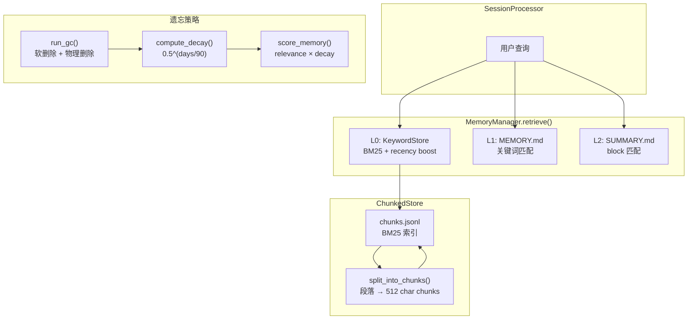

# M7 — Long-term Memory（长期记忆）

**里程碑日期**: 2026-04-07
**状态**: ✅ 已完成
**前置里程碑**: M4 — Memory

---

## 目标

在 M4 会话/项目/全局三层记忆基础上，增加第四层长期记忆（L0），实现关键词检索 + 遗忘机制。

> 向量检索（ChromaDB）延后，本版使用 BM25 关键词 + TF-IDF。

---

## 架构：四层检索

```
L0: chunks.jsonl    BM25 关键词 + 时间衰减 ← M7 新增
L1: MEMORY.md       高价值记忆行           ← M4
L2: SUMMARY.md      会话分段摘要           ← M4
L3: *.jsonl         原始事件流              ← M4
```

---

## 功能清单

### 1. 文本分块（Chunking）

`auton/memory/chunking.py` — ChunkedStore。

```python
from auton.memory import split_into_chunks, ChunkedStore

chunks = split_into_chunks(
    long_text,
    source_type="memory",
    source_id="MEMORY.md",
)

store = ChunkedStore(Path("~/.auton/memory"))
store.add_chunks(chunks)
store.rebuild_index(memory_dir=memory_path)
```

**分块策略**：
- 优先按段落分割（双换行 `\\n\\n`）
- 每个 chunk ≤ 512 字符
- 重叠 64 字符保留上下文
- 太短的 chunk 合并到上一块

### 2. L0 BM25 关键词检索

`auton/memory/keyword_store.py` — KeywordStore。

```python
from auton.memory import KeywordStore

ks = KeywordStore(Path("~/.auton/memory"))
ks.rebuild_index(memory_dir=path)  # 重建索引

hits = ks.search("Python 配置 依赖管理", top_k=5)
for hit in hits:
    print(f"[{hit.score:.3f}] {hit.source_type}: {hit.text[:100]}")
```

**BM25 公式**：
- IDF：词在多少文档中出现（越多越不重要）
- TF：词在当前文档中出现次数
- recency boost：30 天内条目 × 1.5

### 3. 遗忘策略

`auton/memory/forgetting.py`。

```python
from auton.memory import run_gc, get_forgetting_stats

# 干跑（不实际删除）
to_delete = run_gc(memory_dir, dry_run=True)

# 执行遗忘
deleted = run_gc(memory_dir, dry_run=False)

stats = get_forgetting_stats(memory_dir)
```

**遗忘参数**：

| 参数 | 值 | 说明 |
|------|------|------|
| 容量上限 | 200 条 | 超过后强制遗忘 |
| 遗忘阈值 | score < 0.1 | 评分低于此值 |
| 软删除保留期 | 7 天 | 7 天后可恢复 |
| 半衰期 | 90 天 | 每 90 天评分减半 |

**评分公式**：
```
score = relevance × decay(type_weight)
decay = 0.5^(days / 90)
relevance = min(1.0, (access_count × 0.1 + query_hit × 0.2) / 10)
```

**类型权重**：USER(1.5) > FEEDBACK(1.2) > PROJECT(1.0) > REFERENCE(0.8)

### 4. `/memory` 命令增强

`auton/commands/memory_cmd.py`。

```
/memory list              — 列出所有记忆
/memory search <query>    — 四层检索
/memory get <id>          — 查看详情
/memory edit <id>         — 返回文件路径（手动编辑）
/memory delete <id>       — 软删除（7 天后物理删除）
/memory gc                — 蒸馏 + 遗忘 GC
/memory reindex           — 重建 L0 BM25 索引
/memory stats             — 显示统计
```

---

## 新增/修改文件清单

| 文件 | 操作 | 说明 |
|------|------|------|
| `auton/memory/chunking.py` | 新增 | Chunk 数据结构、ChunkedStore、split_into_chunks、extract_keywords |
| `auton/memory/keyword_store.py` | 新增 | KeywordStore（BM25）、L0 检索 |
| `auton/memory/forgetting.py` | 新增 | 遗忘策略、run_gc、get_forgetting_stats |
| `auton/memory/memory_manager.py` | 修改 | 集成 L0 检索、四层 retrieve、遗忘 GC |
| `auton/memory/__init__.py` | 修改 | 导出新增模块 |
| `auton/commands/memory_cmd.py` | 修改 | 完整实现 edit/delete、gc/forget/reindex/stats |
| `docs/Milestones/M7.md` | 新增 | 本文档 |

---

## 架构图



---

## 测试方法

### 1. 模块导入验证

```bash
python -c "
from auton.memory import (
    MemoryManager, KeywordStore, ChunkedStore,
    split_into_chunks, extract_keywords,
    run_gc, get_forgetting_stats, compute_decay,
)
print('All M7 imports OK!')
"
```

### 2. 分块测试

```bash
python -c "
from auton.memory import split_into_chunks, extract_keywords

text = '''第一段内容。

第二段，包含更多信息。

第三段。'''

chunks = split_into_chunks(text, source_type='test', source_id='test.md')
print(f'Chunks: {len(chunks)}')
for c in chunks:
    print(f'  [{c.chunk_index}] {c.text[:30]!r}')
    print(f'  keywords: {c.keywords}')

kw = extract_keywords('Python 编程和 JavaScript 配置')
print(f'Keywords: {kw}')
"
```

### 3. BM25 检索测试

```bash
python -c "
from auton.memory import KeywordStore
from pathlib import Path
import tempfile

tmp = Path('/tmp/m7test')
tmp.mkdir(exist_ok=True)
(tmp / 'MEMORY.md').write_text('''---
name: test
---
项目使用 Poetry 管理 Python 依赖。
配置使用 pyproject.toml。
''', encoding='utf-8')

ks = KeywordStore(tmp)
n = ks.rebuild_index(memory_dir=tmp)
print(f'Indexed {n} chunks')

hits = ks.search('Poetry 依赖', top_k=3)
for h in hits:
    print(f'[{h.score:.3f}] {h.text[:50]!r}')

import shutil; shutil.rmtree(tmp)
"
```

### 4. 遗忘策略测试

```bash
python -c "
from auton.memory import compute_decay
import time

for days in [0, 7, 30, 90, 180, 365]:
    d = compute_decay(time.time() - days * 86400)
    print(f'{days}d: {d:.4f}')

from auton.memory import get_forgetting_stats
from pathlib import Path
stats = get_forgetting_stats(Path('~/.auton/memory'))
print(f'Stats: {stats}')
"
```

### 5. CLI 命令测试

```bash
auton --msg "/memory list"
auton --msg "/memory stats"
auton --msg "/memory gc"
auton --msg "/memory reindex"
auton --msg "/memory search Python"
```

### 6. 四层检索集成测试

```python
from auton.memory import MemoryManager
from pathlib import Path

mm = MemoryManager(storage_dir=Path("~/.auton/memory"))
mm.rebuild_long_term_index()

results = mm.retrieve("Python 依赖管理", top_k=5)
print(f"Results: {len(results)}")
for r in results:
    print(f"  [{r.score:.3f}] {r.source}: {r.content[:60]}")
```

---

## 已知限制

1. **BM25 替代向量** — ChromaDB 向量检索在 M7+ 实现，本版使用 BM25 + TF-IDF
2. **关键词依赖** — 检索质量依赖分词和停用词效果，中文效果有限
3. **遗忘访问索引** — 访问计数（access_count）仅在 L0 查询时更新，需要历史积累
