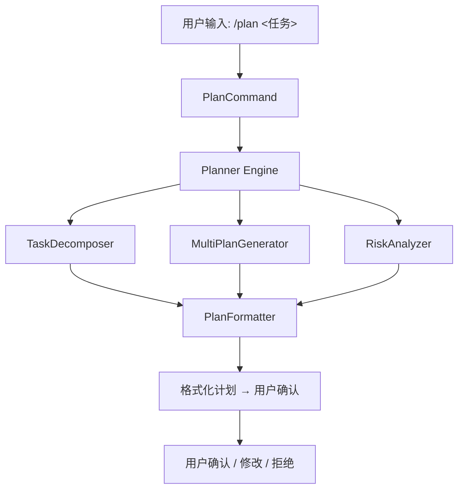

# M8 — Planning Engine（规划引擎）

**里程碑日期**: 2026-04-07
**状态**: 🚧 开发中
**前置里程碑**: M4 — Memory

---

## 目标

让 Auton 能够对复杂任务进行分解、多方案生成、风险识别，并以结构化方式展示计划，供用户确认后执行。

> "告诉我你想要什么，我把它拆成一步一步，告诉你我会怎么做，你确认了我再动手。"

---

## 架构概览



---

## 核心数据结构

### Plan（计划）

```python
from auton.planner import Plan, PlanStep, Risk, Alternative

plan = Plan(
    id="plan_<timestamp>",
    task="重构 auth 模块",
    goal="将 auth 模块重构为插件化架构",
    steps=[
        PlanStep(
            index=1,
            description="分析现有 auth 模块结构和依赖",
            tool="grep",
            params={"pattern": "def .*auth", "path": "src/auth"},
            risk=Risk(level="low", description="读取文件，无破坏性"),
            depends_on=[],
        ),
    ],
    risks=[
        Risk(level="medium", description="可能影响线上认证，需灰度验证"),
    ],
    alternatives=[
        Alternative(name="方案B: 渐进式重构", description="保留旧接口，逐步迁移"),
    ],
    estimated_steps=5,
    estimated_risk="medium",
)
```

### PlanStep（步骤）

| 字段 | 类型 | 说明 |
|------|------|------|
| `index` | int | 步骤序号 |
| `description` | str | 步骤描述 |
| `tool` | str\|None | 建议工具名 |
| `params` | dict | 工具参数（预览） |
| `risk` | Risk\|None | 步骤级风险 |
| `depends_on` | list[int] | 依赖的其他步骤序号 |
| `confidence` | float | 步骤完成把握（0-1）|

### Risk（风险）

| 字段 | 类型 | 说明 |
|------|------|------|
| `level` | Literal["low", "medium", "high"] | 风险等级 |
| `description` | str | 风险描述 |
| `mitigation` | str\|None | 缓解措施 |

---

## 规划流程

### 1. 任务理解（TaskUnderstanding）

解析用户任务，提取：
- **目标**：最终要达成什么
- **约束**：语言/框架/风格限制
- **范围**：哪些要改，哪些不动

### 2. 任务分解（TaskDecomposition）

将任务递归分解为可执行的叶子步骤：
- 每次分解产生 3-7 个子步骤
- 每个子步骤是原子操作（一个工具调用或一段话）
- 步骤之间标注依赖关系

**分解策略**：
```
如果 步骤 > 7：
    按功能/层级 聚类，每类 ≤ 5 步
如果 步骤 < 3：
    检查是否需要更细粒度分解
```

### 3. 多方案生成（MultiPlan）

生成 2-3 个候选方案：
- **方案A（推荐）**：最直接、最安全的路径
- **方案B（替代）**：时间/资源权衡
- **方案C（探索）**：更大胆的方案（可选）

每个方案包含：相同的步骤集合，但顺序或工具选择不同。

### 4. 风险分析（RiskAnalysis）

- **步骤级风险**：每个步骤可能的失败点
- **整体风险**：整个计划的风险汇总
- **缓解措施**：降低风险的建议

**风险等级**：
- `low`：无破坏性，失败可回滚
- `medium`：有风险，建议备份或灰度
- `high`：高风险，需用户明确确认

### 5. 计划格式化（PlanFormatter）

将结构化计划渲染为 Markdown（带 Mermaid 图）：

```markdown
## 计划 #plan_xxx

**目标**: 重构 auth 模块为插件化架构
**步骤数**: 5
**整体风险**: 🟡 medium

---

### 步骤概览


### 详细步骤

1. **分析现有 auth 模块结构和依赖** 🟢 low
   - 工具: `grep`
   - 参数: `pattern=def .*auth, path=src/auth`
   - 依赖: 无
   - 置信度: 0.9

2. **备份现有代码** 🟡 medium
   ...

### 风险分析

| 风险 | 等级 | 缓解措施 |
|------|------|----------|
| 破坏认证逻辑 | 🟡 medium | 执行前 git commit 快照 |

### 替代方案

**方案B: 渐进式重构**
保留旧接口，逐步迁移新实现。
```

---

## PlanCommand 交互流程

```
用户: /plan 重构 auth 模块

Auton:
  → Planner.decompose(task) → steps
  → Planner.generate_alternatives(steps) → alternatives
  → Planner.analyze_risks(steps) → risks
  → Planner.format(plan) → markdown
  → 展示计划，等待确认

用户: 好，执行吧
  → PlanCommand 返回 confirmed=True
  → SessionProcessor 按步骤执行

用户: 第三步换个方式
  → PlanCommand 标记修改 step_3
  → 重新生成步骤 3 及后续步骤

用户: 不要做了
  → PlanCommand 返回 confirmed=False, cancelled=True
  → 终止
```

---

## 新增/修改文件清单

| 文件 | 操作 | 说明 |
|------|------|------|
| `auton/planner/types.py` | 新增 | Plan, PlanStep, Risk, Alternative 数据结构 |
| `auton/planner/decomposer.py` | 新增 | TaskDecomposer — 任务分解 |
| `auton/planner/risks.py` | 新增 | RiskAnalyzer — 风险分析 |
| `auton/planner/formatter.py` | 新增 | PlanFormatter — 格式化为 Markdown |
| `auton/planner/engine.py` | 新增 | Planner — 主引擎，协调各组件 |
| `auton/planner/storage.py` | 新增 | PlanStorage — 计划持久化 |
| `auton/planner/__init__.py` | 新增 | 导出公共接口 |
| `auton/commands/plan.py` | 修改 | 完整实现 plan 命令（调用 Planner 引擎） |
| `auton/core/event_types.py` | 修改 | 添加 PlanStart/PlanConfirm/PlanCancel 事件 |
| `docs/Milestones/M8.md` | 新增 | 本文档 |

---

## 与 SessionProcessor 的集成

### 方式一：命令模式（默认）

`/plan` 命令生成计划，用户确认后，通过 `CommandContext` 中的 LLM 继续执行。

### 方式二：工具模式（未来扩展）

提供 `plan_create` / `plan_execute` / `plan_confirm` 工具，让模型自主规划并执行。

---

## 测试方法

### 1. 模块导入验证

```bash
python -c "
from auton.planner import (
    Plan, PlanStep, Risk, Alternative,
    Planner, TaskDecomposer, RiskAnalyzer,
    PlanFormatter, PlanStorage,
)
print('All M8 imports OK!')
"
```

### 2. 基本规划测试

```bash
python -c "
from auton.planner import Planner

planner = Planner()
plan = planner.plan('重构 auth 模块，加入插件化支持')
print(f'Plan: {plan.id}')
print(f'Steps: {len(plan.steps)}')
for s in plan.steps:
    print(f'  {s.index}. {s.description}')
"
```

### 3. CLI 测试

```bash
auton --msg "/plan 帮我写一个用户登录 API"
auton --msg "/plan 重构数据库访问层"
```

---

## 已知限制

1. **分解依赖 LLM**：目前 task decomposition 是通过 LLM 调用实现的，需要有效的 LLM 配置
2. **计划持久化**：计划存储在内存中（未来可持久化到 `~/.auton/plans/`）
3. **自动执行**：M8 只实现计划生成和展示，确认后的自动执行在 M9/M10 中实现
