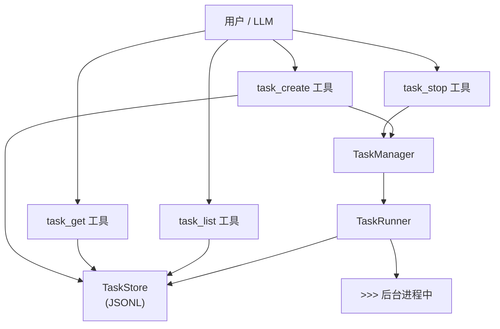

# M9 — Background Task System（后台任务系统）

**里程碑日期**: 2026-04-07
**状态**: ✅ 已完成
**前置里程碑**: M4 — Memory

---

## 目标

实现后台异步任务系统，支持任务状态机、依赖解析、后台执行，让 Agent 能够并行处理多个任务而不阻塞主会话。

> "任务在后台跑，不卡主会话，随时可查进度。"

---

## 架构概览



---

## 核心数据结构

### Task（任务）

```python
from auton.task import Task, TaskStatus

task = Task(
    id="task_xxx",
    title="运行单元测试",
    description="执行 pytest -v",
    status="pending",          # 状态机
    created_by="agent",
    depends_on=[],             # 依赖的任务 ID
    output="",                 # 执行输出
    result={},                 # 结构化结果
    created_at=datetime.now(),
)
```

### 状态机

```
pending ──→ running ──→ completed
                │
                ├──→ failed
                │
                └──→ killed
```

**状态说明**：

| 状态 | 含义 | 可转移至 |
|------|------|---------|
| `pending` | 等待执行（依赖未满足） | running, killed |
| `running` | 执行中 | completed, failed, killed |
| `completed` | 成功完成 | — |
| `failed` | 执行失败 | pending（可重试） |
| `killed` | 被手动终止 | — |

**状态不可逆边界**：
- `completed` / `failed` / `killed` 是终止状态，不可再转移
- 使用 `is_terminal(status)` 判断

---

## 功能清单

### 1. 任务状态机

`auton/task/types.py` — Task / TaskStatus。

- 5 种状态：pending / running / completed / failed / killed
- `is_terminal()` 判断终止状态
- `is_runnable()` 判断是否可以开始执行（pending + 依赖满足）

### 2. 任务存储

`auton/task/store.py` — TaskStore。

```python
from auton.task import TaskStore

store = TaskStore(Path("~/.auton/tasks"))
store.save(task)
task = store.get("task_xxx")
tasks = store.list(status="running")
store.update_status("task_xxx", "completed", output="done")
```

- JSONL 格式：`~/.auton/tasks/` 下每任务一个 JSON 文件
- `tasks/index.jsonl` — 任务索引（ID → 状态映射）

### 3. 任务管理器

`auton/task/manager.py` — TaskManager。

```python
from auton.task import TaskManager

tm = TaskManager()
task = tm.create(title="运行测试", description="pytest")
tasks = tm.list(status="running")
details = tm.get("task_xxx")
tm.stop("task_xxx")      # → killed
tm.retry("task_xxx")    # → pending（重试）
```

- `create()`：创建任务，分配 ID，存入 store
- `list()`：查询任务（支持状态过滤）
- `get()`：获取详情
- `stop()`：终止任务（→ killed）
- `retry()`：重试失败任务（→ pending）

### 4. 任务执行器

`auton/task/runner.py` — TaskRunner。

```python
from auton.task import TaskRunner

runner = TaskRunner(task_store, max_concurrent=3)

# 启动任务（后台）
runner.start("task_xxx")

# 在事件循环中驱动
await runner.tick()
```

- 后台异步执行：`asyncio.create_task()`
- 最多 `max_concurrent` 个任务并行
- `tick()` 在主会话事件循环中调用，推进所有 running 任务
- 任务完成后自动更新状态为 completed / failed

### 5. 任务工具（LLM 调用）

`auton/tools/task_*.py` — 四个工具完整实现。

**task_create**：
```json
{"title": "运行单元测试", "description": "pytest -v", "depends_on": ["task_abc"]}
```

**task_list**：
```json
{"status": "running"}
```

**task_get**：
```json
{"task_id": "task_xxx"}
```

**task_stop**（新增）：
```json
{"task_id": "task_xxx"}
```

### 6. `/tasks` 命令

`auton/commands/tasks_cmd.py`。

```
/tasks list              — 列出所有任务
/tasks get <task_id>     — 查看任务详情和输出
/tasks stop <task_id>    — 终止任务
/tasks retry <task_id>   — 重试失败任务
```

---

## 新增/修改文件清单

| 文件 | 操作 | 说明 |
|------|------|------|
| `auton/task/types.py` | 新增 | Task 数据结构、TaskStatus 枚举、状态判断函数 |
| `auton/task/store.py` | 新增 | TaskStore — JSON 文件持久化 |
| `auton/task/manager.py` | 新增 | TaskManager — 任务创建/查询/停止/重试 |
| `auton/task/runner.py` | 新增 | TaskRunner — 后台异步执行 |
| `auton/task/__init__.py` | 新增 | 导出公共接口 |
| `auton/tools/task_create/__init__.py` | 修改 | 完整实现 |
| `auton/tools/task_get/__init__.py` | 修改 | 完整实现 |
| `auton/tools/task_list/__init__.py` | 修改 | 完整实现 |
| `auton/tools/task_stop/__init__.py` | 新增 | task_stop 工具 |
| `auton/commands/tasks_cmd.py` | 修改 | 完整实现 |
| `auton/tools/registry.py` | 修改 | 注册 task_stop |
| `auton/tools/__init__.py` | 修改 | 导出 task_stop |
| `auton/core/event_types.py` | 修改 | 添加任务事件 |
| `docs/Milestones/M9.md` | 新增 | 本文档 |

---

## 测试方法

### 1. 模块导入验证

```bash
python -c "
from auton.task import (
    Task, TaskStatus, TaskStore,
    TaskManager, TaskRunner,
    is_terminal, is_runnable,
)
print('All M9 imports OK!')
"
```

### 2. 任务创建和查询

```bash
python -c "
from auton.task import TaskManager
tm = TaskManager()
t = tm.create(title='Hello', description='echo hello')
print(f'Created: {t.id}')
tasks = tm.list()
print(f'Total: {len(tasks)}')
"
```

### 3. 状态机验证

```bash
python -c "
from auton.task import is_terminal, is_runnable
assert not is_terminal('pending')
assert is_terminal('completed')
assert is_terminal('failed')
assert is_terminal('killed')
assert not is_runnable('running')
print('State machine OK!')
"
```

### 4. CLI 测试

```bash
auton --msg "/tasks list"
auton --msg "/tasks list running"
auton --msg "Create a task: /tasks create test"
```

---

## 已知限制

1. **任务执行体**：目前 `task_create` 只创建任务记录，实际执行逻辑（运行命令）在 M10 Workflow 里程碑中实现
2. **子代理委托**：M12 Multi-Agent 里程碑中实现子任务委派给独立 Agent
3. **定时任务**：Cron 定时任务在 M10 里程碑中与工作流引擎联动
