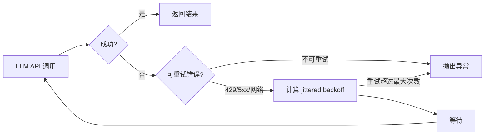
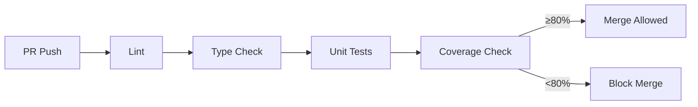
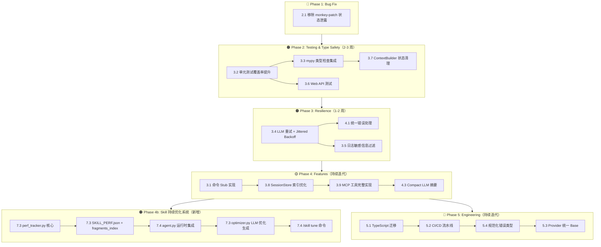
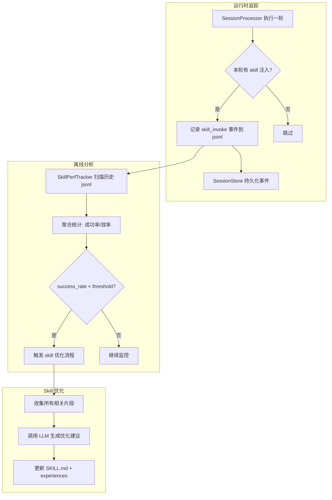
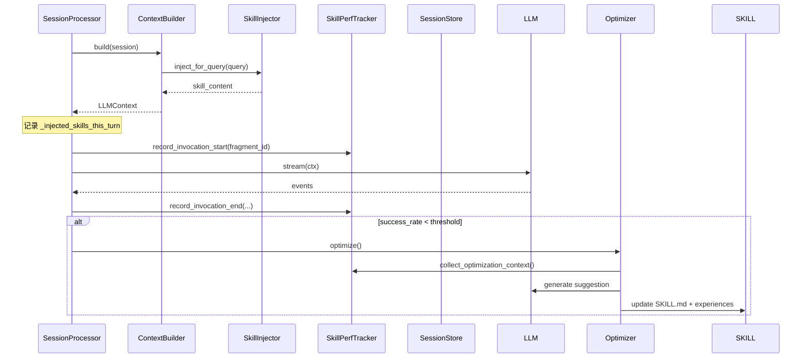

# Auton 优化目标文档

> 参考 hermes-agent（https://github.com/nousresearch/hermes-agent）最佳实践，结合 Auton 当前代码状态编写
>
> 最后更新：2026-04-09（已移除 2.1 重复渲染、2.2 IME 修复两项已完成条目）

---

## 一、现状总览

### 1.1 项目结构

```
auton/
├── core/          ✅ 基础设施（config, events, logging, errors, snapshot）
├── agent/         ✅ 核心（agent.py SessionProcessor 主循环、session、session_store、context、message、policies、token_utils）
├── llm/           ✅ 接口层（base、anthropic、minimax provider）
├── tools/         ✅ 工具系统（15+ 工具，registry 模式）
├── cli/           ✅ CLI 入口（main.py, typer）
├── commands/       ⚠️ 部分完整（compact, plan, help, model, config, session）
│                  🟡 部分为 Stub（memory, skills, cron, tasks, workflow, agents, mcp）
├── memory/        ⚠️ 子系统存在（chunking, global_memory, project_memory,
│                  memory_manager, session_summarizer, storage_utils...）
├── skills/        🟠 持续优化系统规划中（perf_tracker, optimizer 待实现）
│                  ⚠️ 子系统存在（loader, registry, injector, checker...）
├── task/          ⚠️ 子系统存在（manager, runner, store）
├── workflow/      ⚠️ 子系统存在（dsl, runner, store）
├── security/      ✅ 基础（audit, injection, key_manager, permission）
├── cron/          🟡 无独立实现（仅 commands/cron_cmd.py Stub）
├── web/           ⚠️ 基础可用（FastAPI + 原生 JS，缺失测试和类型）
└── tests/         ⚠️ 仅 27 个单元测试，核心模块无覆盖
```

### 1.2 当前问题分类

| 优先级 | 问题类别 | 数量 |
|--------|---------|------|
| 🔴 Critical | Bug（功能损坏） | 1 |
| 🟠 High | 功能缺失 / 架构缺陷 | 9 |
| 🟡 Medium | 代码质量 / 安全 | 7 |
| 🔵 Low | 工程化改进 | 5 |

---

## 二、🔴 Critical — 必须立即修复

### 2.1 `SessionProcessor` 状态泄露到 Web 层

**文件：** `auton/web/app.py` 第 243 行

**问题描述：**
Web 层通过 monkey-patch 私有属性来同步状态：

```python
processor._last_stored_msg_index = len(session.messages) - 1  # noqa: SLF001
```

这暴露了 `SessionProcessor` 内部实现细节，且 `run_stream()` 和 `run()` 的 `_last_stored_msg_index` 语义不同（一个是追加用户消息的索引，一个是追加所有消息的索引），容易出错。

**优化方案：**

```python
# 在 SessionProcessor.run_stream() 前调用，显式公开方法
processor.prepare_streaming_session(session)
```

```python
# SessionProcessor 新增方法
def prepare_streaming_session(self, session: Session) -> None:
    """Web 层专用：初始化流式会话状态"""
    self._last_stored_msg_index = len(session.messages) - 1
```

---

## 三、🟠 High — 功能缺失 / 架构缺陷

### 3.1 命令子系统存大量 Stub

**文件：** `auton/commands/memory_cmd.py`、`skill_cmd.py`、`cron_cmd.py`

**问题描述：**

| 命令 | 文件 | 状态 |
|------|------|------|
| `/memory` | `memory_cmd.py` | 🟡 Stub（仅有 `handle()` 返回 TODO） |
| `/skills` | `skill_cmd.py` | 🟡 Stub |
| `/cron` | `cron_cmd.py` | 🟡 Stub |
| `/tasks` | `tasks_cmd.py` | ✅ 已实现 |
| `/workflow` | `workflow_cmd.py` | ✅ 已实现 |
| `/agents` | `agents_cmd.py` | ✅ 已实现 |
| `/mcp` | `mcp_cmd.py` | ✅ 已实现 |

**参考 hermes-agent：** hermes-agent 的 cron 系统（`cron/` 目录）有完整实现，包含调度器、作业管理、日志输出。

**优化方案：**
```
优先级：/tasks > /workflow > /agents > /cron > /memory > /skills
建议按优先级逐个实现，每个命令独立 PR。
```

---

### 3.2 测试覆盖率严重不足

**现状：** 仅 27 个单元测试，无核心模块（agent、session、session_store、llm provider）测试。

**参考 hermes-agent：**

```python
# hermes-agent/tests/conftest.py
@pytest.fixture(autouse=True)
def _isolate_hermes_home(tmp_path, monkeypatch):
    """重定向 HERMES_HOME 到临时目录，测试永不写入 ~/.hermes/"""
    fake_home = tmp_path / "hermes_test"
    monkeypatch.setenv("HERMES_HOME", str(fake_home))

@pytest.fixture(autouse=True)
def _enforce_test_timeout():
    """30 秒超时强制终止"""
    if sys.platform != "win32":
        signal.alarm(30)
```

**待补充测试（按优先级）：**

```
auton/agent/session.py       → compact 逻辑、消息管理
auton/agent/session_store.py → append 正确性、base64 落盘、compact 事件
auton/agent/agent.py         → _decide、_handle_llm_event 单元测试
auton/agent/token_utils.py   → 新建文件，必须有测试
auton/llm/base.py            → Provider 抽象行为
auton/commands/compact.py    → 命令执行逻辑
auton/web/app.py             → API endpoint 测试（FastAPI TestClient）
auton/web/session_utils.py   → 辅助函数测试
```

**覆盖率目标：** 核心模块（agent/、llm/）≥ 80%，命令系统 ≥ 60%。

---

### 3.3 缺少 Type Checking（mypy）

**现状：** `pyproject.toml` 中 mypy 未配置，所有模块无类型检查。

**参考 hermes-agent：** 无显式 mypy 配置，但代码中类型注解完整。

**待修复类型错误（已发现）：**

```python
# auton/agent/context.py 第 15 行
from ..llm.base import LLMPProvider  # ← 拼写错误：LLMPProvider → LLMProvider

# auton/agent/agent.py 第 171 行
self.session.messages.pop(i)  # ← list.pop 修改了 list，属于可变操作
```

**优化方案：**
```bash
# pyproject.toml 新增
[tool.mypy]
python_version = "3.11"
warn_return_any = true
warn_unused_configs = true
disallow_untyped_defs = true
plugins = ["mypy_ asyncio"]

[tool.ruff.lint]
select = ["E", "F", "I", "N", "W", "UP", "B"]
ignore = ["E501"]  # line too long
```

---

### 3.4 无重试机制 / Jittered Backoff

**文件：** `auton/llm/anthropic_provider.py`、`auton/llm/minimax_provider.py`

**问题描述：**
LLM API 调用失败（如限流 429、网络错误）时无重试，直接抛异常。

**参考 hermes-agent（`agent/retry_utils.py`）：**

```python
def jittered_backoff(attempt, base_delay=5.0, max_delay=120.0, jitter_ratio=0.5):
    """ decorrelated exponential backoff — 并发重试风暴时防止雷鸣羊群效应"""
    delay = min(base_delay * (2 ** (attempt - 1)), max_delay)
    seed = (time.time_ns() ^ (tick * 0x9E3779B9)) & 0xFFFFFFFF
    jitter = rng.uniform(0, jitter_ratio * delay)
    return delay + jitter
```

**优化方案：**



---

### 3.5 日志无敏感信息过滤

**文件：** `auton/core/logging.py`

**问题描述：**
API Key、Token 等敏感信息可能写入日志文件。

**参考 hermes-agent（`agent/redact.py`）：**

```python
_PREFIX_PATTERNS = [
    r"sk-[A-Za-z0-9_-]{10,}",           # OpenAI / Anthropic
    r"claude-[A-Za-z0-9_-]{10,}",       # Claude keys
    r"github_pat_[A-Za-z0-9_]{10,}",    # GitHub PATs
    r"xox[baprs]-[A-Za-z0-9-]{10,}",    # Slack tokens
    # ... 30+ patterns
]

class RedactingFormatter(logging.Formatter):
    def format(self, record: LogRecord) -> str:
        return redact_sensitive_text(super().format(record))
```

**优化方案：**
1. 新建 `auton/core/redact.py`，实现 `redact_sensitive_text()`
2. `auton/core/logging.py` 的 `setup_logging()` 使用 `RedactingFormatter`
3. 支持日志文件加密压缩（Loguru `serialize=True` + gzip）

---

### 3.6 Web UI 缺失测试

**文件：** `auton/web/app.py`

**问题描述：**
`/api/chat/stream`、`/api/sessions/{id}` 等 endpoint 无任何测试。

**优化方案：**

```python
# tests/unit/test_web_app.py
from fastapi.testclient import TestClient
from auton.web.app import create_app

def test_chat_stream_returns_session_id():
    app = create_app()
    client = TestClient(app)
    response = client.post("/api/chat/stream", json={
        "message": "hello"
    })
    assert response.status_code == 200

def test_sidebar_project_mode():
    ...

def test_session_messages_replay():
    ...
```

**参考 hermes-agent：** `tests/conftest.py` 提供 `FakeLLMProvider`、`FakeTool` 等测试替身，避免真实 API 调用。

---

### 3.7 ContextBuilder 内部状态泄露

**文件：** `auton/agent/context.py`、`auton/agent/agent.py`

**问题描述：**
`ContextBuilder` 使用实例属性 `_system_stored` 记录是否已存储系统提示词，暴露给 `SessionProcessor` 直接修改：

```python
# auton/agent/agent.py 第 248-253 行
if ctx.system_prompt and not self._ctx_builder._system_stored:  # ← 访问私有属性
    self.session_store.append_system_message(...)
    self._ctx_builder._system_stored = True  # ← 直接修改私有状态
```

**参考 hermes-agent：** hermes-agent 的 context 构建完全无状态，每次调用 `build()` 返回新的 context dict。

**优化方案：**
```python
class ContextBuilder:
    def __init__(self, provider, tools):
        self._system_stored = False  # 保持私有

    def build(self, session, system_prompt="") -> LLMContext:
        # 内部逻辑：首次调用时标记，外部不再访问 _system_stored
        ...

    def reset(self) -> None:
        """重置 Builder 状态（用于新会话）"""
        self._system_stored = False
```

---

### 3.8 SessionStore 重复路径搜索逻辑

**文件：** `auton/agent/session_store.py`

**问题描述：**
两处搜索 session 路径逻辑重复：

1. **静态方法** `find_session_path()`（第 470–499 行）：搜索 `dates/` 和 `projects/`
2. **实例方法** `read_session_by_id()`（第 501–524 行）：调用 `session_memory_sources()` 再搜索

且 `session_memory_sources()` 每次调用都遍历目录，O(n) 复杂度。

**参考 hermes-agent：** hermes-agent 的 `hermes_state.py` 使用 `index.jsonl` 索引，查找为 O(1)。

**优化方案：**
```python
# SessionStore 新增索引方法
def build_index(self) -> dict[str, Path]:
    """建立 session_id → Path 的内存索引（启动时构建）"""
    index: dict[str, Path] = {}
    for sessions_dir in self.session_memory_sources():
        for p in sessions_dir.glob("*.jsonl"):
            session_id = p.stem
            index[session_id] = p
    return index

# 实例方法使用索引
_index_cache: dict[str, Path] | None = None

def read_session_by_id(self, session_id: str, *, scope="session") -> list[dict]:
    global _index_cache
    if _index_cache is None:
        _index_cache = self.build_index()
    path = _index_cache.get(session_id)
    if path:
        return self._read_session_file(path)
    return []
```

---

### 3.9 缺少 MCP 工具实现

**文件：** `auton/tools/mcp/__init__.py`

**问题描述：**
`MCPTool` 和 MCP 集成是 Stub，MCP 命令已注册但 `load_mcp_servers()`/`stop_mcp_servers()` 可能不完整。

**参考 hermes-agent：** hermes-agent 有完整的 `acp_adapter/` 目录实现 MCP 协议。

**优化方案：**
```
优先级：
1. 实现基础 MCP 工具执行（MCPTool.execute）
2. 实现 MCP server 生命周期管理（start/stop）
3. 实现 MCP 工具的 schema 动态注册
```

---

## 四、🟡 Medium — 代码质量 / 安全

### 4.1 Error Handling 不一致

**现状：**
- `SessionStore.append_event()` → bare `except Exception`
- `SessionProcessor._execute_tools()` → 捕获所有异常但只写字符串
- `LLMProvider.stream()` → 部分异常未处理
- Web API → bare `except Exception` 传回客户端

**参考 hermes-agent：** hermes-agent 所有 tool dispatch 捕获异常并返回 JSON error 格式：

```python
# hermes-agent tools/registry.py
def dispatch(self, name: str, args: dict) -> str:
    try:
        return entry.handler(args, **kwargs)
    except Exception as e:
        logger.exception("Tool %s dispatch error", name)
        return json.dumps({"error": f"Tool execution failed: {e}"})
```

**优化方案：**
统一错误处理策略：
- 工具层：异常 → JSON error string → 返回给 LLM
- API 层：异常 → 结构化 JSON 错误响应
- CLI 层：异常 → `rich` 红色面板展示

---

### 4.2 CLI REPL 代码重复

**文件：** `auton/cli/main.py`

**问题描述：**
`_run_repl()` 中有一段约 30 行代码与 `_run_stream_once()` 中的渲染逻辑几乎完全相同（`renderer.handle(event)` + `live.update(Panel(...))`）。

**优化方案：**

```python
async def _render_loop(processor: SessionProcessor, live) -> None:
    """REPL 和单次运行共用的事件渲染循环"""
    renderer = CLIRenderer()
    from auton.commands import CommandResult
    try:
        async for event in processor.run_stream():
            if not hasattr(event, "type"):
                continue
            if isinstance(event, CommandResult):
                live.update(Panel(Markdown(event.content), title="[command result]", border_style="green"))
                continue
            renderer.handle(event)
            live.update(Panel(Markdown(renderer.render()), title="Auton", border_style="blue"))
    except Exception as exc:
        live.update(Panel(f"[red]Error:[/red] {exc}", title="[error]", border_style="red"))
```

---

### 4.3 Compact 摘要质量不足

**文件：** `auton/agent/session.py`

**问题描述：**
当前 compact 摘要仅为 `[role] text[:120]` 的简单拼接，无 LLM 参与，质量较低。

**参考 hermes-agent：** hermes-agent 的 session 压缩使用 LLM 生成结构化摘要。

**优化方案：**

```mermaid
flowchart TD
    A[compact 触发] --> B[收集待压缩消息]
    B --> C[调用 LLM 生成结构化摘要]
    C --> D[摘要格式：JSON\n{summary, topics, key_decisions, pending_tasks}]
    D --> E[替换为 LLM 摘要消息]
    E --> F[继续对话]
```

---

### 4.4 缺少凭据池化 / 多 API Key 支持

**文件：** `auton/llm/`（当前每个 Provider 仅持有一个 API Key）

**参考 hermes-agent（`agent/credential_pool.py`）：**

```python
@dataclass
class PooledCredential:
    provider: str
    id: str
    label: str
    auth_type: str  # oauth or api_key
    access_token: str
    # ... 状态跟踪、超时冷却

# 策略：fill_first / round_robin / random / least_used
# HTTP 429 时自动标记 exhausted，进入冷却
```

**现状：** Auton 当前无此需求，但若服务同时使用多个 LLM Provider 则需要。

**优化方案：** 低优先级，若未来需要多 Provider 负载均衡再实现。

---

### 4.5 缺少 Supply Chain 安全扫描

**文件：** `.github/workflows/`

**参考 hermes-agent（`.github/workflows/supply-chain-audit.yml`）：**
扫描 PR diff 中的：
- `.pth` 文件（Python 路径注入）
- `base64 + exec` 模式（编码命令执行）
- `subprocess` 调用含编码参数

**现状：** Auton 无任何 GitHub Actions CI。

**优化方案：**
```yaml
# .github/workflows/ci.yml
- name: Lint & Type Check
  run: |
    ruff check auton/
    mypy auton/ --no-error-summary

- name: Supply Chain Audit
  run: |
    # 扫描恶意模式
```

---

### 4.6 依赖版本未完全 Pin

**文件：** `pyproject.toml`

**现状：** 部分依赖无版本约束。

**优化方案：**

```toml
[project.optional-dependencies]
dev = [
    "pytest>=8.0",
    "pytest-asyncio>=0.23",
    "pytest-cov>=4.1",
    "ruff>=0.4",
    "mypy>=1.9",
    "httpx>=0.27",  # FastAPI TestClient
]
```

---

### 4.7 插件 Hook 系统缺失

**参考 hermes-agent：** `hermes_cli/plugins.py` 实现了完整的插件生命周期：

```python
VALID_HOOKS: Set[str] = {
    "pre_tool_call", "post_tool_call",
    "pre_llm_call", "post_llm_call",
    "on_session_start", "on_session_end", ...
}
```

**现状：** Auton `auton/plugins/` 目录存在但可能为空。

**优化方案：** 低优先级，在有实际插件需求时再实现。

---

## 五、🔵 Low — 工程化改进

### 5.1 Web 前端升级为 TypeScript

**文件：** `auton/web/static/app.js`

**现状：** 300+ 行原生 JavaScript，无类型，无测试。

**目标：** 迁移到 TypeScript，添加类型定义，提升可维护性。

---

### 5.2 添加 CI/CD 流水线

**文件：** `.github/workflows/`

**目标流水线：**



---

### 5.3 LLM Provider 统一 Base Class

**文件：** `auton/llm/base.py`、`anthropic_provider.py`、`minimax_provider.py`

**现状：** Provider 实现分散，部分逻辑（如 retry、错误处理）未抽象。

---

### 5.4 规范化错误类型

**文件：** `auton/core/errors.py`

**现状：** 部分地方直接抛 `Exception`，无结构化错误类型。

**目标：** 建立错误层次：
```
AutonError (base)
├── ConfigurationError
├── ToolExecutionError
├── LLMProviderError
├── SessionStoreError
└── SecurityError
```

---

### 5.5 配置热加载支持

**文件：** `auton/core/config.py`

**现状：** `get_config()` 读取一次后缓存全局变量，修改 `~/.auton/config.yaml` 后需要重启。

**参考 hermes-agent：** 支持配置文件热重载。

---

## 六、优化路线图



---

## 七、🟠 Skill 持续优化系统（新增）

> **目标：** 为每个 Skill 建立完整的性能追踪体系，在成功率/效率低于阈值时自动触发优化流程。

### 7.1 背景与设计思路

**现状：**
- `SkillCreator` 能创建 skill，但创建后无性能反馈
- `experiences/README.md` 依赖人工追加，无法自动积累
- 无法量化某个 skill 实际好不好用、成功率高不高

**参考 hermes-agent：** hermes-agent 的 `skills/` 目录已有 `experiences/` 模板，但无自动追踪机制。

**核心设计：**



---

### 7.2 核心数据结构

#### 7.2.1 Skill 性能元数据文件（`SKILL_PERF.json`）

**路径：** 每个 skill 目录下：`~/.auton/skills/<skill-name>/SKILL_PERF.json`

```json
{
  "skill_name": "python-debug",
  "created_at": "2026-04-01T10:00:00Z",
  "updated_at": "2026-04-09T18:30:00Z",
  "thresholds": {
    "success_rate_min": 0.70,
    "avg_tool_calls_max": 15,
    "avg_turns_max": 5
  },
  "cumulative": {
    "total_invocations": 47,
    "successful_invocations": 38,
    "failed_invocations": 9,
    "success_rate": 0.809,
    "avg_tool_calls": 8.3,
    "avg_turns": 2.1,
    "avg_duration_ms": 12400,
    "last_invocation": "2026-04-09T18:20:00Z"
  },
  "window_7d": {
    "total_invocations": 12,
    "successful_invocations": 9,
    "success_rate": 0.750,
    "avg_tool_calls": 9.1,
    "avg_turns": 2.4,
    "alert_triggered": false
  },
  "alert": {
    "enabled": true,
    "last_alert_at": null,
    "alert_count": 0
  }
}
```

#### 7.2.2 Skill 调用片段事件（写入 session jsonl）

在现有 `session_store.py` 的 `append_event()` 基础上，新增事件类型：

```json
// skill_invoke_start — skill 被注入 context 时
{
  "type": "skill_invoke_start",
  "session_id": "abc123",
  "skill_name": "python-debug",
  "skill_path": "~/.auton/skills/python-debug",
  "trigger": "auto | manual",       // auto: LLM 推理自动触发, manual: 用户显式调用
  "query": "帮我调试这个 Python 函数",
  "turn_index": 5,
  "timestamp": 1712659200.123
}

// skill_invoke_end — 本轮 skill 调用结束
{
  "type": "skill_invoke_end",
  "session_id": "abc123",
  "skill_name": "python-debug",
  "success": true,
  "tool_calls_count": 7,
  "llm_turns": 2,
  "duration_ms": 8500,
  "error_message": null,
  "fragment_id": "abc123-5-0",      // session_id-turn_index-invoke_index
  "timestamp": 1712659208.623
}

// skill_fragment — 本轮 session 片段（引用 skill）
// 在 compact 时保存原始片段，不被压缩丢失
{
  "type": "skill_fragment",
  "session_id": "abc123",
  "fragment_id": "abc123-5-0",
  "skill_name": "python-debug",
  "trigger": "auto",
  "query": "帮我调试这个 Python 函数",
  "messages": [...],                 // 完整消息列表（用于 LLM 优化分析）
  "outcome": {
    "success": true,
    "tool_calls_count": 7,
    "llm_turns": 2,
    "duration_ms": 8500,
    "error_message": null
  },
  "timestamp": 1712659200.123
}
```

#### 7.2.3 片段引用索引文件（`fragments_index.jsonl`）

**路径：** `~/.auton/skills/<skill-name>/fragments_index.jsonl`

每积累一个片段追加一行，compact 时追加不移除：

```
{"fragment_id":"abc123-5-0","session_id":"abc123","timestamp":1712659200,"success":true,"path":"~/.auton/memory/dates/2026-04-09/sessions/abc123.jsonl","line_start":42,"line_end":89}
{"fragment_id":"def456-3-0","session_id":"def456","timestamp":1712572800,"success":false,"path":"~/.auton/memory/dates/2026-04-08/sessions/def456.jsonl","line_start":15,"line_end":41}
```

---

### 7.3 新增模块设计

#### 7.3.1 `auton/skills/perf_tracker.py`

```python
"""Skills Performance Tracker — 追踪、分析、优化"""

from __future__ import annotations

import json
import time
from dataclasses import asdict, dataclass
from datetime import datetime, timedelta
from pathlib import Path

from loguru import logger

from .types import Skill


@dataclass
class SkillPerfRecord:
    """单次调用记录（从 jsonl 解析）"""
    fragment_id: str
    session_id: str
    skill_name: str
    trigger: str  # "auto" | "manual"
    query: str
    tool_calls_count: int
    llm_turns: int
    duration_ms: float
    success: bool
    error_message: str | None
    timestamp: float
    session_path: Path | None = None  # jsonl 文件路径（compact 后定位用）
    line_start: int = 0
    line_end: int = 0


@dataclass
class SkillPerfStats:
    """聚合统计数据"""
    total_invocations: int
    successful_invocations: int
    failed_invocations: int
    success_rate: float
    avg_tool_calls: float
    avg_turns: float
    avg_duration_ms: float
    last_invocation: str | None


@dataclass
class SkillPerfConfig:
    """阈值配置"""
    success_rate_min: float = 0.70
    avg_tool_calls_max: float = 15.0
    avg_turns_max: float = 5.0


class SkillPerfTracker:
    """Skill 性能追踪器"""

    PERF_FILE = "SKILL_PERF.json"
    FRAGMENTS_INDEX = "fragments_index.jsonl"

    def __init__(self, skill: Skill) -> None:
        self.skill = skill
        self._perf_path = skill.skill_dir / self.PERF_FILE
        self._fragments_path = skill.skill_dir / self.FRAGMENTS_INDEX
        self._logger = logger.bind(name="SkillPerfTracker", skill=skill.name)
        self._ensure_init()

    def _ensure_init(self) -> None:
        """确保 SKILL_PERF.json 存在（首次创建时）"""
        if not self._perf_path.exists():
            self._perf_path.write_text(
                json.dumps(asdict(self._default_perf()), indent=2, ensure_ascii=False),
                encoding="utf-8",
            )

    def _default_perf(self) -> _PerfData:
        return _PerfData(
            skill_name=self.skill.name,
            created_at=datetime.utcnow().isoformat() + "Z",
            updated_at=datetime.utcnow().isoformat() + "Z",
            thresholds={"success_rate_min": 0.70, "avg_tool_calls_max": 15, "avg_turns_max": 5},
            cumulative={"total_invocations": 0, "successful_invocations": 0,
                        "failed_invocations": 0, "success_rate": 0.0,
                        "avg_tool_calls": 0.0, "avg_turns": 0.0, "avg_duration_ms": 0.0,
                        "last_invocation": None},
            window_7d={"total_invocations": 0, "successful_invocations": 0,
                       "success_rate": 0.0, "avg_tool_calls": 0.0, "avg_turns": 0.0,
                       "alert_triggered": False},
            alert={"enabled": True, "last_alert_at": None, "alert_count": 0},
        )

    # ─── 运行时记录 ──────────────────────────────────────────────────

    def record_invocation_start(
        self,
        trigger: str,
        query: str,
        turn_index: int,
    ) -> str:
        """SessionProcessor 在 skill 注入时调用，返回 fragment_id"""
        self._logger.debug("skill {n} invoked (trigger={t})", n=self.skill.name, t=trigger)
        return f"{self.skill.name}-{turn_index}-{int(time.time() * 1000)}"

    def record_invocation_end(
        self,
        fragment_id: str,
        session_id: str,
        turn_index: int,
        tool_calls_count: int,
        llm_turns: int,
        duration_ms: float,
        success: bool,
        error_message: str | None,
        session_path: Path | None,
        line_start: int,
        line_end: int,
    ) -> None:
        """SessionProcessor 在一轮结束时调用，持久化到 SKILL_PERF.json 和 fragments_index.jsonl"""
        self._update_cumulative(success, tool_calls_count, llm_turns, duration_ms)
        self._update_window_7d(success, tool_calls_count, llm_turns)
        self._append_fragment_index(
            fragment_id, session_id, success,
            session_path, line_start, line_end,
        )
        self._check_alert()

    # ─── 聚合统计 ──────────────────────────────────────────────────────

    def get_stats(self, window: str = "cumulative") -> SkillPerfStats:
        ...

    def get_fragments(self, limit: int = 50, successful_only: bool = False) -> list[SkillPerfRecord]:
        """读取 fragments_index.jsonl，返回历史片段列表"""
        ...

    # ─── 优化触发 ──────────────────────────────────────────────────────

    def should_optimize(self) -> tuple[bool, str]:
        """判断是否需要触发优化

        Returns:
            (should_optimize, reason)
        """
        ...

    def collect_optimization_context(
        self,
        successful_fragments_limit: int = 10,
        failed_fragments_limit: int = 10,
    ) -> str:
        """收集用于 LLM 优化的上下文（成功/失败片段）
        """
        ...

    # ─── 内部 ──────────────────────────────────────────────────────────

    def _update_cumulative(self, success, tool_calls, turns, duration_ms) -> None:
        ...

    def _update_window_7d(self, success, tool_calls, turns) -> None:
        ...

    def _append_fragment_index(self, ...) -> None:
        ...

    def _check_alert(self) -> None:
        ...


@dataclass
class _PerfData:
    """SKILL_PERF.json 内存结构"""
    skill_name: str
    created_at: str
    updated_at: str
    thresholds: dict
    cumulative: dict
    window_7d: dict
    alert: dict


def skill_perf_tracker(skill_name: str) -> SkillPerfTracker | None:
    """从 skill name 获取 tracker 实例（需先通过 registry 找到 skill）"""
    ...
```

#### 7.3.2 `auton/skills/optimizer.py`（新增）

```python
"""Skills Optimizer — 基于追踪数据自动优化 Skill"""

class SkillOptimizer:
    """Skill 持续优化器"""

    def __init__(self, tracker: SkillPerfTracker, llm: LLMProvider) -> None:
        self.tracker = tracker
        self.llm = llm
        self._logger = logger.bind(name="SkillOptimizer", skill=tracker.skill.name)

    async def optimize(self) -> "OptimizationResult":
        """执行完整优化流程

        1. 收集优化上下文（成功片段 + 失败片段）
        2. 调用 LLM 生成优化建议
        3. 更新 SKILL.md
        4. 追加 experiences 条目
        """
        ...

    async def _generate_suggestion(self, context: str) -> str:
        """调用 LLM 生成优化建议"""
        ...
```

---

### 7.4 SessionProcessor 集成点

在 `agent/agent.py` 的 `_execute_tools()` 前后记录 skill 调用：

```python
# agent/agent.py — 新增方法
def _record_skill_invocation(self, fragment_id: str, trigger: str, query: str, turn_index: int) -> None:
    """在 skill 注入时调用（ContextBuilder._inject_skills 调用后）"""
    for skill_name in self._injected_skills_this_turn:
        tracker = skill_perf_tracker(skill_name)
        if tracker:
            tracker.record_invocation_start(trigger, query, turn_index)

def _record_skill_completion(
    self,
    fragment_id: str,
    success: bool,
    tool_calls_count: int,
    duration_ms: float,
    error: str | None = None,
) -> None:
    """一轮结束时调用，更新统计数据"""
    ...
```

在 `run_stream()` 的主循环中嵌入记录逻辑：



---

### 7.5 Skill 优化触发机制

#### 7.5.1 触发条件

```
触发优化 = OR(
    window_7d.success_rate < thresholds.success_rate_min,
    window_7d.avg_tool_calls > thresholds.avg_tool_calls_max,
    window_7d.avg_turns > thresholds.avg_turns_max
)
```

#### 7.5.2 阈值配置（`SKILL_PERF.json`）

用户可通过修改 `SKILL_PERF.json` 的 `thresholds` 字段自定义阈值：

```json
{
  "thresholds": {
    "success_rate_min": 0.70,
    "avg_tool_calls_max": 15,
    "avg_turns_max": 5
  }
}
```

#### 7.5.3 优化提示示例

```
## Skill python-debug 优化建议

基于最近 7 天的 12 次调用：
- 成功率 75%（9/12），低于 80% 阈值
- 平均工具调用 9.1 次，偏高
- 失败案例集中在「traceback 解析」场景

### 成功案例共性（9次）
...

### 失败案例问题（3次）
...

### 优化建议
1. 在 ## When to Use 中增加「优先检查日志文件」条目
2. 在 ## Common Commands 中增加 `grep -n "ERROR" logs/` 命令
3. experiences/ 新增「traceback 解析」专项经验
```

---

### 7.6 待修改文件清单

| 文件 | 操作 | 说明 |
|------|------|------|
| `auton/skills/perf_tracker.py` | **新增** | 性能追踪器核心类 |
| `auton/skills/optimizer.py` | **新增** | 基于 LLM 的 Skill 优化器 |
| `auton/skills/__init__.py` | 修改 | 导出 `SkillPerfTracker`, `SkillOptimizer` |
| `auton/skills/types.py` | 修改 | 新增 `SkillPerfConfig` dataclass |
| `auton/skills/skill_creator.py` | 修改 | 创建 Skill 时初始化 `SKILL_PERF.json` |
| `auton/agent/session_store.py` | 修改 | 新增 `append_skill_fragment()` 方法 |
| `auton/agent/agent.py` | 修改 | `run_stream()` 嵌入 skill 记录逻辑 |
| `auton/agent/context.py` | 修改 | `ContextBuilder` 暴露注入的 skill 列表 |
| `auton/cli/main.py` | 修改 | 新增 `/skill tune <name>` 命令手动触发优化 |
| `tests/unit/skills/` | **新增** | `test_perf_tracker.py`, `test_optimizer.py` |

---

### 7.7 路线图

```
Week 1: perf_tracker.py 核心 + SKILL_PERF.json 结构 + skill_creator 集成
Week 2: Session jsonl 事件写入 + agent.py 集成
Week 3: optimizer.py + LLM 优化生成 + experiences 自动追加
Week 4: /skill tune 命令 + 测试覆盖
```

---

### 7.8 与 hermes-agent 的对比

| 维度 | hermes-agent | Auton（本设计） |
|------|-------------|---------------|
| 性能追踪 | 无 | SKILL_PERF.json + fragments_index.jsonl |
| 自动优化 | experiences 模板（人工维护） | LLM 自动生成优化建议 |
| 触发机制 | 手动 | 阈值自动触发 + 手动命令 |
| 片段回放 | 无 | fragments_index 支持回放原始 session |
| 7 天窗口 | 无 | 短期窗口指标监控 |

---

## 八、hermes-agent 最佳实践速查

| 模式 | hermes-agent 位置 | 可应用到 Auton | 优先级 |
|------|------------------|---------------|--------|
| Secret redaction in logs | `agent/redact.py` | `auton/core/logging.py` | 🟠 High |
| Jittered backoff | `agent/retry_utils.py` | `auton/llm/base.py` | 🟠 High |
| Auto-isolated test fixtures | `tests/conftest.py` | `tests/conftest.py` | 🟠 High |
| Tool registry (import-time) | `tools/registry.py` | `auton/tools/registry.py` | ✅ 已有 |
| Plugin hook system | `hermes_cli/plugins.py` | `auton/plugins/` | 🔵 Low |
| Credential pool | `agent/credential_pool.py` | future | 🔵 Low |
| Supply chain audit | `.github/workflows/` | `.github/workflows/` | 🟡 Medium |
| SQLite write contention | `hermes_state.py` | `auton/agent/session_store.py` | 🟡 Medium |
| Centralized logging | `hermes_logging.py` | `auton/core/logging.py` | 🟠 High（增强） |
| Managed system detection | `hermes_cli/config.py` | N/A | 🔵 Low |
