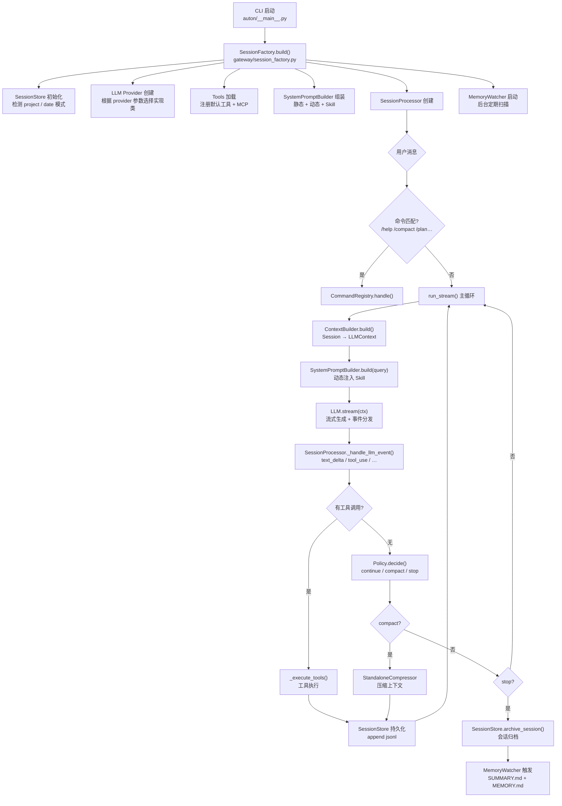
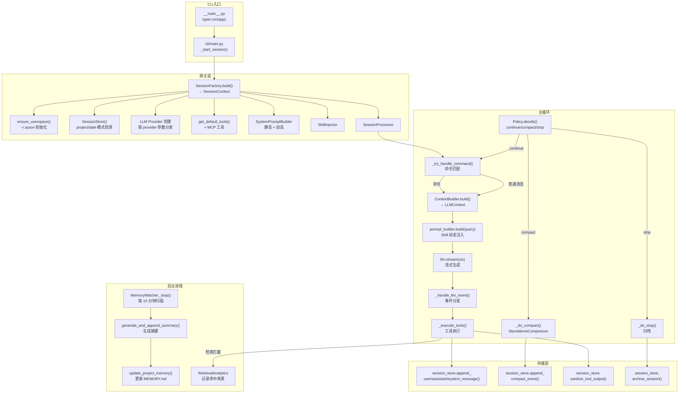
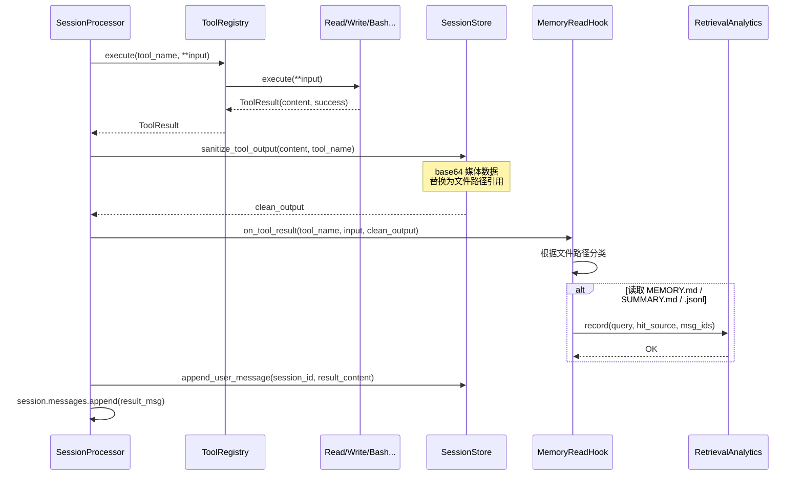
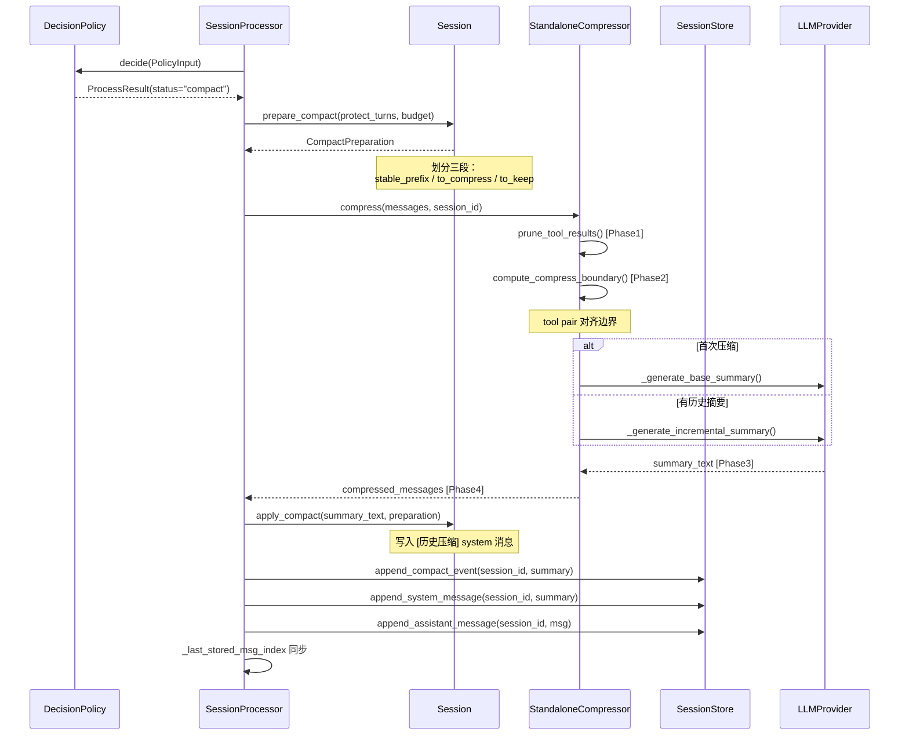
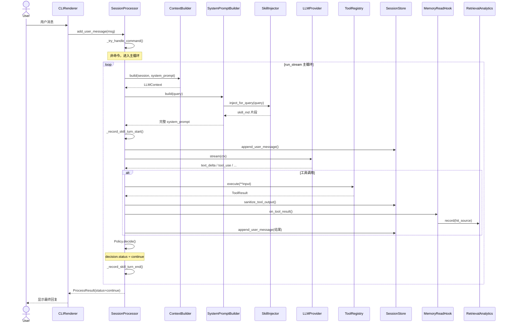
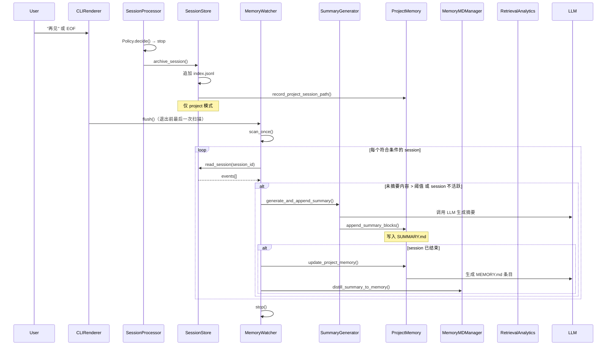
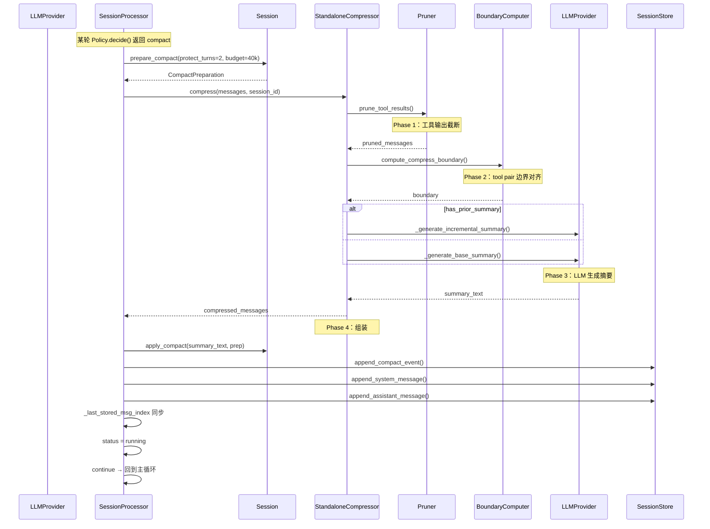

# Auton 项目执行文档

> 本文档描述 Auton 项目的完整执行逻辑、模块关系、代码调用流程和时序图。
> 目标读者：初中级工程师（可直接参考实现）

---

## 1. 系统概述

### 1.1 是什么

Auton 是一个基于大语言模型的自主 AI Agent，专注于软件工程任务。通过 CLI、Web、Discord、Slack 等多种适配器与用户交互，执行代码读写、命令运行、任务规划、多轮对话等能力。

### 1.2 核心目标

- **会话管理**：多轮对话，支持项目模式和日期模式
- **上下文压缩**：上下文超限时自动压缩（compact），避免 token 溢出
- **长期记忆**：session 结束后自动蒸馏为 SUMMARY.md 和 MEMORY.md，支持检索
- **技能注入**：根据 query 动态注入相关 Skill 到 system prompt
- **Subagent 调用**：按需调度代码审查、安全审查、TDD、架构审查等专项子代理

---

## 2. 模块一览

| 模块 | 目录 | 职责 |
|------|------|------|
| 入口适配层 | `adapters/` | CLI / Web / Discord / Slack / Feishu / WhatsApp |
| 网关工厂 | `gateway/` | SessionFactory 统一构建会话运行时 |
| Agent 核心 | `agent/` | SessionProcessor 主循环、Session 会话对象、SessionStore 存储 |
| LLM 层 | `llm/` | Provider 抽象接口 + 多 Provider 实现（Anthropic / OpenAI / DeepSeek 等） |
| 工具层 | `tools/` | Read / Write / Edit / Bash / Git / Glob / Grep / MCP / Browser 等 |
| Subagent 层 | `subagents/` | CodeReview / Security / TDD / Planner / Refactor 等专项子代理 |
| 记忆层 | `memory/` | 蒸馏、检索、冲突解决、遗忘 GC、摘要自学习 |
| 压缩层 | `compress/` | StandaloneCompressor 实时上下文压缩 |
| 技能层 | `skills/` | Skill 注册、加载、语义检索、注入 |
| 命令层 | `commands/` | /help /model /compact /plan /config /session 等内置命令 |
| 后台进程 | `heartbeat/` / `cron/` | 心跳监控 / 定时任务 |
| 安全层 | `security/` | 权限模型、注入检测、密钥管理 |
| 核心基础 | `core/` | 配置加载、事件总线、错误、日志、快照 |

---

## 3. 执行流程总览

### 3.1 整体执行流程



---

## 4. 核心模块详解

### 4.1 网关工厂 — SessionFactory

**文件**：`gateway/session_factory.py`

SessionFactory 是整个应用的入口协调者，所有适配器（CLI / Web / Bot）共享同一套构建逻辑。

```
SessionFactory.build() 执行顺序：

  1. ensure_userspace()        校验 ~/.auton 目录完整性
  2. SessionStore()            根据 session_mode 设置 project/date 模式
  3. Session.create()          创建新 Session（UUID）
  4. _create_llm()             按 provider 名称实例化对应 Provider
  5. get_default_tools()       加载内置工具 + Bash 权限模型
  6. _start_mcp()              启动 MCP server（如启用）
  7. EventBus()                事件总线
  8. SystemPromptBuilder       组装静态提示词 + 加载磁盘上下文
  9. UserspaceLoader           加载 ~/.auton/subagents / workflows
  10. SkillInjector            技能注入器（per-turn 动态注入）
  11. SessionProcessor          传入全部依赖，创建主循环实例

返回：SessionContext（processor / session / session_store / llm / event_bus / skill_injector）
```

**支持的 LLM Provider**：

| provider 参数 | 实现类 |
|-------------|--------|
| anthropic（默认） | `AnthropicProvider` |
| openai / gpt | `OpenAIProvider` |
| deepseek | `DeepSeekProvider` |
| qwen / dashscope | `QwenProvider` |
| doubao / ark | `DoubaoProvider` |
| kimi / moonshot | `KimiProvider` |
| gemini / google | `GeminiProvider` |
| openrouter | `OpenRouterProvider` |
| ollama | `OllamaProvider` |
| lm_studio | `LMStudioProvider` |
| vllm | `VLLMProvider` |
| minimax | `MiniMaxProvider` |

### 4.2 Agent 主循环 — SessionProcessor

**文件**：`agent/agent.py`

SessionProcessor 是 Agent 的核心，包含 `run()`（同步）和 `run_stream()`（流式）两种主循环入口。

#### run_stream() 主循环（流式，供 CLI 使用）

```
while True:
    ┌─ 1. 命令处理 ─────────────────────────────────────────────
    │  _try_handle_command()
    │    → CommandRegistry.match() 匹配 /help /compact /plan …
    │    → 命中则执行命令，返回 command handled
    │
    ├─ 2. 上下文构建 ───────────────────────────────────────────
    │  _query = _last_user_query()
    │  ctx = _ctx_builder.build(session, prompt_builder.build(_query))
    │  _memory_read_hook.set_current_query(_query)   # 记录当前 query
    │
    ├─ 3. 系统提示词持久化（仅首次） ───────────────────────────
    │
    ├─ 4. 消息持久化（user / system 新消息） ─────────────────
    │
    ├─ 5. Skill 追踪开始 ──────────────────────────────────────
    │  _record_skill_turn_start(query)
    │    → 每个 active_sills 记录 skill_invoke_start 事件
    │
    ├─ 6. LLM 流式生成 ───────────────────────────────────────
    │  assistant_msg = session.add_assistant_message()
    │  async for event in llm.stream(ctx):
    │      _handle_llm_event(event, assistant_msg)
    │      yield event  # 流向 CLI Renderer 渲染
    │
    ├─ 7. 工具执行 ────────────────────────────────────────────
    │  _execute_tools(assistant_msg)
    │    → tool.execute() → sanitize_tool_output()
    │    → memory_read_hook.on_tool_result()  # 检索命中分析
    │    → session.messages.append(结果消息)
    │    → session_store 持久化
    │
    ├─ 8. 决策 ────────────────────────────────────────────────
    │  decision = _decide()
    │    → Policy.decide(PolicyInput) → ProcessResult
    │
    ├─ 9. Skill 追踪结束 ──────────────────────────────────────
    │  （无工具执行 或 decision == stop 时）
    │
    ├─ 10. 决策路由 ───────────────────────────────────────────
    │  decision.status:
    │    "compact"  → _do_compact() → continue
    │    "stop"     → _do_stop() → return
    │    "continue" → 无工具执行则退出循环；有工具则 continue
    │
    └─ _turn_index++

```

### 4.3 会话对象 — Session

**文件**：`agent/session.py`

Session 管理单个会话的内存状态（消息列表、token 计数、compact 边界）。

```
Session 对象核心属性：
  - meta: SessionMeta (session_id, created_at, updated_at, project_path, step_count)
  - messages: list[Message]          # 内存中的消息列表
  - status: idle / running / compact
  - _token_count: int               # 当前上下文 token 数

Compact 边界计算（prepare_compact）：

  ┌─────────────────┬─────────────────────┬──────────────────┐
  │  stable_prefix  │  messages_to_compress │  messages_to_keep │
  │  (首条系统消息  │    待 LLM 摘要的中间段  │   最近 N 轮用户对话 │
  │   + 历史摘要)   │                      │   (默认保留 2 轮)  │
  └─────────────────┴─────────────────────┴──────────────────┘

  尾部 token 超预算时自动减少保留轮次
```

### 4.4 会话存储 — SessionStore

**文件**：`agent/session_store.py`

SessionStore 是 append-only 的 JSONL 存储引擎，遵循"存储与检索完全分离"原则。

```
存储路径：

  project 模式（检测到 .git/ 目录）：
    ~/.auton/memory/projects/<URL编码绝对路径>/
      sessions/<session_id>.jsonl   ← 对话日志（append only）
      memory/SUMMARY.md              ← 会话摘要
      memory/MEMORY.md               ← 长期记忆
      index.jsonl                    ← 所有 session 的索引

  date 模式（无 .git/ 目录）：
    ~/.auton/memory/dates/YYYY-MM-DD/
      sessions/<session_id>.jsonl
      memory/SUMMARY.md
      memory/MEMORY.md
      index.jsonl

append-only 原则：
  - 每个事件一行 jsonl，永不修改已有行
  - compact 时：compact 事件行 + 摘要行同时 append，不删除原行
  - base64 媒体数据：工具结果中的 base64 在落盘前替换为文件路径引用

事件类型：
  user-message / system / assistant /
  compact / skill_invoke_start / skill_invoke_end
```

### 4.5 上下文构建 — ContextBuilder

**文件**：`agent/context.py`

```
ContextBuilder.build(session, system_prompt) → LLMContext

  LLMContext:
    - session_id
    - messages: list[Message]      # session.messages
    - tools: list[dict]           # 工具 JSON Schema 列表
    - system_prompt: str          # 拼接后的系统提示词
    - model / max_tokens / temperature
```

### 4.6 系统提示词 — SystemPromptBuilder

**文件**：`agent/system_prompt.py`

系统提示词分三层：

```
┌─────────────────────────────────────────────────────────────┐
│ 静态层（会话初始化时确定）                                    │
│  - _IDENTITY_PROJECT / _IDENTITY_CHAT                      │
│  - _SYSTEM_RULES（工具使用规范 / 安全边界）                   │
│  - _MEMORY_RULES（记忆读取说明）                             │
│  - _SKILL_RULES（技能注入规范）                              │
│  - _COMPACTION_RULES（compact 说明）                        │
│  - _SUBAGENT_RULES（子代理规范）                             │
└─────────────────────────────────────────────────────────────┘
                           ↓ 动态拼装
┌─────────────────────────────────────────────────────────────┐
│ 动态层（每次 build(query) 时）                               │
│  - 运行环境（OS / CWD / Git 状态）                          │
│  - 记忆上下文（来自 MEMORY.md / SUMMARY.md）                  │
│  - 项目文档（CLAUDE.md / AUTON.md 等）                       │
└─────────────────────────────────────────────────────────────┘
                           ↓ per-turn 注入
┌─────────────────────────────────────────────────────────────┐
│ 注入层（SkillInjector.inject_for_query(query)）              │
│  - 从 SkillRegistry 语义检索 top-k 相关 Skill               │
│  - 截断至 MAX_SKILL_BODY_CHARS=3000                         │
└─────────────────────────────────────────────────────────────┘
```

### 4.7 决策策略 — DecisionPolicy

**文件**：`agent/policies.py`

```
Policy.decide(PolicyInput) → ProcessResult

决策逻辑（按优先级）：
  1. explicit_stop = True        → stop（用户要求停止）
  2. token_count >= 180k        → compact（压缩上下文）
  3. step_count >= 500          → stop（达到最大轮次）
  4. user_ask_mode == "ask"     → stop（等待用户确认）
  5. 其他                        → continue（继续）
```

---

## 5. 工具层

### 5.1 工具注册与调用

**文件**：`tools/base.py` / `tools/registry.py`

```
Tool 基类：
  - name: str              # 工具唯一名称
  - description: str       # 供 LLM 理解的描述
  - execute(**kwargs)      # 异步执行入口
  - schema()               # 返回 JSON Schema

内置工具（tools/）：
  Read / Write / Edit      # 文件读写编辑
  Glob / Grep              # 文件搜索
  Bash                      # 命令执行（含安全沙箱）
  Git                       # Git 操作
  HTTP                      # HTTP 请求
  TaskCreate / TaskGet / TaskList / TaskStop  # 任务管理
  AgentCreate / AgentList  # Subagent 创建
  Browser                   # 浏览器自动化
  WebFetch                  # 网页抓取
  WebSearch + 10 个 Provider # 搜索

工具执行流程（SessionProcessor._execute_tools）：
  1. tool = tools[name]
  2. result: ToolResult = await tool.execute(**input)
  3. clean_output = session_store.sanitize_tool_output(result.content)
  4. memory_read_hook.on_tool_result(tool_name, input, output)  # 检索分析
  5. 追加 [tool: name]\noutput 为 user message
```

---

## 6. Subagent 层

### 6.1 Subagent 架构

**文件**：`subagents/base.py`

所有 Subagent 继承 `BaseSubagent`（无状态工具类），通过 `run()` 方法执行。

```
subagents/ 目录结构：

  architect/           # 架构审查
    architecture_advisor.py
  code_review/         # 代码审查
    reviewer.py
  debugging/           # 调试辅助
    debugger.py
  delegator/           # 任务委托
    task_delegator.py
  planner/             # 规划器
    planner.py
  refactor/            # 重构清理
    refactor_cleaner.py
  security/            # 安全审查
    security_reviewer.py
  tdd/                 # TDD 驱动
    tdd_runner.py
  registry.py          # Subagent 注册表
  base.py              # 抽象基类
  types.py             # 数据类型
```

### 6.2 Subagent 调用方式

Subagent 不在 SessionProcessor 主循环中自动调用，而是通过 LLM 决策（当 system prompt 中包含 SUBAGENT_RULES 时，LLM 自行决定是否调用 `AgentCreate` / `AgentList` 工具），或由 `TaskDelegator` 子代理按任务类型分发。

---

## 7. 记忆层

### 7.1 记忆架构

**文件**：`memory/` 目录

```
memory/ 子模块：

  memory_manager.py       # 统一检索入口（detect_mode / retrieve / distill_session）
  memory_watcher.py       # 后台定期扫描（每 10 分钟）
  session_summarizer.py   # 从 jsonl 提取 block 并生成摘要
  summary_generator.py   # 调用 LLM 生成会话分段摘要
  summary_parser.py      # 解析 SUMMARY.md 的 msg_id 引用
  msg_id_assigner.py     # 将 jsonl 消息划分为语义连续的 MsgBlock
  project_memory.py       # 项目级存储读写（MEMORY.md / SUMMARY.md）
  global_memory.py        # 日期模式全局记忆
  memory_md.py            # MEMORY.md 解析与写入
  memory_generator.py    # 长期记忆生成
  memory_indexer.py       # BM25 索引构建
  keyword_store.py        # 关键词存储与检索
  memory_read_hook.py     # 工具层拦截，自动分类检索命中来源
  retrieval_analytics.py  # 检索命中率记录
  compression_improver.py # SUMMARY.md 自学习改进
  conflict_resolver.py    # 记忆冲突解决
  forgetting.py           # 遗忘 GC（过期记忆清理）
  chunking.py             # 分块策略
  types.py                # 核心数据结构
  config.py               # 记忆配置
  storage_utils.py        # 存储路径工具
```

### 7.2 记忆数据流

```
会话结束 → SessionStore.archive_session()
              ↓
         MemoryWatcher.scan_once()（后台每 10 分钟）
              ↓
         SessionSummarizer.summarize_from_store()
              ↓
         SummaryGenerator 生成摘要块
              ↓
         append_summary_blocks() → SUMMARY.md
              ↓
         MemoryMDManager.distill_summary_to_memory()
              ↓
         写入 / 更新 MEMORY.md

四层检索（MemoryManager.retrieve）：
  L0 BM25 → keyword_store.search()     # chunks.jsonl 关键词
  L1      → project_mem.read_memory()  # MEMORY.md 全文匹配
  L2      → project_mem.read_summary() # SUMMARY.md 块匹配
  L3      → session.jsonl              # 原始对话（按需降级）
```

### 7.3 检索命中率自学习

```
检索命中链路：
  query → agent 读取 MEMORY.md
            → MEMORY 能回答？（hit_source="memory"）
            → 不够 → agent 读取 SUMMARY.md
                      → SUMMARY 能回答？（hit_source="summary"）
                      → 不够 → agent 降级读 session.jsonl（hit_source="jsonl"）

MemoryReadHook 在工具层拦截：
  set_current_query(query)       # 每轮 LLM 调用前记录
  on_tool_result(tool, input, result)
    → 读 MEMORY.md  → record(hit_source="memory")
    → 读 SUMMARY.md → record(hit_source="summary")
    → 读 .jsonl     → record(hit_source="jsonl")

RetrievalAnalytics 持久化到 retrieval_records.jsonl
CompressionImprover 分析失败案例，生成改进 prompt（冷启动 <10 条用静态模板）
```

---

## 8. 压缩层 — StandaloneCompressor

**文件**：`compress/compressor.py`

StandaloneCompressor 是完全独立于主 agent 的压缩组件，可在任何地方直接使用。

```
压缩流程（4 阶段）：

  Phase 1: prune_tool_results()
           工具输出 pre-pass 截断（无 LLM，纯计算）

  Phase 2: compute_compress_boundary()
           计算压缩边界（tool pair 对齐）
           - protect_turns=2      保留最近 2 轮用户对话
           - tail_token_budget=40k 尾部 token 上限
           - has_prior_summary     是否有历史压缩摘要

  Phase 3: LLM 生成摘要
           - 首次压缩：_generate_base_summary()
           - 增量压缩：_generate_incremental_summary()

  Phase 4: 组装压缩后消息
           stable_prefix + 摘要 + messages_to_keep

防抖保护：
  compression_cooldown_seconds=60   # 上次压缩后 60 秒内不触发
  max_compressions_per_session=10 # 每个 session 最多 10 次

双阈值压缩触发（DecisionPolicy）：
  条件1：token_count >= 150,000
  条件2：token_count >= context_window * 60%
  任一满足 → decision.status = "compact"
```

---

## 9. 技能层 — Skills

### 9.1 技能注入流程

**文件**：`skills/injector.py`

```
SkillInjector.inject_for_query(query) → str（system prompt 片段）

流程：
  1. SkillSearcher.semantic_search(query, top_k=5)
     → 语义相似度排序
  2. 对每个 skill，截断 body 至 MAX_SKILL_BODY_CHARS=3000
  3. 拼接为 Skill Markdown 片段返回

SkillRegistry 全局单例（`skills/registry.py`）：
  - 加载 ~/.auton/skills/ 目录下的所有 .md 文件
  - 解析 frontmatter（name / description / trigger）
  - 按名称查找 / 按来源过滤 / 重新加载
```

### 9.2 Skill 结构

```yaml
---
name: tdd-guide
description: 测试驱动开发
trigger: [feature, test, bug fix]
---

# Skill Body
...
```

---

## 10. 命令层

### 10.1 命令注册表

**文件**：`commands/registry.py`

```
CommandRegistry.match(text) → (Command, args)

内置命令：
  /help      → HelpCommand       # 帮助
  /model     → ModelCommand     # 切换模型
  /compact   → CompactCommand    # 手动触发压缩
  /plan      → PlanCommand       # 规划
  /config    → ConfigCommand     # 配置管理
  /session   → SessionCommand    # 会话管理
  /memory    → MemoryCommand     # 记忆管理（M4）
  /skill     → SkillCommand      # 技能管理（M6）
  /workflow  → WorkflowCommand   # 工作流（M8）
  /tasks     → TasksCommand      # 任务管理
  /agents    → AgentsCommand     # Subagent 管理
  /cron      → CronCommand       # 定时任务
  /mcp       → MCPCmd            # MCP 服务器管理
  /security  → SecurityCommand   # 安全扫描
```

---

## 11. 代码调用流程图

### 11.1 完整调用链（CLI 启动 → 对话结束）



### 11.2 工具执行调用链



### 11.3 Compact 执行调用链



---

## 12. 执行时序图

### 12.1 单次对话时序（无 compact）



### 12.2 会话结束 + 记忆蒸馏时序



### 12.3 压缩触发时序



---

## 13. 数据结构

### 13.1 核心类型

```python
# agent/types.py
@dataclass
class SessionMeta:
    session_id: str
    created_at: datetime
    updated_at: datetime
    project_path: str | None
    step_count: int = 0
    compaction_count: int = 0

@dataclass
class LLMContext:
    session_id: str
    messages: list[Message]
    tools: list[dict]
    system_prompt: str
    model: str
    max_tokens: int
    temperature: float

@dataclass
class ProcessResult:
    status: Literal["continue", "compact", "stop"]
    reason: str = ""

# memory/types.py
@dataclass
class MemoryEntry:
    name: str
    type: MemoryType  # USER / FEEDBACK / PROJECT / REFERENCE
    description: str
    content: str
    created_at: datetime

@dataclass
class RetrievalResult:
    content: str
    source: str
    session_id: str | None = None
    block_index: int | None = None
    score: float = 0.0

# agent/session.py
@dataclass
class CompactPreparation:
    stable_prefix: list[Message]
    messages_to_compress: list[Message]
    messages_to_keep: list[Message]
    has_prior_summary: bool

@dataclass
class CompactResult:
    compacted_count: int
    summary_text: str
    compressed_message_ids: list[str]
    summary_message_id: str | None

# gateway/types.py
@dataclass
class SessionContext:
    processor: SessionProcessor
    session: Session
    session_store: SessionStore
    llm: LLMProvider
    event_bus: EventBus
    skill_injector: SkillInjector | None
    system_prompt: str
```

---

## 14. 存储结构

### 14.1 文件系统布局

```
~/.auton/                           ← 用户空间根目录（ensure_userspace 创建）
├── config.json                     ← 主配置文件
├── skills/                         ← 用户自定义技能
│   ├── tdd-guide.md
│   └── python-patterns.md
├── subagents/                      ← 用户自定义子代理
├── workflows/                     ← 工作流定义
└── memory/                        ← 记忆存储
    ├── projects/                  ← 项目模式
    │   └── <URL编码绝对路径>/
    │       ├── sessions/
    │       │   └── <session_id>.jsonl
    │       ├── memory/
    │       │   ├── SUMMARY.md
    │       │   ├── MEMORY.md
    │       │   ├── index.jsonl
    │       │   └── chunks.jsonl    ← BM25 索引数据
    │       └── tmp/                ← base64 媒体文件临时存储
    └── dates/                     ← 日期模式
        └── YYYY-MM-DD/
            ├── sessions/
            ├── memory/
            └── tmp/
```

### 14.2 session.jsonl 行格式

```jsonl
{"type": "user-message", "content": "...", "message_id": "uuid", "timestamp": 1234567890.0}
{"type": "system", "content": "..."}
{"role": "assistant", "parts": [...], "message_id": "uuid"}
{"type": "compact", "before_count": 50, "summary": "...", "compressed_message_ids": [...], "timestamp": ...}
{"type": "skill_invoke_start", "skill_name": "tdd", "fragment_id": "...", "query": "...", "timestamp": ...}
{"type": "skill_invoke_end", "skill_name": "tdd", "fragment_id": "...", "success": true, "duration_ms": 1234}
```

---

## 15. 配置参数表

| 配置项 | 默认值 | 说明 |
|--------|--------|------|
| `llm.provider` | anthropic | LLM 提供商 |
| `llm.model` | claude-sonnet-4-20250514 | 模型名称 |
| `llm.max_tokens` | 8192 | 最大输出 token |
| `llm.temperature` | 0.0 | 生成温度 |
| `memory.storage_dir` | ~/.auton/memory | 记忆存储目录 |
| `memory.chunk_size` | 500 | 分块大小（token） |
| `compact.protect_turns` | 2 | compact 时保留最近轮数 |
| `compact.tail_token_budget` | 40,000 | 尾部保留 token 上限 |
| `compact.absolute_threshold` | 150,000 | 压缩绝对阈值（token） |
| `compact.percent_threshold` | 0.60 | 压缩比例阈值 |
| `policy.max_turns` | 500 | 最大对话轮次 |
| `skill_injector.top_k` | 5 | 每轮注入 skill 数量上限 |
| `skill_injector.max_body_chars` | 3000 | skill body 最大字符数 |
| `watcher.scan_interval` | 600s | 记忆扫描间隔 |
| `watcher.unsummarized_threshold` | 200,000 chars | 中途触发摘要阈值 |
| `watcher.inactivity_seconds` | 600s | 视为 session 结束的空闲时间 |
| `retrieval_analytics.min_queries` | 10 | 自学习冷启动阈值 |

---

## 16. 模块依赖图

```mermaid
graph TD
    subgraph 接入层
        CLI["CLI Adapter<br/>adapters/cli/main.py"]
        WEB["Web Adapter<br/>adapters/web/app.py"]
        DISCORD["Discord Adapter"]
        SLACK["Slack Adapter"]
    end

    subgraph 核心
        SF["SessionFactory<br/>gateway/session_factory.py"]
        SP["SessionProcessor<br/>agent/agent.py"]
        SS["SessionStore<br/>agent/session_store.py"]
        SC["Session<br/>agent/session.py"]
        CB["ContextBuilder<br/>agent/context.py"]
        PB["SystemPromptBuilder<br/>agent/system_prompt.py"]
        Policy["DecisionPolicy<br/>agent/policies.py"]
    end

    subgraph LLM层
        LLM["LLMProvider (抽象)<br/>llm/base.py"]
        Providers["Anthropic / OpenAI /<br/>DeepSeek / Qwen / …<br/>llm/providers/"]
    end

    subgraph 工具层
        Tools["Tools (Read/Write/Bash…)<br/>tools/"]
        Registry["ToolRegistry<br/>tools/registry.py"]
        MCP["MCP Client<br/>tools/mcp/"]
    end

    subgraph 技能层
        Injector["SkillInjector<br/>skills/injector.py"]
        Registry2["SkillRegistry<br/>skills/registry.py"]
        Loader["SkillLoader<br/>skills/loader.py"]
    end

    subgraph 记忆层
        MM["MemoryManager<br/>memory/memory_manager.py"]
        MW["MemoryWatcher<br/>memory/memory_watcher.py"]
        Summ["SessionSummarizer<br/>memory/session_summarizer.py"]
        SummGen["SummaryGenerator<br/>memory/summary_generator.py"]
        PM["ProjectMemory<br/>memory/project_memory.py"]
        GM["GlobalMemory<br/>memory/global_memory.py"]
        Hook["MemoryReadHook<br/>memory/memory_read_hook.py"]
        RA["RetrievalAnalytics<br/>memory/retrieval_analytics.py"]
        CI["CompressionImprover<br/>memory/compression_improver.py"]
    end

    subgraph 压缩层
        Comp["StandaloneCompressor<br/>compress/compressor.py"]
        Prune["Pruner<br/>compress/pruner.py"]
        Bound["Boundary<br/>compress/boundary.py"]
        Config["CompressConfig<br/>compress/config.py"]
    end

    subgraph Subagent层
        SubBase["BaseSubagent<br/>subagents/base.py"]
        CR["CodeReview<br/>subagents/code_review/"]
        Sec["Security<br/>subagents/security/"]
        TDD["TDD<br/>subagents/tdd/"]
        Plan["Planner<br/>subagents/planner/"]
    end

    CLI & WEB & DISCORD & SLACK --> SF
    SF --> SP & SS & LLM & Tools & PB & Injector
    SP --> CB & Policy & SS & SC
    CB --> SC
    PB --> Injector
    Injector --> Registry2
    Registry2 --> Loader
    Policy --> Comp
    Comp --> Prune & Bound & Config
    Tools --> Registry
    Registry --> MCP
    SP --> MM
    MM --> MW & Summ & PM & GM & Hook & RA & CI
    MW --> Summ & SummGen
    Hook --> RA
    CI --> SummGen
    SP --> SubBase
    SubBase --> CR & Sec & TDD & Plan
```



---

## 17. 事件总线

**文件**：`core/events.py` / `core/event_types.py`

EventBus 是全局发布-订阅事件总线，用于解耦各模块间的通信。

```python
# 事件类型（core/event_types.py）
SessionStatusChangeEvent   # session 状态变化（idle / running / compact）
TextDeltaEvent             # LLM 文本增量
TextFinishEvent            # LLM 文本完成
ToolCallEvent             # 工具调用开始
ToolResultEvent           # 工具调用结果
ToolErrorEvent            # 工具执行错误
StepStartEvent            # 步骤开始
StepFinishEvent           # 步骤完成
SessionCompactEvent       # 压缩完成（before/after token 数）
```

CLIRenderer 订阅这些事件，实现流式渲染：
- `TextDeltaEvent` → 追加到渲染缓冲区
- `ToolCallEvent` → 显示 `[tool_name] ...`
- `ToolResultEvent` → 替换为实际输出（前 500 字符）
- `ToolErrorEvent` → 显示错误信息
