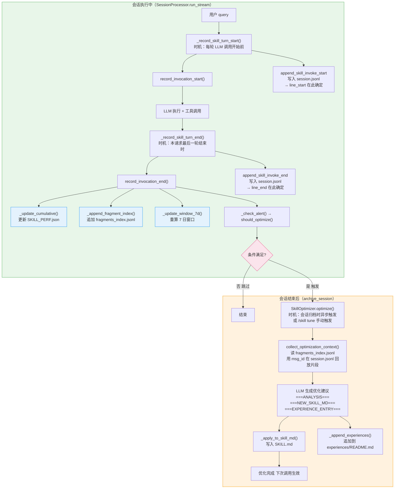
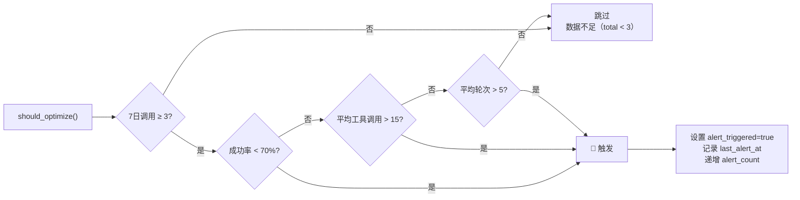
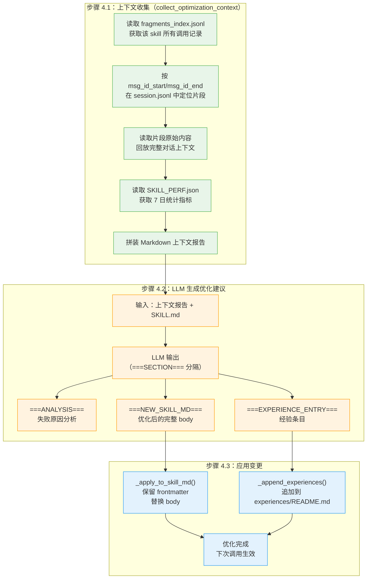
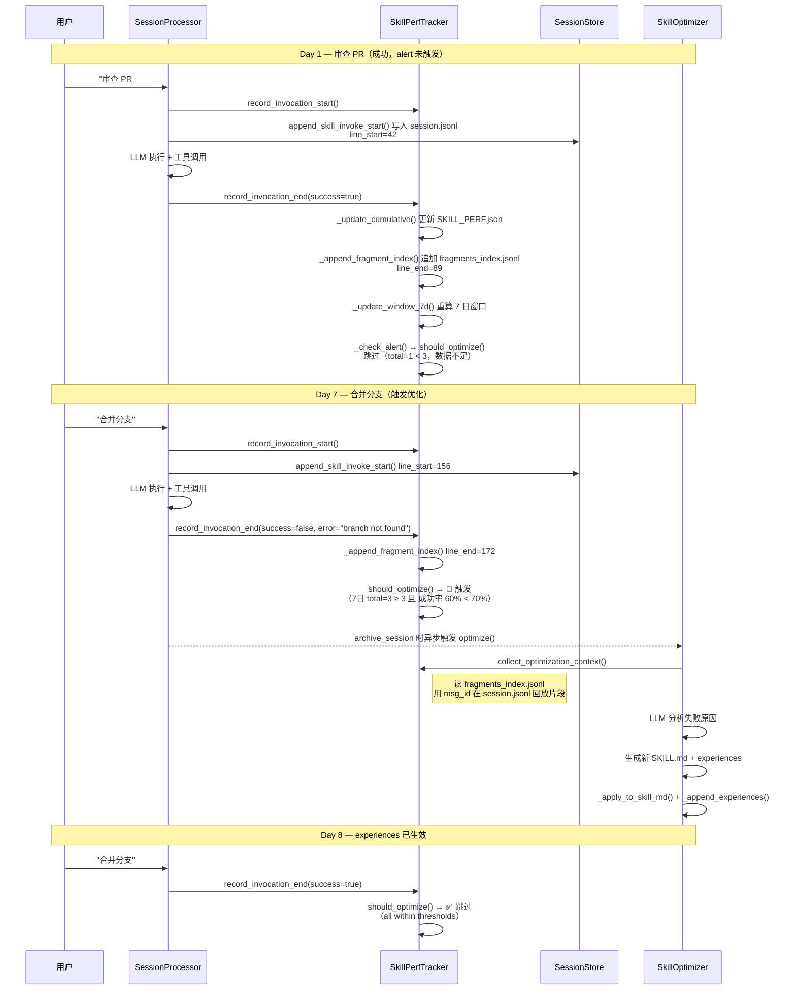

# Auton Skill 自动优化机制 — 完整逻辑说明

## 概述

Skill 优化是一个**数据驱动的持续改进系统**，由 `SkillPerfTracker` 和 `SkillOptimizer` 两个核心组件构成。在每次 Skill 调用**执行过程中**实时记录数据，会话**结束后**检查是否触发优化条件，满足时**异步执行** LLM 优化。

---

## 核心组件

| 组件 | 文件 | 职责 |
|------|------|------|
| `SkillPerfTracker` | `auton/skills/perf_tracker.py` | 执行中记录数据、会话后分析、上下文收集 |
| `SkillOptimizer` | `auton/skills/optimizer.py` | 异步执行 LLM 优化、分析片段回放 |
| `SkillPerfConfig` | `auton/skills/types.py` | 阈值配置定义 |
| `Skill` | `auton/skills/types.py` | Skill 内存表示 + experiences 读写 |

---

## 时间轴总览



**图例：**

- 绿色背景：会话执行中（实时）
- 橙色背景：会话结束后（异步）
- 蓝色背景：写文件操作
- 粉色背景：条件判断节点

---

## 触发时机详解

### ① 会话执行中（每轮 LLM 调用开始前）：Skill 注入开始

**时机**：`SessionProcessor.run_stream()` 主循环每轮 LLM 调用**开始前**，`_record_skill_turn_start()` 被调用。
**调用链**：`SessionProcessor._record_skill_turn_start()`

```python
def _record_skill_turn_start(self, query: str) -> None:
    session_id = self.session.meta.session_id
    msg_id_start = self._last_message_id()          # ← 记录此刻最后一条消息的 UUID
    for skill in self._active_skills:
        fragment_id = tracker.record_invocation_start(
            trigger="auto", query=query, turn_index=self._turn_index
        )
        self._skill_fragment_ids[skill.name] = (fragment_id, msg_id_start)
        self.session_store.append_skill_invoke_start(
            session_id=session_id, skill_name=skill.name,
            fragment_id=fragment_id, msg_id_start=msg_id_start, ...
        )
        # ↑ append_skill_invoke_start 内部写入 session.jsonl
        #   line_start = 写入前的行数 + 1（本次写入的行号）
```

同时写入 session.jsonl 事件 `skill_invoke_start`（含 `msg_id_start`）。

---

### ② 会话执行中（本轮 LLM 最后一轮结束时）：Skill 调用结束

**时机**：`SessionProcessor.run_stream()` 主循环中，工具链执行完毕后（`not tools_executed` 或 `decision.status == "stop"`），`_record_skill_turn_end()` 被调用。
**调用链**：`SessionProcessor._record_skill_turn_end()`

```python
def _record_skill_turn_end(self, success: bool, tool_calls: int) -> None:
    msg_id_end = self._last_message_id()            # ← 记录此刻最后一条消息的 UUID
    for skill in self._active_skills:
        fragment_id, msg_id_start = self._skill_fragment_ids.pop(skill.name)
        tracker.record_invocation_end(
            fragment_id=fragment_id, msg_id_start=msg_id_start,
            msg_id_end=msg_id_end, success=success, ...
        )
        self.session_store.append_skill_invoke_end(
            session_id=session_id, fragment_id=fragment_id,
            msg_id_end=msg_id_end, success=success, ...
        )
        # ↑ append_skill_invoke_end 内部写入 session.jsonl
        #   line_end = 写入前的行数 + 1（本次写入的行号）
```

`record_invocation_end()` 内部立即执行 4 个写操作（**均在会话执行中完成**）：

| 步骤 | 方法 | 写入文件 | 时机 |
|------|------|----------|------|
| 1. 更新全量统计 | `_update_cumulative()` | `SKILL_PERF.json` | `record_invocation_end()` 内立即执行 |
| 2. 追加调用记录 | `_append_fragment_index()` | `fragments_index.jsonl` | `record_invocation_end()` 内立即执行 |
| 3. 重算 7 日窗口 | `_update_window_7d()` | `SKILL_PERF.json` | `record_invocation_end()` 内立即执行 |
| 4. 检查告警条件 | `_check_alert()` | `SKILL_PERF.json` | `record_invocation_end()` 内立即执行 |

---

### ③ 会话执行中（本轮结束时）：条件检查

**时机**：`record_invocation_end()` 末尾，`_check_alert()` 内部调用 `should_optimize()`。
**判断条件**（满足任一即触发）：



**也可手动触发**（跳过条件检查）：
```bash
/skill tune <skill-name>   # 等价于 force=True
```

---

### ④ 会话结束后（archive_session 时）：异步执行优化

**时机**：会话归档（`SessionProcessor._do_stop()` → `session_store.archive_session()`）时，若 `alert_triggered == true`，异步任务触发 `SkillOptimizer.optimize()`；也可由用户手动 `/skill tune` 命令触发。
**调用链**：`SkillOptimizer.optimize()`



---

## 数据存储

每个 Skill 目录下维护两个数据文件：

```
~/.auton/skill/<skill-name>/
├── SKILL.md               # Skill 定义
├── SKILL_PERF.json        # 性能统计数据（每次调用结束时更新）
└── fragments_index.jsonl  # 调用片段索引（每次调用结束时追加）
```

### SKILL_PERF.json 结构

```json
{
  "skill_name": "github",
  "created_at": "2026-04-01T00:00:00Z",
  "updated_at": "2026-04-14T12:00:00Z",
  "thresholds": {
    "success_rate_min": 0.70,
    "avg_tool_calls_max": 15,
    "avg_turns_max": 5
  },
  "cumulative": {
    "total_invocations": 42,
    "successful_invocations": 35,
    "failed_invocations": 7,
    "success_rate": 0.833,
    "avg_tool_calls": 8.2,
    "avg_turns": 2.1,
    "avg_duration_ms": 5200.0,
    "last_invocation": "2026-04-14T12:00:00Z"
  },
  "window_7d": {
    "total_invocations": 15,
    "successful_invocations": 12,
    "success_rate": 0.80,
    "avg_tool_calls": 9.5,
    "avg_turns": 2.3,
    "alert_triggered": false
  },
  "alert": {
    "enabled": true,
    "last_alert_at": null,
    "alert_count": 0
  }
}
```

### fragments_index.jsonl 结构

每行一条调用记录（**每次 Skill 调用结束时 `record_invocation_end()` 内部 `_append_fragment_index()` 追加**）。

`line_start` / `line_end` 为 session.jsonl 中本次 skill 调用片段的起止行号（1-based），用于快速定位片段在 JSONL 文件中的精确位置。`msg_id_start` / `msg_id_end` 为对应消息的 UUID，指向消息内容本身，两种定位方式互补。

```jsonl
{"fragment_id": "github-3-1744003200000", "session_id": "abc123", "skill_name": "github",
 "trigger": "auto", "query": "帮我审查这个 PR", "tool_calls_count": 12, "llm_turns": 3,
 "duration_ms": 8500, "success": true, "error_message": null, "timestamp": 1744003200.0,
 "session_path": "~/.auton/memory/sessions/...", "line_start": 42, "line_end": 89,
 "msg_id_start": "a1b2c3d4-...", "msg_id_end": "e5f6g7h8-..."}
{"fragment_id": "github-5-1744004500000", "session_id": "def456", "skill_name": "github",
 "trigger": "manual", "query": "合并这个分支", "tool_calls_count": 5, "llm_turns": 1,
 "duration_ms": 2100, "success": false, "error_message": "branch not found",
 "timestamp": 1744004500.0, "session_path": "~/.auton/memory/sessions/...",
 "line_start": 102, "line_end": 118,
 "msg_id_start": "i9j0k1l2-...", "msg_id_end": "m3n4o5p6-..."}
```

| 字段 | 说明 | 何时写入 |
|------|------|----------|
| `fragment_id` | 唯一标识本次调用，由 `record_invocation_start()` 生成 | `record_invocation_start()` |
| `msg_id_start` | skill 调用片段在 session.jsonl 中的起始消息 UUID | `_record_skill_turn_start()` |
| `msg_id_end` | skill 调用片段在 session.jsonl 中的结束消息 UUID | `_record_skill_turn_end()` |
| `line_start` | skill 调用片段在 session.jsonl 中的起始行号（1-based） | `_record_skill_turn_start()` → `append_skill_invoke_start` 写入后的行号 |
| `line_end` | skill 调用片段在 session.jsonl 中的结束行号（1-based） | `_record_skill_turn_end()` → `append_skill_invoke_end` 写入后的行号 |
| `session_path` | session.jsonl 文件路径（用于片段回放定位） | `_record_skill_turn_end()` |

**`line_start` / `line_end` 获取方式**：`append_skill_invoke_start` / `append_skill_invoke_end` 在写入前调用 `f.tell()` 获取当前文件字节偏移量（若文件为空则从 0 开始），写入后再次 `f.tell()`，通过 `file_size / (avg_line_length + newline)` 估算行号；也可在追加后通过 `subprocess` 调用 `wc -l` 或直接计数文件行数。

---

## 默认阈值

| 指标 | 默认值 | 说明 |
|------|--------|------|
| `success_rate_min` | 0.70 (70%) | 7 日成功率下限 |
| `avg_tool_calls_max` | 15 | 7 日平均工具调用次数上限 |
| `avg_turns_max` | 5 | 7 日平均 LLM 轮次上限 |

---

## 动态阈值标定

**时机**：用户手动执行 `/skill tune --calibrate <name>` 时调用。

```python
async def calibrate_thresholds(llm, overhead_factor=1.2):
    # 1. 读取 SKILL.md 内容
    skill_content = self.skill.path.read_text()[:4000]
    # 2. LLM 评估典型任务的工具调用和轮次
    # 3. 阈值 = 估算值 × 1.2（允许 20% 超量）
    config.avg_tool_calls_max = round(est_tool_calls * 1.2, 1)
    config.avg_turns_max = round(est_turns * 1.2, 1)
```

---

## 渐进式优化原则

优化不是一次性大幅重写，而是**小步迭代**：

1. **保留 frontmatter**：只替换 body 部分
2. **追加经验条目**：每次优化追加一条到 `experiences/README.md`
3. **标签归类**：经验按 `#context`、`#workflow`、`#bug` 等分类
4. **数据驱动**：基于真实调用数据优化，不是假设

---

## 使用方式

| 命令 | 功能 | 时机 |
|------|------|------|
| 自动触发 | 每次 Skill 调用结束时 `should_optimize()` 检查，在 `record_invocation_end()` 内执行 | 会话执行中 |
| `/skill tune <name>` | 手动触发优化（跳过条件检查） | 任何时候 |

---

## 示例：完整生命周期



---

## 文件位置

| 文件 | 位置 | 说明 |
|------|------|------|
| `perf_tracker.py` | `auton/skills/perf_tracker.py` | 性能追踪器 |
| `optimizer.py` | `auton/skills/optimizer.py` | 优化器 |
| `types.py` | `auton/skills/types.py` | 类型定义和阈值配置 |
| `SKILL_PERF.json` | `~/.auton/skill/<name>/` | 性能数据（会话中更新） |
| `fragments_index.jsonl` | `~/.auton/skill/<name>/` | 调用索引（会话中追加） |
