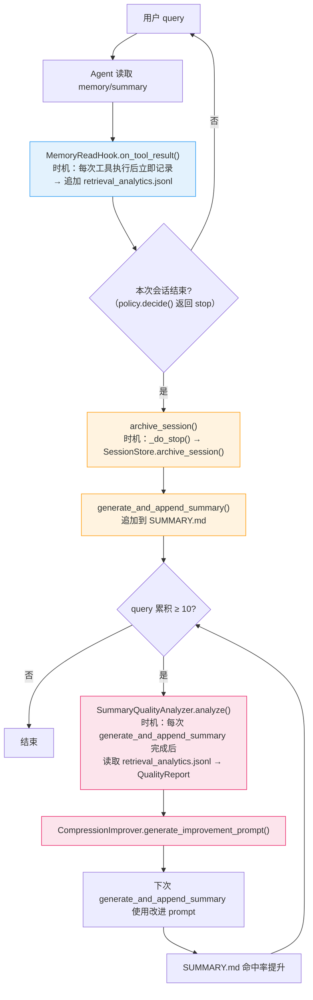
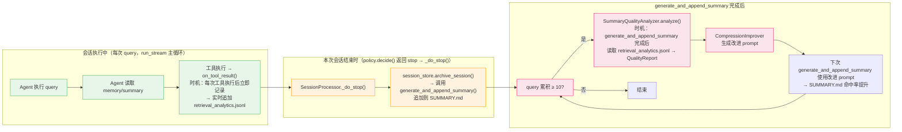
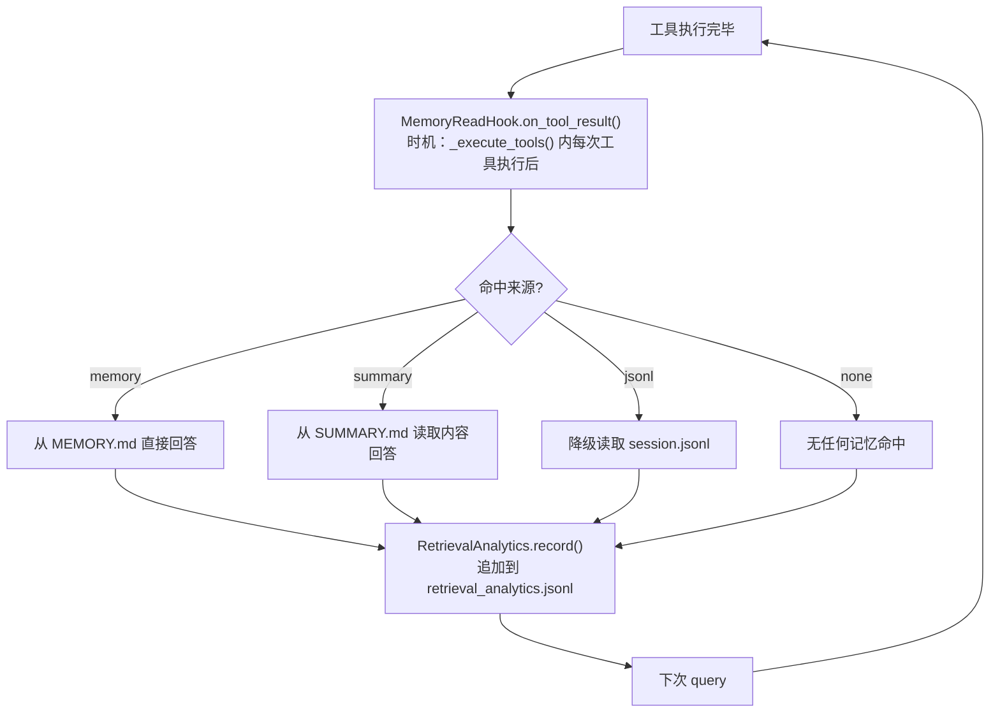
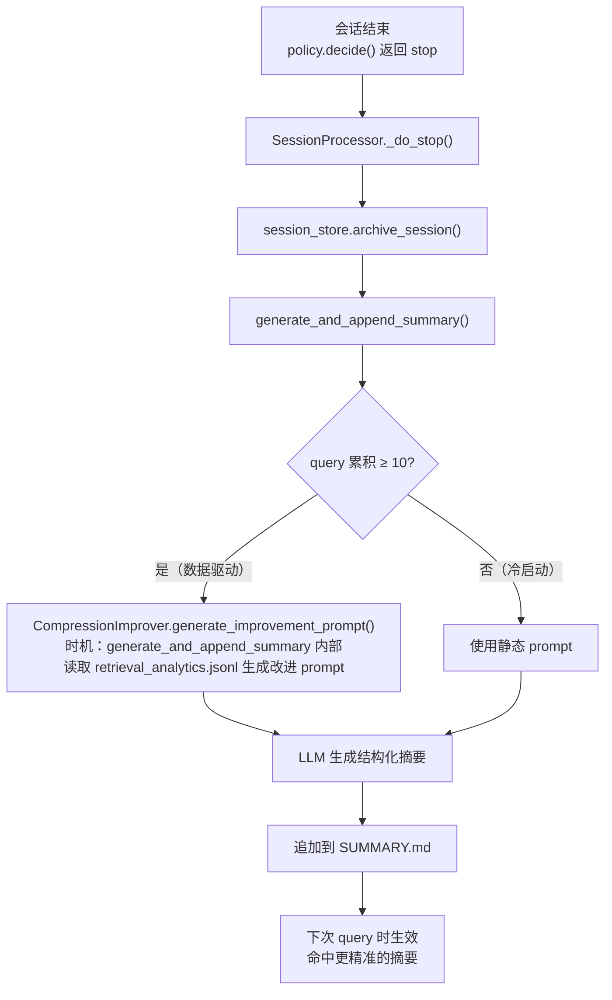
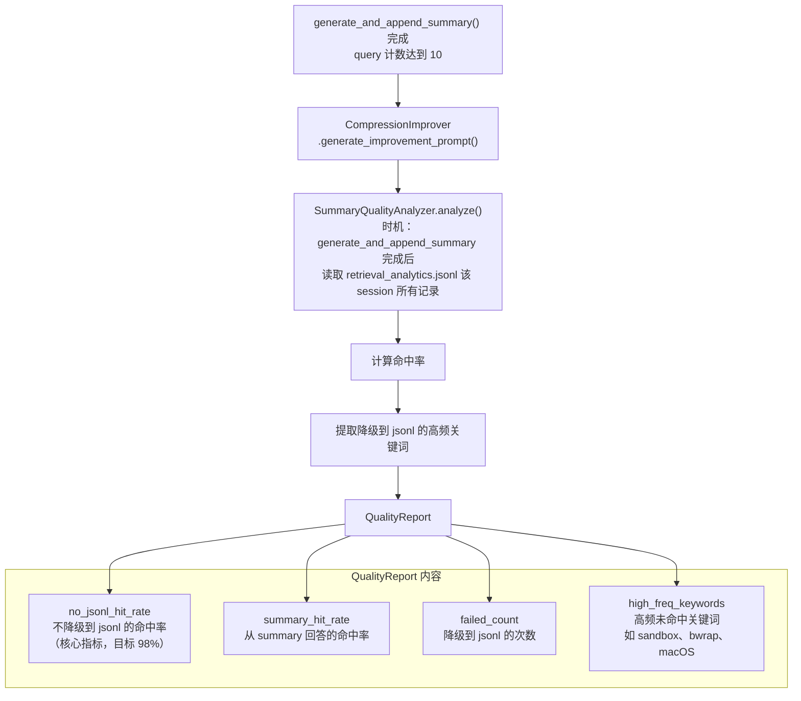
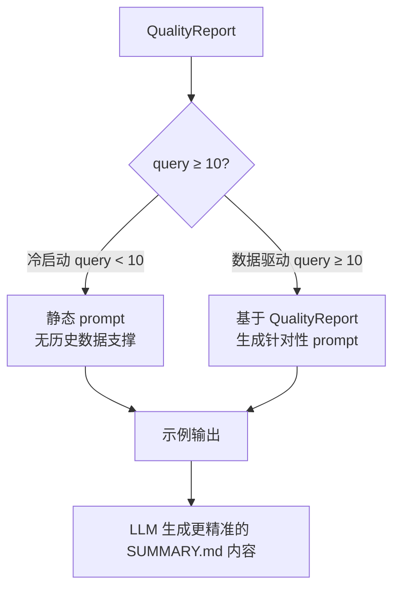
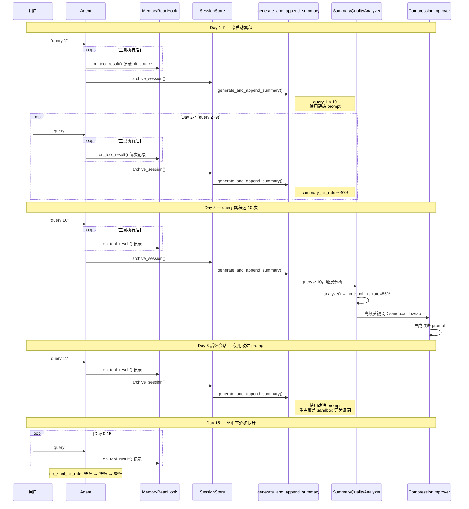

# Auton 会话摘要自动优化机制 — 完整逻辑说明

## 概述

会话摘要（SUMMARY.md）的质量通过**检索命中率驱动**的闭环系统持续自动优化：



**核心指标**：98% 的 query 应能在不读取原始 session.jsonl 的情况下回答。

---

## 核心组件

| 组件 | 文件 | 职责 |
|------|------|------|
| `MemoryReadHook` | `auton/memory/memory_read_hook.py` | 钩子：每次工具执行后记录命中来源 |
| `RetrievalAnalytics` | `auton/memory/retrieval_analytics.py` | 管理检索记录、计算命中率 |
| `SummaryQualityAnalyzer` | `auton/memory/compression_improver.py` | 分析 SUMMARY.md 质量瓶颈 |
| `CompressionImprover` | `auton/memory/compression_improver.py` | 生成改进后的 prompt |
| `generate_and_append_summary` | `auton/memory/summary_generator.py` | 生成摘要并追加到 SUMMARY.md |
| `SessionProcessor` | `auton/agent/agent.py` | 管理会话执行、触发 archive / compaction |

---

## 系统设计原则

**System Prompt 一次性构建，不参与压缩**：
- System Prompt（含 skills / tools / subagents / MCP 配置）在 `SessionProcessor.__init__` 时一次性拼装完整
- 后续每次 query 的上下文 = **完整的 system prompt** + **压缩后的 session.messages** + **最新用户 query**
- `generate_and_append_summary` 执行 compaction 时**仅压缩 session.messages**，不涉及 system prompt
- 此设计确保 LLM 每次调用都拥有完整的技能配置，能力不因会话压缩而丢失

---

## 时间轴总览



---

## 触发时机详解

### ① 会话执行中（每次工具执行后）：记录命中来源

**时机**：`SessionProcessor._execute_tools()` 每执行完一个工具调用后，立即调用 `MemoryReadHook.on_tool_result()`，将命中来源实时追加到 `retrieval_analytics.jsonl`。
**调用链**：`SessionProcessor._execute_tools()` → `MemoryReadHook.on_tool_result()`



**命中来源定义：**

| 来源 | 含义 | 何时判定 |
|------|------|----------|
| `memory` | Agent 从 MEMORY.md 直接回答 | `MemoryReadHook.on_tool_result()` 时 |
| `summary` | Agent 读取了 SUMMARY.md 并回答 | `MemoryReadHook.on_tool_result()` 时 |
| `jsonl` | Agent 降级读取了原始 session.jsonl | `MemoryReadHook.on_tool_result()` 时 |
| `none` | 无任何记忆命中 | `MemoryReadHook.on_tool_result()` 时 |

**注意**：命中来源在**会话执行中**实时记录（每次工具执行后），而非等到会话结束。

---

### ② 本次会话结束时：生成并追加摘要

**时机**：本次会话结束（`policy.decide()` 返回 `stop`）→ `SessionProcessor._do_stop()` → `session_store.archive_session()` → `generate_and_append_summary()`。
**调用链**：`SessionProcessor._do_stop()` → `SessionStore.archive_session()` → `generate_and_append_summary()`



**摘要格式示例（含 msg_id 引用）：**

```
- [msg_id: a1b2c3d4-...~e5f6g7h8-...] 修了 user_service.py 的认证逻辑（msg_id-001, msg_id-002），
  将 Session 验证从同步改为异步（msg_id-003）

  - [msg_id-001] 发现 Session.validate() 为同步阻塞调用
  - [msg_id-002] 用户确认改异步后 QPS 提升 40%
  - [msg_id-003] 最终实现使用 asyncpg 异步查询

- [msg_id: i9j0k1l2-...~m3n4o5p6-...] 重构了数据库连接池配置（msg_id-010）
```

---

### ③ generate_and_append_summary 完成后：分析质量瓶颈

**时机**：每次 `generate_and_append_summary()` 执行完毕后立即检查。当 `query >= min_queries_for_analysis`（默认 10）时触发。
**调用链**：`generate_and_append_summary()` 内部 `CompressionImprover.generate_improvement_prompt()` → `SummaryQualityAnalyzer.analyze()`



---

### ④ 分析完成后：生成改进 Prompt

**时机**：`SummaryQualityAnalyzer.analyze()` 完成后，由 `CompressionImprover.generate_improvement_prompt()` 调用。
**调用链**：`generate_and_append_summary()` → `CompressionImprover.generate_improvement_prompt()` → `SummaryQualityAnalyzer.analyze()`



#### 冷启动阶段（query < 10）

```python
prompt = """\
你是一个会话总结助手，请将对话内容浓缩为高检索命中率的结构化摘要。

重点：
1. 保留文件名、函数名、变量名、具体数值
2. 决策理由要写，不仅写结论
3. 当前状态要精确：代码停在哪个文件、哪一行
4. 使用 msg_id 引用原始消息，便于回溯
"""
```

#### 数据驱动阶段（query ≥ 10）

```python
prompt = """\
## 命中率分析（最近 {total_queries} 次 query）
- 不降级到 jsonl 的命中率：{no_jsonl_hit_rate}%（{no_jsonl_count}/{total_queries}）
- 从 summary 回答的命中率：{summary_hit_rate}%
- 降级到 jsonl 的次数：{failed_count}

## 高频未覆盖关键词（下次摘要需重点覆盖）
{high_value_keywords_formatted}

## 改进指导
1. **使用 msg_id 引用**：外层标对话块起止，内层标每个子论点
2. **具体优先于抽象**：保留文件名、函数名、变量名、具体数值
3. **覆盖高频关键词**：上述关键词对应的知识点必须写入 summary
4. **决策理由要写**：不仅写结论，写为什么这么做
5. **当前状态要精确**：代码停在哪个文件、哪一行、什么状态

## 对话内容
{jsonl_content}
"""
```

---

## 数据存储

```
~/.auton/memory/<scope>/memory/
├── session.jsonl              # 原始会话消息（会话中实时追加）
├── SUMMARY.md                 # 结构化摘要（会话结束时追加）
└── retrieval_analytics.jsonl  # 命中率记录（每次工具执行后实时追加）
```

### retrieval_analytics.jsonl 结构

**每次工具执行后 `on_tool_result()` 实时追加**（一条记录对应一次工具执行）：

```jsonl
{"query_text": "帮我审查这个 PR", "hit_source": "summary", "hit_msg_ids": ["a1b2c3d4"], "timestamp": 1744003200.0}
{"query_text": "修复了什么 bug", "hit_source": "jsonl", "hit_msg_ids": null, "timestamp": 1744003300.0}
{"query_text": "项目用的什么框架", "hit_source": "memory", "hit_msg_ids": ["e5f6g7h8"], "timestamp": 1744003400.0}
```

---

## 质量瓶颈识别

### 高价值判断关键词

```python
RELEVANCE_KEYWORDS = [
    "决策", "决定", "结论", "偏好", "规范", "规则", "约束",
    "架构", "方案", "选择", "修改", "重构", "bug", "安全", "配置", "关键", "重要"
]
```

### 沉淀到 MEMORY.md 的标准

```python
def is_high_value(block: SummaryBlock) -> bool:
    """判断一个 block 是否值得沉淀到 MEMORY.md"""
    summary_lower = block.summary.lower()
    return any(kw in summary_lower for kw in RELEVANCE_KEYWORDS)
```

---

## 配置

| 配置 | 默认值 | 说明 |
|------|--------|------|
| `min_queries_for_analysis` | 10 | 达到此数量才开始数据驱动优化 |

---

## 示例周期



---

## 相关文件

| 文件 | 路径 | 何时写入 |
|------|------|----------|
| `memory_read_hook.py` | `auton/memory/` | 每次工具执行后（会话中） |
| `retrieval_analytics.py` | `auton/memory/` | 每次工具执行后（会话中） |
| `compression_improver.py` | `auton/memory/` | `generate_and_append_summary` 完成时（query ≥ 10） |
| `summary_generator.py` | `auton/memory/` | 会话结束时（`_do_stop()` → `archive_session()`） |
| `session.jsonl` | `~/.auton/memory/<scope>/sessions/` | 会话中实时 |
| `SUMMARY.md` | `~/.auton/memory/<scope>/memory/` | 会话结束时 |
| `retrieval_analytics.jsonl` | `~/.auton/memory/<scope>/memory/` | 每次工具执行后（会话中实时） |
| `perf_tracker.py` | `auton/skills/perf_tracker.py` | 会话中（Skill 优化相关） |

---

## 两个优化系统的对比

| 维度 | 会话摘要优化 | Skill 优化 |
|------|-------------|-----------|
| **目标** | 提升检索命中率（98%） | 提升调用成功率（≥70%） |
| **① 记录时机** | 每次工具执行后，`MemoryReadHook.on_tool_result()` | 每次 Skill 调用时，`_record_skill_turn_start()` / `_record_skill_turn_end()` |
| **② 生成时机** | 会话结束时（`_do_stop()` → `archive_session()`） | 调用结束时立即检查（`record_invocation_end()` 内 `should_optimize()`） |
| **③ 分析时机** | `generate_and_append_summary()` 完成后，query ≥ 10 时 | `should_optimize()` 满足条件时（自动或手动 `/skill tune`） |
| **改进对象** | SUMMARY.md 生成质量（通过改进 prompt 实现） | SKILL.md 内容 + experiences/README.md |
| **数据来源** | `retrieval_analytics.jsonl` | `SKILL_PERF.json` + `fragments_index.jsonl` |
| **核心指标** | `no_jsonl_hit_rate`（98%） | `window_7d.success_rate`（≥70%） |
| **手动触发** | 无 | `/skill tune <name>` |
