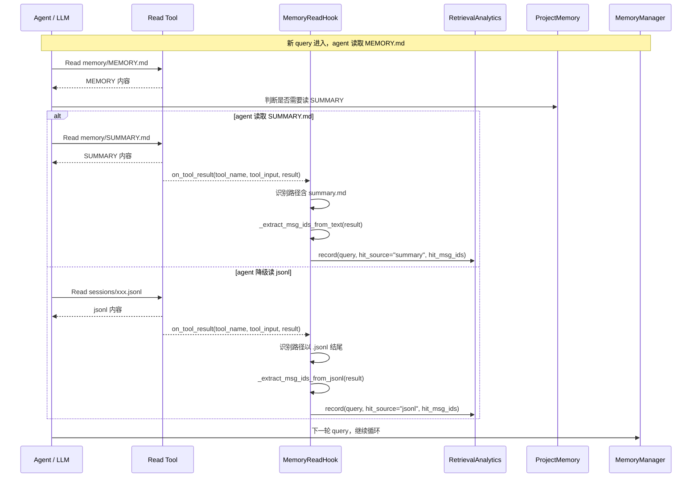
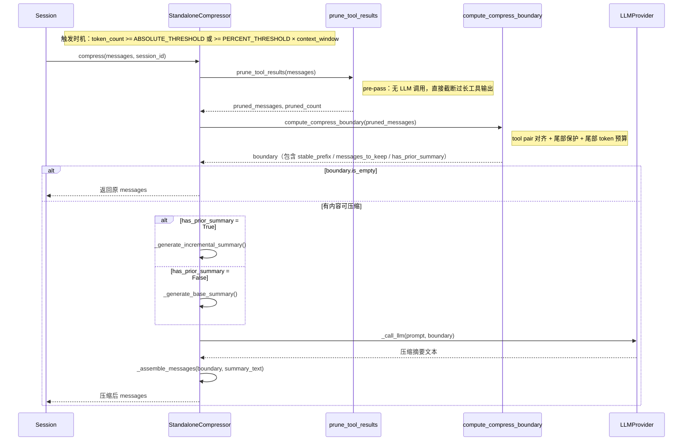
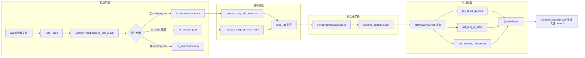
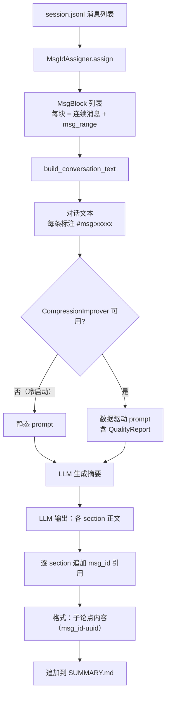
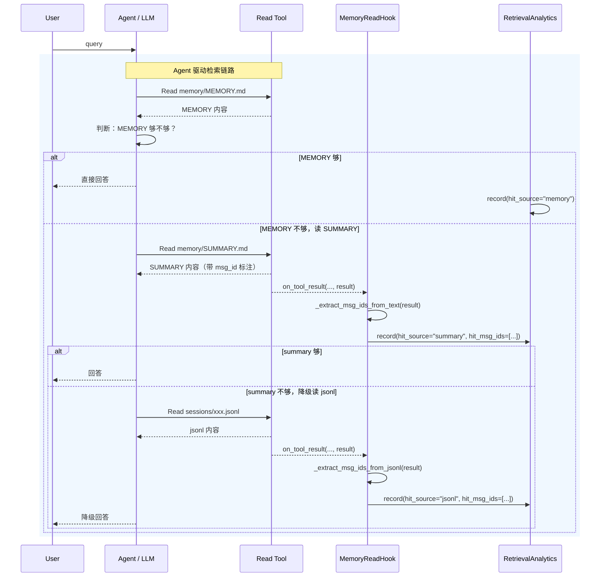
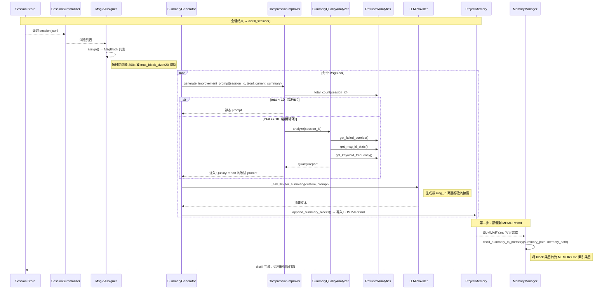
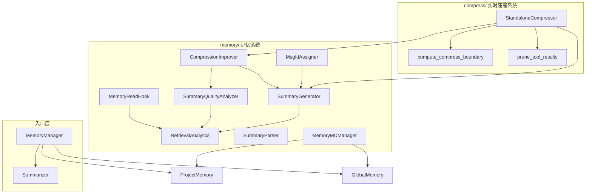

# 摘要自学习系统设计与实现文档

> 本文档描述 Auton 的**检索自学习系统**完整设计与实现，覆盖全部模块、流程图和时序图。
> 目标读者：初中级工程师（可直接参考实现）

---

## 1. 系统概述

### 1.1 核心目标

**98% 检索命中率**：agent 在 98% 的情况下能从 SUMMARY.md 获得足够信息，无需读取 session.jsonl 原始文件。

### 1.2 检索链路

```
query 进入
  → agent 读取 MEMORY.md
    → MEMORY 能回答？ → 直接回答（hit_source="memory"）
    → MEMORY 不够？ → agent 读取 summary.md
      → summary 能回答？ → 回答（hit_source="summary"）
      → summary 不够？ → agent 降级读取 session.jsonl → 降级回答（hit_source="jsonl"）
```

### 1.3 核心模块一览

| 模块 | 文件 | 职责 |
|------|------|------|
| 检索分析 | `memory/retrieval_analytics.py` | 记录每次检索的命中来源 |
| 读取拦截 | `memory/memory_read_hook.py` | 在 Read 工具层拦截，自动分类记录 |
| 质量分析 | `memory/compression_improver.py` | 分析 SUMMARY.md 质量瓶颈，生成改进 prompt |
| 摘要解析 | `memory/summary_parser.py` | 解析 SUMMARY.md 的 msg_id 引用 |
| 分块分配 | `memory/msg_id_assigner.py` | 将 jsonl 消息划分为语义连续的 MsgBlock |
| 摘要生成 | `memory/summary_generator.py` | 调用 LLM 生成会话分段摘要 |
| 会话摘要 | `memory/session_summarizer.py` | 从 jsonl 提取 block 并生成摘要 |
| 记忆管理 | `memory/memory_manager.py` | 统一检索入口，触发蒸馏 |
| 项目记忆 | `memory/project_memory.py` | 项目级存储读写（MEMORY.md / SUMMARY.md） |
| 类型定义 | `memory/types.py` | 核心数据结构 |
| 实时压缩 | `compress/compressor.py` | 实时会话上下文压缩（StandaloneCompressor） |
| 压缩配置 | `compress/config.py` | 压缩阈值、尾部保护等配置 |
| 压缩边界 | `compress/boundary.py` | 计算 tool pair 对齐的压缩边界 |
| 压缩剪枝 | `compress/pruner.py` | pre-pass 工具输出截断 |

---

## 2. 存储结构

### 2.1 项目级存储（项目模式下）

```
{项目根}/.auton/memory/
├── sessions/                        # append-only session jsonl
│   └── <session_id>.jsonl
├── memory/                          # 长期记忆沉淀
│   ├── MEMORY.md                    # 顶层索引（agent 直接读取）
│   ├── SUMMARY.md                   # 所有 jsonl 的分段详细摘要
│   └── *.md                         # 主题文件（user_role / feedback / project / reference）
└── index.jsonl                      # session 索引
```

### 2.2 全局存储（日期模式下）

```
~/.auton/memory/
├── dates/YYYY-MM-DD/
│   ├── sessions/<session_id>.jsonl
│   └── memory/
│       ├── MEMORY.md
│       └── SUMMARY.md
```

### 2.3 Analytics 存储

```
~/.auton/memory/
├── retrieval_analytics.json   # 检索命中记录（JSON）
```

---

## 3. 完整执行流程图

```mermaid
flowchart TD
    subgraph 会话进行中
        A[query 进入] --> B{agent 判断}
        B -->|MEMORY 能回答| C[直接回答]
        B -->|MEMORY 不够| D[agent 读取 SUMMARY.md]
        D --> E{summary 能回答?}
        E -->|是| F[回答]
        E -->|否| G[agent 降级读 session.jsonl]
        G --> H[降级回答]
    end

    subgraph 工具层拦截
        D --> I[Read 工具执行]
        G --> J[Read 工具执行]
        I --> K[MemoryReadHook.on_tool_result]
        J --> K
        K --> L[根据路径分类记录]
        L -->|summary.md| M[analytics.record hit_source=summary]
        L -->|.jsonl| N[analytics.record hit_source=jsonl]
        C --> O[analytics.record hit_source=memory]
    end

    subgraph 会话结束时
        P[触发 distill_session] --> Q[SessionSummarizer]
        Q --> R[读取 session.jsonl]
        R --> S[split_blocks 划分 block]
        S --> T[生成摘要块 SummaryBlock]
        T --> U[写入 SUMMARY.md]
        T --> V[distill_summary_to_memory]
        V --> W[写入 MEMORY.md]
    end

    subgraph 压缩时（自学习改进）
        X[StandaloneCompressor.compress] --> Y[判断是否首次摘要]
        Y -->|有历史摘要| Z[CompressionImprover]
        Y -->|首次摘要| AA[使用静态 prompt]
        Z --> BA[RetrievalAnalytics 分析]
        BA --> BB[QualityReport]
        BB --> BC[生成改进 prompt]
        BC --> BD[LLM 生成带 msg_id 标注的摘要]
        BD --> BE[写入 SUMMARY.md]
    end

    C --> P
    F --> P
    H --> P
    X --> P
```

---

## 4. 代码调用流程图

### 4.1 检索流程（Agent 驱动）



### 4.2 会话蒸馏流程（distill_session）

```mermaid
sequenceDiagram
    participant SM as SessionSummarizer
    participant SG as SummaryGenerator
    participant CI as CompressionImprover
    participant QA as SummaryQualityAnalyzer
    participant RA as RetrievalAnalytics
    participant PM as ProjectMemory
    participant LLM as LLMProvider

    Note over SM,L宏: 会话结束触发 distill_session

    SM->>SM: summarize_from_store(session_id)
    SM->>PM: 读取 session.jsonl
    SM->>SM: split_blocks(events)
    Note right of SM: 按 user-message 划分 block
    SM->>SM: _build_block(messages)
    Note right of SM: 提取 intent / decisions / conclusions
    SM-->>list[SummaryBlock]

    loop 每个 SummaryBlock
        SG->>SG: generate_and_append_summary()
        SG->>CI: compression_improver.generate_improvement_prompt()
        CI->>RA: total_count(session_id)
        alt 历史 query < 10（冷启动）
            CI-->>SG: 静态 prompt
        else 历史 query >= 10
            CI->>QA: analyzer.analyze(session_id)
            QA->>RA: get_failed_queries()
            QA->>RA: get_msg_id_stats()
            QA->>RA: get_keyword_frequency()
            QA-->>CI: QualityReport
            CI-->>SG: 数据驱动的改进 prompt
        end
        SG->>LLM: _call_llm_for_summary(custom_prompt)
        LLM-->>SG: 摘要文本（带 msg_id 标注）
        SG->>PM: append_summary_blocks() → 写入 SUMMARY.md
    end

    SM->>MM: distill_summary_to_memory()
    Note over MM: 将 SUMMARY.md 块蒸馏为 MEMORY.md 索引条目
```

### 4.3 实时压缩流程（StandaloneCompressor）



---

## 5. 核心数据流详解

### 5.1 检索命中记录流



### 5.2 摘要生成流（带 msg_id 两层标注）



---

## 6. 关键数据结构

### 6.1 RetrievalRecord

```python
@dataclass
class RetrievalRecord:
    query_id: str                      # UUID 前 8 位
    query_text: str                    # query 原文
    hit_source: HitSource              # "memory" | "summary" | "jsonl" | "none"
    hit_msg_ids: list[str] | None     # 命中的 msg_id 列表
    hit_content: str | None           # 命中的内容片段（前 500 字符）
    session_id: str
    timestamp: float
```

### 6.2 SummaryEntry（解析 SUMMARY.md 用）

```python
@dataclass
class SummaryEntry:
    topic: str                 # 所属 ## 标题
    msg_range: str             # 外层范围，如 "a1b2c3d4~c3d4e5f6"
    content: str               # 要点内容（含内层引用）
    inner_msg_ids: list[str]   # 内层 (msg_id-xxx) 引用的 msg_id

    @property
    def all_msg_ids(self) -> list[str]:
        """外层端点 + 内层引用，合并去重"""
        outer = self._parse_range(self.msg_range)
        return list(dict.fromkeys(outer + self.inner_msg_ids))
```

### 6.3 MsgBlock（jsonl 分块用）

```python
@dataclass
class MsgBlock:
    msg_ids: list[str]         # 块内所有消息的 msg_id
    msg_range: str             # "first_id~last_id"，单条仅写一个 id
    messages: list[dict]        # 原始消息内容

    @property
    def start_id(self) -> str: ...
    @property
    def end_id(self) -> str: ...
    @property
    def size(self) -> int: ...
```

### 6.4 QualityReport

```python
@dataclass
class QualityReport:
    session_id: str
    summary_hit_rate: float            # 从 summary 回答的命中率
    no_jsonl_hit_rate: float          # 不降级到 jsonl 的命中率（98% 目标）
    total_queries: int
    failed_count: int
    failed_by_msg: dict[str, list[str]]   # {msg_id: [未命中 query]}
    high_miss_msg_ids: list[str]          # 高频 miss 的 msg_id（Top 10）
    high_freq_keywords: list[str]           # 高频 query 关键词（Top 15）
    msg_stats: dict[str, dict[str, int]]
```

---

## 7. 完整代码调用链路

### 7.1 SessionProcessor 主循环中接入 Hook

```python
# SessionProcessor 集成方式
class SessionProcessor:
    def __init__(self, session_store, llm):
        self.analytics = RetrievalAnalytics(
            storage_path=Path("~/.auton/memory/retrieval_analytics.json")
        )
        self.hook = MemoryReadHook(self.analytics)

    def set_current_query(self, query: str):
        """每轮对话开始时调用"""
        self.hook.set_current_query(query)

    async def _execute_tools(self, tools_result, session_id):
        for tool_result in tools_result:
            self.hook.on_tool_result(
                tool_name=tool_result.tool_name,
                tool_input=tool_result.tool_input,
                result=tool_result.result,
                session_id=session_id,
            )

    async def run_session(self, session_id, query):
        self.set_current_query(query)
        # ... agent 执行 ...
        # ... 工具执行 ...
        await self._execute_tools(tools_result, session_id)
        # ... 蒸馏 ...
        if should_distill:
            await distill_session(session_store, session_id, self.analytics)
```

### 7.2 distill_session 完整调用链

```python
async def distill_session(session_store, session_id, analytics):
    summarizer = SessionSummarizer()

    # Step 1: 读取 jsonl，split blocks
    blocks = summarizer.summarize_from_store(
        session_store.sessions_dir(), session_id
    )

    # Step 2: LLM 生成带 msg_id 标注的摘要
    improver = CompressionImprover(
        analytics=analytics,
        analyzer=SummaryQualityAnalyzer(analytics),
        min_queries_for_analysis=10,
    )

    summary_path = project_mem.get_summary_path()
    await generate_and_append_summary(
        llm=llm_provider,
        session_id=session_id,
        events=all_events,
        start_idx=last_summarized_idx + 1,
        summary_path=summary_path,
        compression_improver=improver,
    )

    # Step 3: 蒸馏到 MEMORY.md
    md_manager = MemoryMDManager()
    new_count = md_manager.distill_summary_to_memory(
        summary_path, memory_path
    )
```

---

## 8. 时序图：完整生命周期

### 8.1 单轮对话 + 检索记录



### 8.2 会话结束 + 蒸馏 + 自学习改进



---

## 9. SUMMARY.md 格式规范

### 9.1 两层 msg_id 标注

```markdown
## 段落 001 — 会话 abc12345（事件 0–44，sessions/abc12345.jsonl 第 1–45 行）

**请求摘要**：
用户提出了什么

**关键决策**：
- [msg_id: a1b2c3d4~c3d4e5f6] 采用了 Redis Session 方案（msg_id-a1b2c3d4），TTL=300s（msg_id-c3d4e5f6）

**错误与教训**：
- [msg_id: d4e5f6g7] max_clients=100 配置过小，导致连接超时

**待处理**：
- [msg_id: g7h8i9j0~i9j0k1l2] 待验证 500 是否足够（msg_id-g7h8i9j0），计划压测到 1000（msg_id-i9j0k1l2）
```

格式规则：
- **外层** `[msg_id: <start_uuid>~<end_uuid>]`：标记该论点对应 jsonl 中的哪一段连续对话块
- **内层** `(msg_id-<uuid>)`：每个子论点精确引用的单条消息 UUID
- 内层引用按**论点粒度**标注，不能按分词标注

### 9.2 MEMORY.md 格式

```markdown
## 会话摘要索引

本文档是项目记忆顶层索引，详细的会话分段总结见 [memory/SUMMARY.md](memory/SUMMARY.md)。

- [session_id: abc12345] 用户认证模块重构：采用 Redis Session，TTL=300s，key 格式 user:session:{user_id}。涉及文件：user_service.py
- [session_id: def67890] Redis 连接池优化：max_clients 从 100 调至 500，添加熔断机制。涉及文件：redis_config.py
```

---

## 10. 可调参数

| 参数 | 默认值 | 模块 | 说明 |
|------|--------|------|------|
| `time_gap_threshold` | 300 秒 | MsgIdAssigner | 消息间隔超过此值则切块 |
| `max_block_size` | 20 | MsgIdAssigner | 单块最大消息数 |
| `min_queries_for_analysis` | 10 | CompressionImprover | 触发数据驱动 prompt 的最小 query 数 |
| `token_threshold` | 150,000 | CompressConfig | 绝对 token 触发阈值 |
| `threshold_percent` | 0.60 | CompressConfig | 上下文窗口比例阈值 |
| `protect_turns` | 2 | CompressConfig | 尾部保护轮数 |
| `tail_token_budget` | 40,000 | CompressConfig | 尾部 token 预算 |
| `compression_cooldown_seconds` | 60 | CompressConfig | 压缩冷却时间 |
| `max_compressions_per_session` | 10 | CompressConfig | 单会话最大压缩次数 |

---

## 11. 模块边界与依赖关系



**依赖规则**：
- `MemoryReadHook` 只依赖 `RetrievalAnalytics`，不依赖其他 memory 模块
- `CompressionImprover` 只依赖 `RetrievalAnalytics` 和 `SummaryQualityAnalyzer`，独立于 compress 模块
- `StandaloneCompressor` 依赖 compress 子模块，可独立于 memory 模块使用
- `SummaryGenerator` 是 compress 和 memory 之间的桥梁，同时被两者调用
