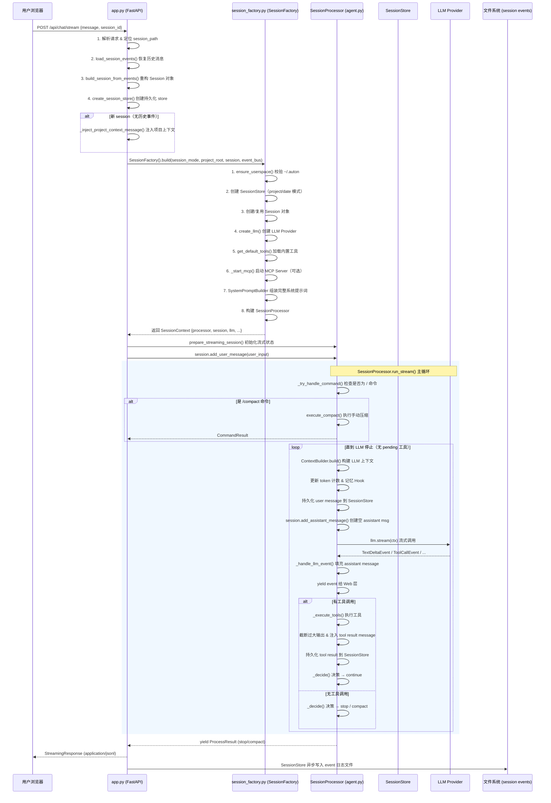
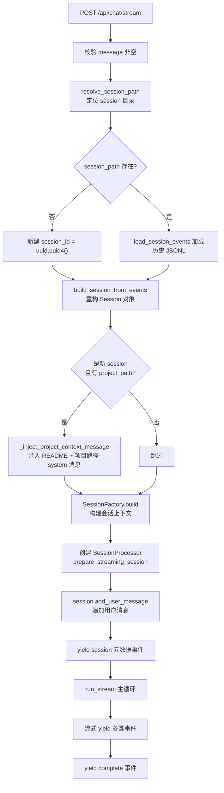
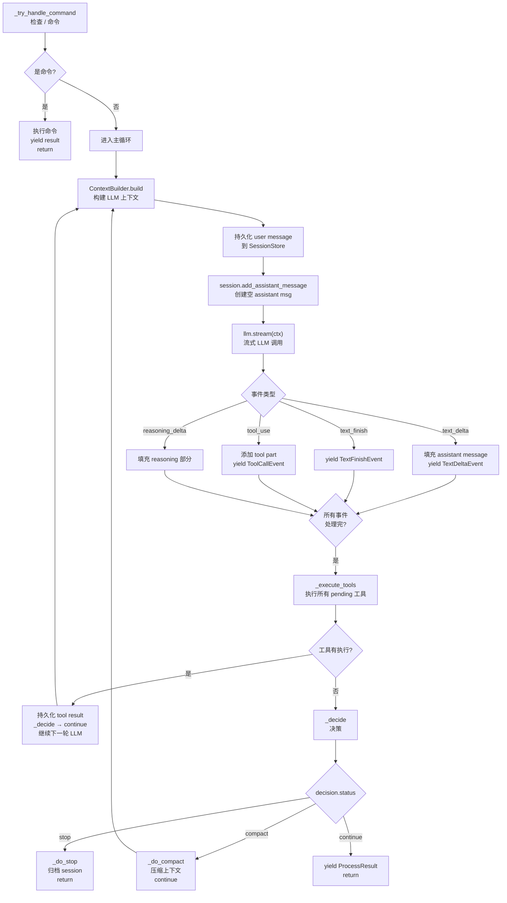
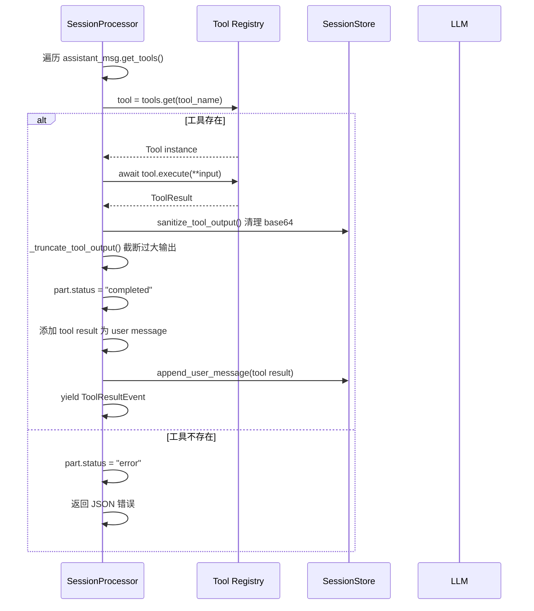
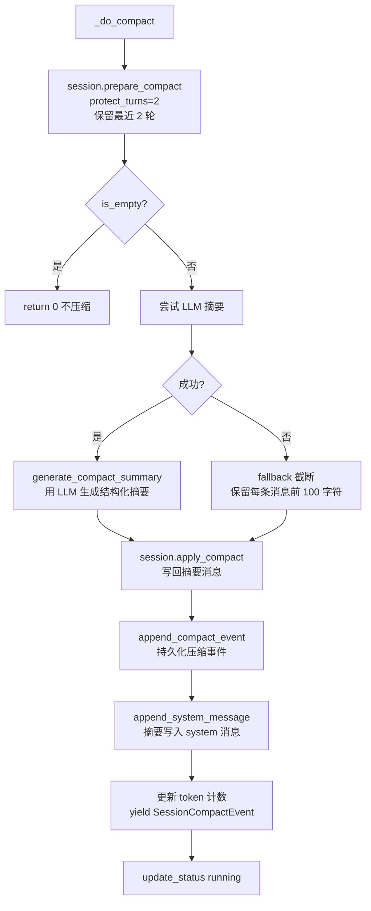

# Web 请求处理流程详解

本文档详细说明从用户通过 Web 界面发起请求，到 LLM 返回响应的完整数据流。重点覆盖三个核心脚本的协作关系：`app.py`（Web 入口）、`session_factory.py`（会话工厂）、`agent.py`（主循环处理器）。

---

## 1. 整体架构



---

## 2. 入口：app.py

### 2.1 路由注册

`create_app()` 是整个 Web 应用的工厂函数，注册了以下端点：

| 路由 | 方法 | 用途 |
|------|------|------|
| `/` | GET | 返回 `static/index.html`（前端页面） |
| `/api/health` | GET | 健康检查，返回 `{"status": "ok"}` |
| `/api/greeting` | GET | 启动问候语（复用 CLI 逻辑） |
| `/api/sidebar` | GET | 侧边栏会话列表 |
| `/api/sessions/{id}` | GET | 加载历史会话消息 |
| `/POST /api/chat/stream` | POST | **核心**：处理用户聊天请求，流式返回事件 |

### 2.2 核心端点：POST /api/chat/stream

#### 请求体

```python
class ChatRequest(BaseModel):
    message: str           # 用户输入文本
    session_id: str | None # 可选：指定恢复的 session ID
    project_path: str | None# 可选：项目目录路径
    session_date: str | None# 可选：session 所属日期（date 模式）
```

#### 执行步骤



#### 项目上下文注入逻辑

如果是**新 session** 且指定了 `project_path`，`_inject_project_context_message()` 会：

1. 在 `session.messages` **头部**（index=0）插入一条 `role=system` 的消息，内容包含：
   - `[Project workspace]\n{project_path}`
   - 提示工具使用绝对路径
   - README 文件内容预览（最多 2000 字符）
2. 同时持久化到 `SessionStore.append_system_message()`

这使得 LLM 在整个会话中始终知道当前工作目录。

#### 生命周期管理

`create_app()` 使用 `lifespan` 上下文管理器：

```python
@asynccontextmanager
async def _lifespan(app: FastAPI):
    watcher = MemoryWatcher(storage_dir=..., llm=...)
    await watcher.start()
    yield
    await watcher.flush()   # 退出前 flush 记忆
    await watcher.stop()
```

**MemoryWatcher** 是后台进程，每 10 分钟定期扫描 session 做摘要与记忆。

---

## 3. 工厂层：session_factory.py

### 3.1 SessionFactory.build() 的职责

`SessionFactory` 是**统一会话工厂**，消除了 CLI / Web / Bot 等各接入端的重复初始化代码。它在 `build()` 方法中按顺序完成以下工作：

```mermaid
flowchart LR
    A["build 参数"] --> B["ensure_userspace<br/>校验 ~/.auton 完整性"]
    B --> C["SessionStore<br/>project/date 模式"]
    C --> D["Session 创建或复用"]
    D --> E["create_llm<br/>创建 LLM Provider"]
    E --> F["get_default_tools<br/>加载内置工具"]
    F --> G["_start_mcp<br/>启动 MCP Server"]
    G --> H["SystemPromptBuilder<br/>组装系统提示词"]
    H --> I["SessionProcessor<br/>构建主循环处理器"]
    I --> J["返回 SessionContext"]
```



### 3.2 System Prompt 组装顺序

System Prompt 在 `build()` 时**一次性拼装完整**，后续不再变化（不参与 compact 压缩）：

| 序号 | 内容 | 来源 |
|------|------|------|
| 1 | 静态核心（Identity + 规则） | `build_base()` |
| 2 | 环境信息（OS / CWD / Git） | `build_base()` |
| 3 | 项目指令（CLAUDE.md / AGENTS.md） | `load_context_from_disk()` |
| 4 | 记忆（Project Memory / Today's Memory） | `load_context_from_disk()` |
| 5 | 内置 Skill 片段（真实内容） | `_inject_skill_context()` |
| 6 | 内置 Subagent 元数据 | `_inject_skill_context()` |
| 7 | MCP Server 配置及工具列表 | `_inject_mcp_context()` |
| 8 | 用户扩展（~/.auton/subagents） | `UserspaceLoader` |
| 9 | **可用工具目录** | `_inject_tool_catalog()` |

> **关键设计**：System Prompt 是会话级别的静态文本，compact 只压缩 `session.messages`，不压缩系统提示词。

### 3.3 LLM Provider 工厂

`create_llm()` 是公开静态方法，支持以下 providers：

| Provider | 模型示例 |
|----------|----------|
| `anthropic`（默认） | claude-sonnet-4-20250514 |
| `minimax` | MiniMax-Text-01 |
| `openai` / `gpt` | gpt-4o |
| `deepseek` | deepseek-chat |
| `qwen` / `dashscope` | qwen-max |
| `doubao` / `ark` | doubao-pro-32k |
| `gemini` | gemini-2.0-flash |
| `ollama` | qwen3:8b |
| `lm_studio` | local-model |
| `vllm` | Qwen/Qwen3-8B |
| `openrouter` | openai/gpt-4o |

Provider 切换时，API key / base_url 由各 provider 自行从环境变量读取，避免混淆凭证。

### 3.4 DecisionPolicy

构建 `SessionProcessor` 时传入的 `DecisionPolicy` 会根据 LLM 的 `context_window` 自动计算 compact 阈值：

```python
policy = DecisionPolicy(context_window=getattr(llm, "context_window", 8_192))
```

---

## 4. 主循环：agent.py（SessionProcessor）

### 4.1 run_stream() 完整流程

`SessionProcessor.run_stream()` 是 Web 层的驱动方法，逐事件 yield 给 FastAPI：



### 4.2 消息持久化时机

SessionStore 的持久化发生在多个关键节点，确保即使进程崩溃也不会丢失数据：

| 时机 | 操作 | 说明 |
|------|------|------|
| LLM 调用前 | 遍历 `session.messages`，持久化所有 `role=user` 消息 | 包括用户最新输入 |
| 每轮工具执行后 | 持久化新增的 `role=user` 消息 | 工具结果注入为 user message |
| LLM 响应完成后 | `append_assistant_message()` 持久化完整 assistant message | 含所有 tool calls |
| System Prompt | `append_system_message()` 一次性写入 | 只写一次 |
| Compact 完成后 | `append_compact_event()` 记录压缩事件 | 含摘要文本和元数据 |

### 4.3 工具执行细节



### 4.4 决策机制（DecisionPolicy）

每轮 LLM 响应后，`_decide()` 根据以下输入决策：

```python
PolicyInput(
    message_count=len(session.messages),
    token_count=session._token_count,
    last_user_message=last_user_text,
    step_count=session.meta.step_count,
)
```

返回三种状态：
- **`stop`**：对话结束（用户明确停止、max_turns 达到、或 policy 认为应结束）
- **`compact`**：上下文即将超限，需要压缩
- **`continue`**：工具链未完成，继续下一轮 LLM

### 4.5 Compact 压缩机制

当 `decision.status == "compact"` 时触发：



**保护策略**：
- `protect_turns=2`：最近 2 轮对话（用户+助手）永远不被压缩
- `recent_token_budget=40_000`：最近消息保留的 token 上限
- `has_prior_summary`：若已有摘要消息，新摘要会追加而非替换

---

## 5. 数据流向总结

```
用户输入 (HTTP)
    │
    ▼
app.py: chat_stream()
    ├── resolve_session_path() → 定位 session 目录
    ├── load_session_events() → 从 JSONL 文件恢复历史
    ├── build_session_from_events() → 重构 Session 对象
    ├── create_session_store() → 创建持久化 store
    ├── _inject_project_context_message() → 新 session 注入项目上下文
    ├── SessionFactory.build() → 构建 SessionContext
    │       ├── create_llm() → LLM Provider
    │       ├── get_default_tools() → 工具列表
    │       ├── SystemPromptBuilder.build_base() → 完整系统提示词
    │       └── SessionProcessor() → 主循环处理器
    └── processor.run_stream() → 启动流式主循环
            │
            ▼
        SessionProcessor 内部循环
            ├── ContextBuilder.build() → 构建 LLM 上下文
            ├── llm.stream() → 流式调用
            ├── _handle_llm_event() → 处理每种事件类型
            ├── _execute_tools() → 执行工具
            └── _decide() → 决策 continue/stop/compact
            │
            ▼
        yield 事件流
    │
    ▼
StreamingResponse (application/jsonl)
    ├── {"type": "session", ...}  — session 元数据
    ├── {"type": "delta", "text": "..."}  — 文本增量
    ├── {"type": "tool_call", "name": "..."}  — 工具调用
    ├── {"type": "command", "content": "..."}  — 命令结果
    ├── {"type": "result", "status": "..."}  — 决策结果
    ├── {"type": "error", "message": "..."}  — 错误
    └── {"type": "complete", ...}  — 结束标记
```

---

## 6. 关键设计决策

### 6.1 System Prompt 一次性构建，不参与 Compact

System Prompt 在 `SessionFactory.build()` 时一次性拼装完整（包含 skills、tools、subagents、MCP 配置等），后续 `run_stream()` 的每个循环中直接传入 `ContextBuilder.build()` 使用。

**原因**：
- 这些内容与会话历史无关，是相对静态的背景知识
- 避免每次循环重复构建导致 token 浪费
- compact 只需关注 `session.messages` 的消息历史

### 6.2 双入口：run() vs run_stream()

- **`run()`**：用于 CLI 同步模式，完整执行后返回 `ProcessResult`
- **`run_stream()`**：用于 Web/API 异步模式，逐事件 yield，支持 SSE 推送

两者共享同一个主循环逻辑，Web 层额外做了：
- `prepare_streaming_session()` 初始化持久化索引
- `yield` 每条事件给 FastAPI `StreamingResponse`

### 6.3 命令优先于 LLM

每轮主循环开始时先调用 `_try_handle_command()`，检查用户最新消息是否为 `/` 开头的命令（如 `/compact`）。

**如果匹配到 `/compact`**：
1. 从 `session.messages` 中移除该命令消息（不进入 LLM 上下文）
2. 直接调用 `command.execute_compact()` 执行压缩
3. 返回 `CommandResult` 给前端展示

### 6.4 工具输出截断保护

```python
context_window = getattr(llm, "context_window", 8192)
self._max_tool_output_chars = max(4_000, min(40_000, context_window * 4 * 2 // 5))
```

单条工具输出超过 `max_tool_output_chars` 时会被截断，并在末尾附加提示文本。这防止了文件读取等大输出撑爆 LLM 上下文窗口。

### 6.5 记忆读取 Hook

`set_memory_read_hook()` 允许外部注入 `MemoryReadHook`，用于：
- 记录当前 query（检索命中分析）
- 在工具执行结果返回时拦截文件读取事件
- 上报到 `RetrievalAnalytics` 用于记忆系统的自我优化

---

## 7. Session 持久化格式

每个 session 的事件以 JSONL 格式存储在 `~/.auton/sessions/{date}/{session_id}/events.jsonl`：

```jsonl
{"type": "system", "content": "...system prompt...", "timestamp": "..."}
{"type": "user", "content": "用户输入", "message_id": "uuid", "timestamp": "..."}
{"type": "assistant", "content": "助手回复", "tool_calls": [...], "timestamp": "..."}
{"type": "compact", "before_count": 10, "summary": "...摘要...", "meta": {...}, "timestamp": "..."}
```

恢复时通过 `build_session_from_events()` 将 JSONL 行反向重构为 `Session` 对象和 `Message` 列表。
