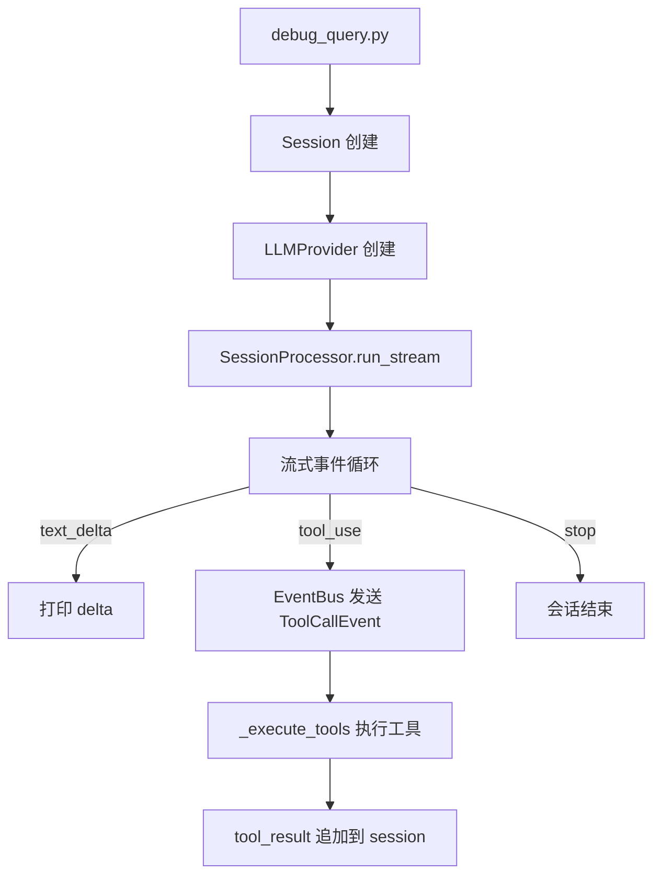

# debug_query.py — 快速调试脚本

向 Agent 发送单条 query，流式打印 LLM 响应，支持切换 LLM Provider。

## 使用方法

```bash
# 激活虚拟环境
conda activate auton_env

# 使用默认 provider（anthropic）
python scripts/debug_query.py "你好，介绍一下你自己"

# 使用 MiniMax provider
python scripts/debug_query.py "你好" --provider minimax

# 指定模型
python scripts/debug_query.py "你好" --provider minimax --model MiniMax-M2.7
```

## 参数说明

| 参数 | 默认值 | 说明 |
|------|--------|------|
| `query` | （必需） | 要发送给 Agent 的问题 |
| `--provider`, `-p` | `anthropic` | LLM Provider，可选：`anthropic`、`minimax` |
| `--model`, `-m` | 配置默认值 | 模型名称，如 `MiniMax-M2.7`、`claude-sonnet-4-20250514` |

## 环境变量

`debug_query.py` 通过 `auton.core.config` 读取配置，配置优先级：

```
CLI args > 环境变量 > ~/.auton/config.json
> ~/.auton/config/extensions_abilities.json > ~/.auton/config/auton_config.json
> ~/.auton/config/buildin_abilities.json > 内置默认值
```

在使用特定 provider 前，确保对应的环境变量已设置：

```bash
# MiniMax
export MINIMAX_API_KEY="your-minimax-api-key"

# Anthropic
export ANTHROPIC_API_KEY="your-anthropic-api-key"
```

## 输出示例

```
============================================================
Query: 你好
============================================================

你好！有什么我可以帮助你的吗？
============================================================
Session ended. id=6d2bae33-...
Messages: 2
```

> 注意：`run_stream()` 仅 yield `LLMStreamEvent`，因此只能直接打印 `text_delta` 和 `tool_use` 事件。
> 工具执行结果通过 EventBus 分发，如需打印可监听 `tool-result` 事件。

## 工作原理



1. **创建 Session**：生成唯一 session_id，消息存储在 `~/.auton/memory/execution/`
2. **流式处理**：SessionProcessor 循环处理 LLM 事件，工具调用直接执行
3. **流式输出**：text_delta 实时打印，工具调用结果在 `[tool result]` 中显示
4. **会话结束**：打印 session_id 和消息数量

## 故障排查

**报错：`AttributeError: 'AsyncMessageStream' object has no attribute 'events'`**

→ 确认使用 `conda activate auton_env`，旧环境可能装有不同版本的 anthropic SDK
→ 检查 `auton/llm/anthropic_provider.py` 中使用 `async for event in stream:` 而非 `stream.events`

**报错：`TextFinishEvent.__init__() got an unexpected keyword argument 'full_text'`**

→ 确认代码已更新到最新版本，`event_types.py` 中的字段名是 `content` 而非 `full_text`

**报错：`AttributeError: 'Message' object has no attribute 'meta'`**

→ `append_message` 调用已改为 `append_assistant_message(session_id, message)`，确保 agent.py 为最新版本

**报错：`ConnectionError`**

→ 检查 API Key 是否正确，网络是否可达

**输出正常但工具调用未执行**

→ MiniMax 免费版可能不支持工具调用，优先使用 `claude-sonnet-4-20250514` 测试完整流程
